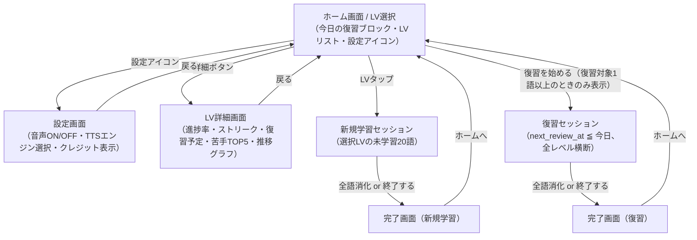
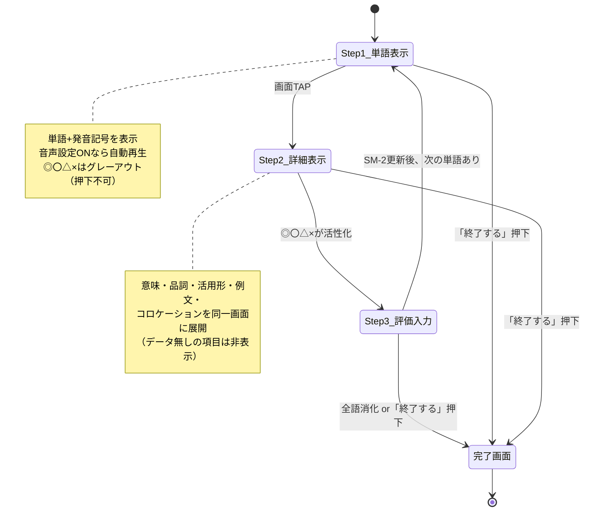
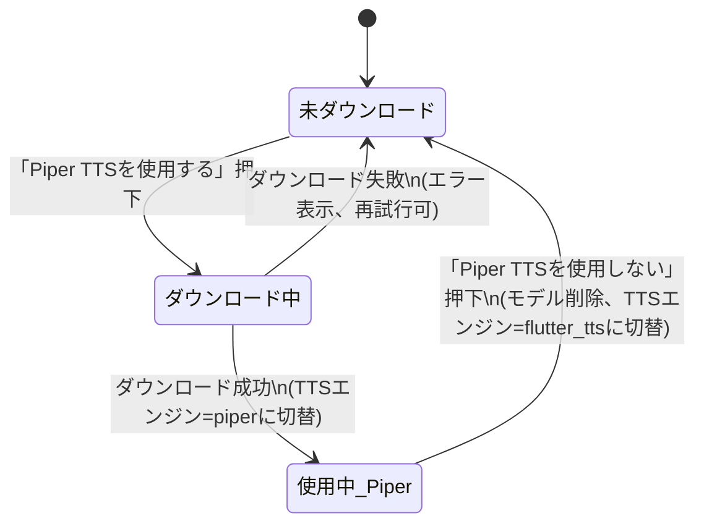
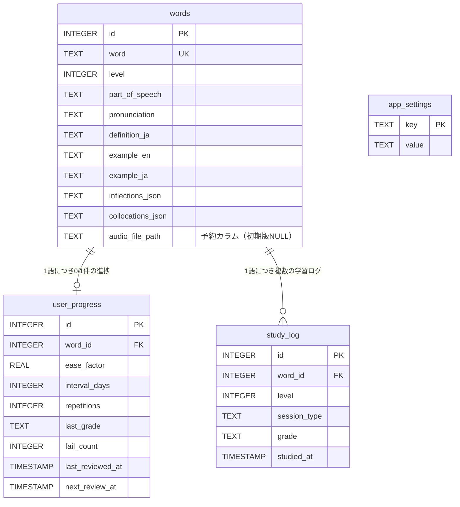

# JACET Vocabulary Learner - RFP（要件定義書）

**プロジェクト名**: JACET Vocabulary Learner
**開発主体**: JaMTec LLC（Jotaro）
**開発フレームワーク**: Flutter (Dart)
**ターゲットプラットフォーム**: モバイル（iOS / Android）
**利用形態**: 非商用・教育目的
**対象ユーザー**: 費用をかけずに英語学習をしたい人
**初期バージョン開発目標**: 1日
**作成日 / 更新日**: 2026-07-02 / 2026-07-02
**版数**: v1.4

---

## 1. プロジェクト概要

日本人学習者向けの段階的英単語学習アプリ。JACET8000（大学英語教育学会、Level 1〜8）を単語・ランクの基盤データとし、Wiktionary等から定義・発音・活用形・例文を補完する。SM-2アルゴリズムによる間隔反復学習（スペースド・リピーション）を核とし、学習の可視化と復習の習慣化を支援する。

---

## 2. データソースとライセンス

| データ | ソース | ライセンス | 対応 |
|---|---|---|---|
| 単語・ランク（Level 1-8） | JACET8000 | 著作権：JACET保有。非商用・教育目的での利用は問題なし | アプリ内クレジット表示 |
| 定義・品詞・発音記号・活用形・例文・コロケーション | Wiktionary API | CC BY-SA 4.0 | アプリ内クレジット表示、改変部分もCC BY-SA継承 |
| 学習アルゴリズム | SM-2（SuperMemo） | 著作権表示のみで自由利用可・特許リスクなし | アプリ内クレジット表示必須 |

**取得方法**: すべて事前収集し、静的データとしてアプリに同梱する（実行時にAPIを叩かない）。データ収集フロー自体は本RFPのスコープ外（別途進行）。

**アプリ内クレジット表示（設定画面）**:
```
・JACET8000 (Japan Association of College English Teachers)
・Wiktionary - CC BY-SA 4.0 (https://en.wiktionary.org/)
・Algorithm SM-2, (C) Copyright SuperMemo World, 1991
```

---

## 3. レベル定義（JACET8000 Level 1-8）

| Level | 説明（1行） | 単語数 | 英検目安 | TOEIC目安 |
|---|---|---|---|---|
| 1 | 中学教科書レベルの基本語 | 1000 | 5級 | - |
| 2 | 高校初級・英字新聞の基礎語 | 1000 | 準2級 | - |
| 3 | 高等学校・大学入試（センター試験）レベル | 1000 | 2級 | - |
| 4 | 大学一般教養初級 | 1000 | 2級 | 300-400点 |
| 5 | 難関大学受験・大学一般教養 | 1000 | 準1級 | 400-500点 |
| 6 | 英語専門外の大学生・ビジネスマン目標 | 1000 | 準1級 | 600点 |
| 7 | 英語を仕事で使う人向け | 1000 | 1級 | 700点+ |
| 8 | 日本人英語学習者の最終目標 | 1000 | 1級 | 800点+ |

各レベルは「1行の簡単な説明」と「詳細説明（対象・カバー率等）」の2段階で保持し、LV選択画面（ホーム画面）では1行説明を、LV詳細画面（詳細ボタン遷移先）では下記の詳細説明を表示する。

> **カバー率について**: 「カバー率」とは、一般的な英文（新聞・書籍・会話等）に登場する語のうち、当該レベルまでを習得した場合に理解できる語の割合の目安を指す。JACET8000 は使用頻度順に配列されているため、上位レベルほど1語あたりの出現頻度が高く、少ない語数で高いカバー率に到達する。以下の数値は一般的な語彙カバー率研究に基づく**目安（assumption）**であり、確定値ではない。正確な数値は今後の実データ検証で差し替え可能とする。

### 3.1 各レベル詳細説明

- **LV1（1〜1000語）**
  - **対象**: 中学教科書レベルの最基本語。be動詞・基本動詞・身近な名詞など、英語運用の土台となる高頻度語。
  - **カバー率（目安）**: 一般英文の約 70〜75%。
  - **到達イメージ**: 中学卒業程度。ごく簡単な日常会話・掲示・短文の大意を把握できる。英検5級相当。

- **LV2（1001〜2000語）**
  - **対象**: 高校初級および英字新聞の基礎語。日常生活・学校生活で頻出する語彙。
  - **カバー率（目安）**: LV1と合わせて一般英文の約 80%。
  - **到達イメージ**: 高校初級〜英検準2級相当。平易な文章の要旨を追える。

- **LV3（2001〜3000語）**
  - **対象**: 高等学校・大学入試（旧センター試験）レベルの中核語。抽象度がやや上がる。
  - **カバー率（目安）**: 累計で一般英文の約 85%。
  - **到達イメージ**: 高校卒業〜英検2級相当。一般的な話題の文章を辞書の補助で読める。

- **LV4（3001〜4000語）**
  - **対象**: 大学一般教養（初級）レベル。学術・報道でも用いられる語が増える。
  - **カバー率（目安）**: 累計で一般英文の約 88%。
  - **到達イメージ**: 英検2級上位／TOEIC 300〜400点相当。一般的なビジネス文書・記事の大意を把握できる。

- **LV5（4001〜5000語）**
  - **対象**: 難関大学受験・大学一般教養レベル。低頻度だが教養として重要な語。
  - **カバー率（目安）**: 累計で一般英文の約 90%。
  - **到達イメージ**: 英検準1級下位／TOEIC 400〜500点相当。専門外の一般的文章を概ね理解できる。

- **LV6（5001〜6000語）**
  - **対象**: 英語専門外の大学生・ビジネスパーソンが目標とする実用上限レベル。
  - **カバー率（目安）**: 累計で一般英文の約 92%。
  - **到達イメージ**: 英検準1級／TOEIC 600点相当。実務・報道で必要な語彙のほぼ全域をカバー。

- **LV7（6001〜7000語）**
  - **対象**: 英語を仕事で使う人向けの上級語。専門的・格式的な語彙を含む。
  - **カバー率（目安）**: 累計で一般英文の約 95%。
  - **到達イメージ**: 英検1級下位／TOEIC 700点以上相当。専門的文章・報道を辞書なしで読める。

- **LV8（7001〜8000語）**
  - **対象**: 日本人英語学習者の最終目標となる最上級語。低頻度・専門・文語的語彙。
  - **カバー率（目安）**: 累計で一般英文の約 96〜98%（ネイティブ教養層に近い水準）。
  - **到達イメージ**: 英検1級／TOEIC 800点以上相当。広範な話題の英文を高精度で理解できる。

---

## 4. 画面構成・機能仕様

### 4.0 画面遷移全体図



### 4.1 ホーム画面（LV選択画面と統合）

- アプリ起動後の最初の画面。LV選択画面と統合し、ホーム画面として機能する。
- 画面右上等に **設定アイコン** を配置し、タップで設定画面（4.5）へ遷移する。音声ON/OFFスイッチは設定画面へ移動（本画面には表示しない）。
- **今日の復習ブロック**：
  - 復習対象単語（全レベル横断）が1語以上ある場合のみ表示。件数と「復習を始める」ボタンを表示し、視覚的に強調（色・カード状）する。
  - 復習対象が0語の場合、このブロックごと非表示にする。
- **LVリスト（LV1〜LV8、固定順で表示）**：
  - 各LVに、1行説明、進捗率、詳細ボタンを表示。
  - タップでそのLVの新規学習セッションを開始。
  - 詳細ボタンでLV詳細画面へ遷移。

### 4.2 LV詳細画面

タイトル：LV名 + 詳細説明

表示項目：

1. **進捗率**
   - 計算式：`Σ(各単語の評価値) / 該当レベルの総単語数`
   - 評価値：◎=1.0、〇=0.5、△=0.1、×・未学習=0
   - 数値（%）＋横棒プログレスバーで表示

2. **連続学習日数（ストリーク）**
   - その日に新規学習または復習を1回でも行った日を1日としてカウント
   - 直近の連続日数を数値表示
   - 過去7日間のカレンダー形式（曜日ごとに実施有無を表示）

3. **復習予定（全レベル共通の数字）**
   - 明日の復習予定数：`next_review_at = 明日`の単語数（全レベル横断）
   - 今週の復習予定数：`next_review_at`が今日から7日以内の単語数（全レベル横断）
   - ※このLV詳細画面内であっても、復習予定は全レベル共通の数字を表示する

4. **苦手な単語 TOP5（このLV内）**
   - このレベル内の単語のうち、×評価を受けた回数が多い順に上位5件
   - 同数の場合は最終復習日が古い順
   - 単語と×回数を表示

5. **学習量推移グラフ（過去7日間、このLV内）**
   - 日別の学習数（新規学習＋復習の合算）を棒グラフで表示

### 4.3 学習セッション画面（新規学習・復習セッション共通UI）

**共通フロー**:

```
Step 1: 単語表示
  - 画面上部に単語と発音記号を表示
  - 表示と同時に音声を自動再生（音声設定ONの場合）
  - ◎〇△×ボタンは表示されるがグレーアウト（押下不可）

Step 2: TAP → 詳細表示
  - 同一画面内で詳細情報を展開表示：
    - 意味・品詞
    - 活用形（あれば。過去形・比較級・複数形等）
    - 例文（1つ、英文＋日本語訳）
    - コロケーション（あれば）
    - ※データがない項目はセクションごと非表示
  - ◎〇△×ボタンが活性化（押下可能に）

Step 3: ◎〇△×いずれかを押下
  - SM-2アルゴリズムで習得度・次回復習日を更新
  - 自動的に次の単語（Step 1）へ遷移
```

**Step1→Step2→Step3ループの状態遷移図**:



**共通要素**:
- 進捗バー（現在何語目か）を常時表示
- **「終了する」ボタンを常時表示**（新規・復習セッション共通）。押下時点までの結果で完了画面へ遷移。
- タイマー機能・時間制限は設けない（ユーザーのペースに委ねる）

**新規学習セッション固有仕様**:
- 対象：選択したLV内の未学習単語
- 1セッション：20語固定
- 20語未満の残りしかない場合はその分だけで終了

**復習セッション固有仕様**:
- 対象：`next_review_at ≦ 今日`の単語（全レベル横断、`next_review_at`が古い順）
- 件数上限なし（「終了する」ボタンで随時終了可能）
- 起動トリガー：ホーム画面の「復習を始める」ボタン

### 4.4 完了画面

**新規学習セッション完了時**:
```
- 理解度の円グラフ（◎〇△×の割合）
- このレベルの総単語数
- 今回の学習対象数
- 累計学習済み単語数（このレベル内）
```

**復習セッション完了時**:
```
- 理解度の円グラフ（◎〇△×の割合）
- 今回消化した単語数
- 残りの復習対象数（0の場合は非表示 or 完了メッセージ）
```

### 4.5 設定画面

ホーム画面右上の設定アイコンから遷移。以下を1画面にまとめて表示する。

**構成**:

```
┌─────────────────────────┐
│ ← 設定                     │
├─────────────────────────┤
│ 音声設定                     │
│                             │
│  読み上げ音声       [ ON/OFF ] │  ← 全体スイッチ（旧ホーム画面から移動）
│                             │
│  ─────────────────────    │
│  TTSエンジン                 │
│                             │
│  現在: OS標準（flutter_tts）  │  ← 現在有効なエンジンを表示
│                             │
│  Piper TTS（高品質音声）       │
│  未ダウンロード                │
│  [ Piper TTSを使用する ]      │  ← 状態A（未DL）のボタン
│                             │
├─────────────────────────┤
│ データソース・クレジット表示     │
│  （第2章のクレジット文言を表示） │
└─────────────────────────┘
```

**Piper TTSボタンの状態遷移**:

| 状態 | ボタン表示 | 押下時の挙動 |
|---|---|---|
| A. 未ダウンロード | 「Piper TTSを使用する」 | ①モデルファイルをダウンロード（進捗表示）→②ダウンロード完了後、TTSエンジンを自動的にPiper TTSへ切替→③ボタン表示を状態Bへ変更 |
| B. ダウンロード済み・使用中 | 「Piper TTSを使用しない」 | ①ダウンロード済みモデルファイルを端末から削除→②TTSエンジンを自動的にflutter_ttsへ切替→③ボタン表示を状態Aへ戻す |



**ダウンロード仕様**:
- ダウンロード元：GitHub Releases または Hugging Face 等、既存の公開インフラ上にホスティングされたPiper TTS英語音声モデル（.onnx形式）を直接取得する。**自前のホスティングサーバーは不要**。
- ダウンロード中は進捗（%またはインジケータ）を表示する。
- ダウンロード失敗時（通信エラー・容量不足等）はエラーメッセージを表示し、状態Aのままとする。
- モデルファイルは端末ローカルストレージに保存し、`app_settings` にファイルパスを記録する（第6章参照）。

**音声再生ロジック（全画面共通）**:
```
if app_settings.tts_engine == 'piper' かつ モデルファイルが存在する:
    Piper TTS モデル（.onnx）を用いて実行時にオンデバイス音声合成・再生（都度生成）
else:
    flutter_tts でOS標準音声を実行時生成・再生（フォールバック）
```
※ Piper TTS・flutter_tts のいずれも、単語表示のたびにテキストから**実行時にリアルタイム合成して再生**する方式で確定（クライアント確認済み）。単語ごとの音声ファイルを事前生成・同梱・キャッシュすることはしない。ただし実機での実行時合成レイテンシが許容できない場合に限り、`words.audio_file_path` を用いた事前生成方式へ切り替える余地を残す（第7章・第9章参照）。

---

## 5. SM-2アルゴリズム仕様

本アプリのSM-2は標準SM-2（SuperMemo）をベースに、4段階評価（◎〇△×）と本アプリ独自の初回interval設定を組み合わせた実装とする。以下の増減値は標準SM-2に準じた**暫定値（assumption）**であり、クライアント確定後に差し替え可能とする。

### 5.1 評価と初期パラメータ（概要表）

| ボタン | 意味 | ease_factor 増減 | 初回interval（repetitions=0のとき） | 既存カード（repetitions≧1のとき）のinterval |
|---|---|---|---|---|
| ◎（楽） | 簡単に思い出せた | +0.10 | 30日 | interval × ease_factor（更新後EFを使用） |
| 〇（良） | 思い出せた | ±0（維持） | 7日 | interval × ease_factor |
| △（難） | 苦労して思い出せた | −0.15 | 3日 | interval × 1.2（延長幅を抑制） |
| ×（忘） | 思い出せなかった | −0.20 | 1日（リセット） | 1日にリセット（repetitions=0へ） |

- **ease_factor 下限**: すべての評価で **1.3** を下回らない（`ease_factor = max(1.3, ease_factor + Δ)`）。上限は設けない。
- **ease_factor 初期値**: 2.5（未学習カード）。`user_progress.ease_factor DEFAULT 2.5` と一致。

### 5.2 パラメータ更新規則（実装仕様）

各評価押下時、対象単語の `user_progress` レコードを以下の手順で更新する。基準時刻 `now` は端末ローカル日付の当日（0:00 境界、`assumption`）とする。

**(1) repetitions（連続成功回数）**
- ◎・〇・△（成功）: `repetitions += 1`
- ×（失敗）: `repetitions = 0`

**(2) ease_factor（易しさ係数）**
```
Δ = { ◎: +0.10, 〇: 0.00, △: −0.15, ×: −0.20 }[grade]
ease_factor = max(1.3, ease_factor + Δ)
```
※ 下記(3)のinterval算出で「更新後の ease_factor」を用いる。

**(3) interval_days（次回までの日数）**
```
if grade == '×':
    interval_days = 1
elif repetitions == 1:          # 今回の成功で初めて repetitions が1になった＝初回学習
    interval_days = { ◎: 30, 〇: 7, △: 3 }[grade]
else:                           # repetitions >= 2 の既存カード
    factor = ease_factor if grade in ('◎','〇') else 1.2   # △は1.2固定
    interval_days = round(interval_days_prev * factor)
```
- 適用条件の要点:
  - **未学習（更新前 repetitions=0）** の成功 → (1)で repetitions が1になるため、**初回interval**（◎30 / 〇7 / △3）を適用する。
  - **既存カード（更新前 repetitions≧1）** の成功 → **乗算式**（◎〇: ×ease_factor、△: ×1.2）を適用する。
  - **×** → repetitions=0、interval_days=1 に強制リセット。

**(4) next_review_at（次回復習予定日時）**
```
last_reviewed_at = now
next_review_at   = last_reviewed_at + interval_days 日
```

**(5) 苦手単語カウント**
- ×押下時のみ `fail_count += 1`（累計。復習で再度×でも加算する。`assumption`）。

**(6) last_grade**
- 押下した評価値（◎〇△×）で上書き保存する（進捗率は常に**最新評価**のみで算出。`assumption`）。

### 5.3 更新擬似コード

```pseudo
function applyGrade(progress, grade, now):
    # (1) repetitions
    if grade == '×':
        progress.repetitions = 0
    else:
        progress.repetitions += 1

    # (2) ease_factor
    delta = {'◎': 0.10, '〇': 0.00, '△': -0.15, '×': -0.20}[grade]
    progress.ease_factor = max(1.3, progress.ease_factor + delta)

    # (3) interval_days
    if grade == '×':
        progress.interval_days = 1
    else if progress.repetitions == 1:
        progress.interval_days = {'◎': 30, '〇': 7, '△': 3}[grade]
    else:  # repetitions >= 2
        factor = progress.ease_factor if grade in ('◎','〇') else 1.2
        progress.interval_days = round(progress.interval_days * factor)

    # (4) 日時
    progress.last_reviewed_at = now
    progress.next_review_at   = now + days(progress.interval_days)

    # (5) 苦手カウント
    if grade == '×':
        progress.fail_count += 1

    # (6) 最新評価
    progress.last_grade = grade
    save(progress)
    append_study_log(word_id, level, session_type, grade, now)
```

### 5.4 進捗率計算式（LV詳細画面用）

```
進捗率 = Σ(各単語の last_grade に対応する評価値) / 該当レベルの総単語数（1000語）
評価値：◎=1.0、〇=0.5、△=0.1、×・未学習=0
```
- 各単語について集計に用いるのは **最新評価（last_grade）のみ**。過去の評価履歴（study_log）は進捗率算出に含めない（`assumption`）。

---

## 6. データベース設計（SQLite）

### `words`（静的データ、事前投入）
```sql
CREATE TABLE words (
  id INTEGER PRIMARY KEY,
  word TEXT UNIQUE NOT NULL,
  level INTEGER NOT NULL,           -- 1-8
  part_of_speech TEXT,
  pronunciation TEXT,               -- IPA
  definition_ja TEXT,
  example_en TEXT,
  example_ja TEXT,
  inflections_json TEXT,            -- {"plural": "apples", ...}
  collocations_json TEXT,           -- ["an apple a day", ...]
  audio_file_path TEXT              -- 【予約カラム】将来のPiper TTS事前生成音声ファイル用。初期版はflutter_ttsで実行時生成するため常にNULL（第7章 音声方式を参照）
);
```

### `user_progress`（学習進捗、SM-2パラメータ）
```sql
CREATE TABLE user_progress (
  id INTEGER PRIMARY KEY,
  word_id INTEGER NOT NULL,
  ease_factor REAL DEFAULT 2.5,
  interval_days INTEGER DEFAULT 0,
  repetitions INTEGER DEFAULT 0,
  last_grade TEXT,                  -- '◎' '〇' '△' '×' or NULL(未学習)
  fail_count INTEGER DEFAULT 0,     -- ×を押された累計回数（苦手単語TOP5用）
  last_reviewed_at TIMESTAMP,
  next_review_at TIMESTAMP,
  FOREIGN KEY(word_id) REFERENCES words(id)
);
```

### `study_log`（学習量推移グラフ・ストリーク計算用）
```sql
CREATE TABLE study_log (
  id INTEGER PRIMARY KEY,
  word_id INTEGER NOT NULL,
  level INTEGER NOT NULL,
  session_type TEXT,                -- 'new' or 'review'
  grade TEXT,                       -- '◎' '〇' '△' '×'
  studied_at TIMESTAMP,
  FOREIGN KEY(word_id) REFERENCES words(id)
);
```

### `app_settings`
```sql
CREATE TABLE app_settings (
  key TEXT PRIMARY KEY,
  value TEXT
);
```

想定するキーと値:

| key | value 例 | 説明 |
|---|---|---|
| `audio_enabled` | `'true'` / `'false'` | 読み上げ音声の全体ON/OFF（設定画面4.5で管理） |
| `tts_engine` | `'flutter_tts'` / `'piper'` | 現在有効なTTSエンジン。初期値は `'flutter_tts'` |
| `piper_model_path` | 端末ローカルパス文字列 or `NULL` | Piper TTSモデルファイルのダウンロード先パス。未ダウンロード時は `NULL` |

### ER図

`study_log` の `word_id` は `words.id` への論理参照（学習履歴を残すため FOREIGN KEY 制約は必須としない設計とし、ここではリレーションを識別関係として表現する）。



（`app_settings` はキー・バリューの単独テーブルで、他テーブルとのリレーションを持たない。）

---

## 7. 非機能要件

- **オフライン動作**: 単語データはすべてアプリに事前組み込みのため、通信不要で全機能が動作すること。音声再生（flutter_tts / Piper TTSいずれも）も通信不要でオフライン動作すること（Piper TTSはモデルダウンロード完了後に限る）。
- **音声方式（TTSエンジン切替）**: 初期状態は **flutter_tts（OS標準TTSによる実行時生成）**。設定画面（4.5）から **Piper TTS（オフラインMLベースの事前学習モデルによる高品質音声）** への切替が可能。
  - Piper TTSのモデルファイルは GitHub Releases / Hugging Face 等、**既存の公開インフラから直接ダウンロード**する。自前のホスティングサーバーは不要。
  - `app_settings.tts_engine` で現在のエンジンを管理し、`tts_engine == 'piper'` かつモデルファイルが存在する場合のみPiper TTSを使用、それ以外はflutter_ttsにフォールバックする（4.5節「音声再生ロジック」参照）。
  - **音声合成方式（クライアント確認済み・確定）**: flutter_tts・Piper TTS のいずれも、単語表示のたびに**実行時にオンデバイスでテキストから都度リアルタイム合成して再生**する。単語ごとの音声ファイルを事前生成・同梱・キャッシュすることはしない。
  - `words.audio_file_path` は事前生成音声ファイル用の**予約カラム**として残す（初期版では常にNULL）。実機検証で実行時合成のレイテンシがユーザー体験上許容できないと判明した場合に限り、事前生成キャッシュ方式へ切り替えるための将来用カラムとして機能させる（切替時は第9章の残課題として扱う）。
- **データ永続化**: SQLiteによるローカル保存。クラウド同期は本バージョンのスコープ外。

---

## 8. 初期バージョンのスコープ（開発目標：1日）

- 上記4章〜6章の全画面・全機能（設定画面・Piper TTS切替を含む）を実装
- LV1〜LV8すべてのデータを搭載（データ自体は別途事前収集済みのものを使用）
- 開発体制：Jotaroが設計・仕様策定、Claude（Claude Code）が実装

---

## 9. 未確定・今後の検討事項

本章は、本RFPのスコープ外、または実装段階で確定・検証すべき残課題のみを記す。レベル詳細説明・音声方式（実行時リアルタイム合成で確定）・SM-2式・設定画面など主要な設計判断は、それぞれ第3.1節／第7章・第4.5節／第5章／第4.5節の本文で確定済みである。

- 単語データ（JACET8000 + Wiktionary補完）の具体的な収集・変換スクリプトの実装（本RFPのスコープ外・別途進行）。
- Piper TTSの具体的なダウンロードURL（GitHub Releases上のモデル名・バージョン指定）の確定。
- Piper TTSダウンロードファイルの改ざん検証（チェックサム確認）を実装するか否か（`assumption`: 初期版は未実装でも可）。
- **Piper TTS / flutter_tts の実行時リアルタイム合成のパフォーマンス検証**（実機で単語表示ごとの合成レイテンシが許容範囲か確認する。許容できない場合に限り、`words.audio_file_path` を用いた事前生成キャッシュ方式へ切り替える）。
- 苦手単語TOP5・復習予定などの集計クエリのパフォーマンス確認（1000語×8レベル＝最大8000語規模での動作、必要なインデックス設計）。

---

## 10. 用語集（Glossary）

| 用語 | 定義 |
|---|---|
| **JACET8000** | 大学英語教育学会（Japan Association of College English Teachers）が策定した、使用頻度順の8000語彙リスト。1000語ごとにLevel 1〜8へ区分される。本アプリの単語・ランクの基盤データ。 |
| **SM-2** | SuperMemo で考案された間隔反復（スペースド・リピテーション）アルゴリズム。評価に応じて次回復習日を動的に算出する。 |
| **ease_factor（易しさ係数）** | 単語ごとの記憶の定着しやすさを表す係数。初期値2.5、下限1.3。評価に応じて増減し、interval の乗数として用いる。 |
| **interval（interval_days）** | 次回復習までの日数。SM-2により算出される。 |
| **repetitions** | 連続して成功（◎〇△）した回数。×で0にリセットされる。初回interval適用の判定に用いる。 |
| **next_review_at（復習予定）** | 次回の復習予定日時。`last_reviewed_at + interval_days 日` で算出。 |
| **ストリーク（連続学習日数）** | 新規学習または復習を1回以上行った日を1日として数えた、直近の連続日数。 |
| **評価値（◎〇△×）** | 単語想起の自己評価。◎=楽に想起、〇=想起できた、△=苦労して想起、×=想起できず。進捗率では ◎=1.0／〇=0.5／△=0.1／×・未学習=0 に対応。 |
| **fail_count** | ×を押された累計回数。苦手単語TOP5の集計に用いる。 |
| **last_grade** | 各単語に対する最新の評価値。進捗率算出に用いる。 |
| **Piper TTS** | オフラインMLベースの音声合成エンジン。設定画面からモデルファイルをダウンロードして有効化する、事前学習済みの高品質音声。 |
| **tts_engine** | `app_settings` に保持する、現在有効なTTSエンジンを示す値（`'flutter_tts'` または `'piper'`）。 |

---

## 11. 受け入れ基準（完成条件チェックリスト）

以下はすべて検証可能な受け入れ条件とする。

**共通・非機能**
- [ ] 端末をオフライン（機内モード）にした状態で、全画面・全機能（音声再生含む。Piper TTS使用時はモデルダウンロード済みであること）が正常に動作する。
- [ ] 音声ON/OFFスイッチの設定が `app_settings` に永続化され、アプリ再起動後も保持される。
- [ ] `tts_engine` の設定値に応じて、Piper TTS（モデルあり）またはflutter_tts（フォールバック）で音声が再生される。

**ホーム画面（4.1）**
- [ ] 復習対象（全レベル横断で `next_review_at ≦ 今日` の単語）が0語のとき、「今日の復習ブロック」がブロックごと非表示になる。
- [ ] 復習対象が1語以上のとき、件数と「復習を始める」ボタンが強調表示される。
- [ ] LVリストはLV1〜LV8が固定順で表示され、各LVに1行説明・進捗率・詳細ボタンが表示される。
- [ ] 設定アイコンから設定画面（4.5）へ遷移できる。ホーム画面上に音声ON/OFFスイッチは表示されない。

**設定画面（4.5）**
- [ ] 音声ON/OFFスイッチが表示され、切替が `app_settings.audio_enabled` に即時反映・永続化される。
- [ ] 未ダウンロード状態で「Piper TTSを使用する」を押すと、ダウンロード進捗が表示され、完了後に `tts_engine` が `'piper'` に切り替わり、ボタンが「Piper TTSを使用しない」に変化する。
- [ ] ダウンロード失敗時はエラーメッセージが表示され、状態は未ダウンロードのまま維持される。
- [ ] 「Piper TTSを使用しない」を押すと、モデルファイルが端末から削除され、`tts_engine` が `'flutter_tts'` に戻り、ボタンが「Piper TTSを使用する」に戻る。
- [ ] データソース・クレジット表示（第2章の文言）が設定画面内に表示される。

**LV詳細画面（4.2）**
- [ ] 進捗率が `Σ(last_grade の評価値) / 1000`（◎=1.0／〇=0.5／△=0.1／×・未学習=0）で算出され、%とプログレスバーで表示される。
- [ ] 復習予定（明日／今週）は当該LV詳細画面でも**全レベル共通の数字**を表示する。
- [ ] 苦手単語TOP5が `fail_count` 降順（同数時は最終復習日が古い順）で最大5件表示される。
- [ ] ストリークと過去7日カレンダー、過去7日の学習量推移グラフが表示される。

**学習セッション（4.3）**
- [ ] Step1では◎〇△×がグレーアウトし、Step2（TAP後）で活性化する。
- [ ] 音声設定ONのとき、単語表示と同時に音声が自動再生される。
- [ ] データが無い項目（活用形・コロケーション等）はセクションごと非表示になる。
- [ ] 「終了する」ボタンが常時表示され、押下時点までの結果で完了画面へ遷移する。
- [ ] 新規学習は選択LVの未学習単語を最大20語（残りが少なければその分）出題する。
- [ ] 復習は `next_review_at ≦ 今日` の単語を全レベル横断・古い順で出題する（件数上限なし）。

**SM-2・データ更新（5章・6章）**
- [ ] 各評価押下で ease_factor が定義どおり増減し（◎+0.10／〇±0／△−0.15／×−0.20）、下限1.3を下回らない。
- [ ] 未学習（repetitions=0）の成功で初回interval（◎30／〇7／△3）が、既存カードで乗算式（◎〇×ease_factor／△×1.2）が適用される。
- [ ] ×押下で interval=1・repetitions=0 にリセットされ、`fail_count` が加算される。
- [ ] `next_review_at = last_reviewed_at + interval_days 日` で算出される。
- [ ] 評価押下ごとに `study_log` に1件記録される。

**完了画面（4.4）**
- [ ] 新規学習完了時に◎〇△×割合の円グラフ・総単語数・学習対象数・累計学習済み数が表示される。
- [ ] 復習完了時に円グラフ・消化数・残り復習対象数（0のとき非表示または完了メッセージ）が表示される。

---

## 12. 開発引き渡し情報

**Jotaro（JaMTec LLC）**
- 主要開発機: peacock (Ryzen AI MAX 395+, 128GB unified memory, RTX 5070, LM Studio)
- 開発言語: Flutter / Dart
- 非商用・教育目的アプリ

---

## 13. 更新履歴

| 版数 | 日付 | 内容 |
|---|---|---|
| v1.0 | （初版） | 初版作成。プロジェクト概要・データソース・レベル定義（1行説明）・画面構成・SM-2概要・DB設計・非機能要件・スコープを記載。 |
| v1.1 | 2026-07-02 | 本フェーズでの完成・整合対応。第3.1節にLV1〜8の詳細説明を追加／第5章SM-2をease_factor増減値・interval算出式・repetitions規則・next_review_at算出まで実装可能な精度に明確化／第7章で音声方式（初期版flutter_tts実行時生成、`audio_file_path`は将来Piper TTS用予約カラム）の整合を明記し第6章コメントと一致／画面遷移図（flowchart）・学習セッション状態遷移図（stateDiagram）・DB ER図（erDiagram）をMermaidで追加／第10章 用語集・第11章 受け入れ基準を新設／第9章の未確定事項を確定済み／残課題に整理。 |
| v1.2 | 2026-07-02 | Piper TTSダウンロード方式が既存公開インフラ（GitHub Releases/Hugging Face）利用でサーバー不要と判明したことを受け、設定画面（4.5節）を新設。音声ON/OFFスイッチをホーム画面から設定画面へ移動。Piper TTSの「使用する/使用しない」ボタンによるダウンロード・削除・エンジン切替の状態遷移を追加（状態遷移図付き）。画面遷移全体図（4.0）に設定画面ノードを追加。第6章 `app_settings` に `tts_engine`・`piper_model_path` キーを追加。第7章 非機能要件・第9章 未確定事項・第10章 用語集・第11章 受け入れ基準を上記に合わせて更新。 |
| v1.3 | 2026-07-02 | 第9章を整理。確定済み設計判断は各本文（第3.1／第5／第7／第4.5節）に集約済みのため、確定済み一覧（旧9.1）を削除し、第9章を残課題のみの構成に再編。ドキュメントを最終成果物として整合。 |
| v1.4 | 2026-07-02 | 音声方式の再確認に対するクライアント回答（「実行時にリアルタイムに作って再生。パフォーマンス的に現実的でなければ修正」）を反映。flutter_tts・Piper TTS ともに実行時オンデバイスでのリアルタイム都度合成で確定（事前生成・同梱・キャッシュはしない）とし、第7章・第4.5節の該当記述から `assumption` を除去して確定表記に更新。第4.5節「音声再生ロジック」の「ファイルベース合成」表現をモデルを用いた実行時合成に明確化。実行時合成のパフォーマンス検証（許容不可時のみ `audio_file_path` 事前生成方式へ切替）を第9章残課題に追加。 |
