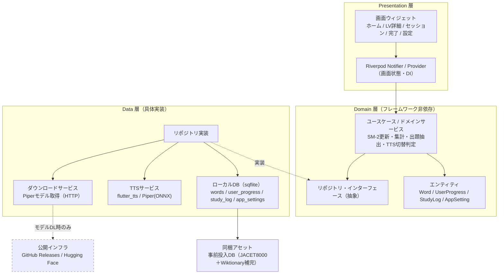
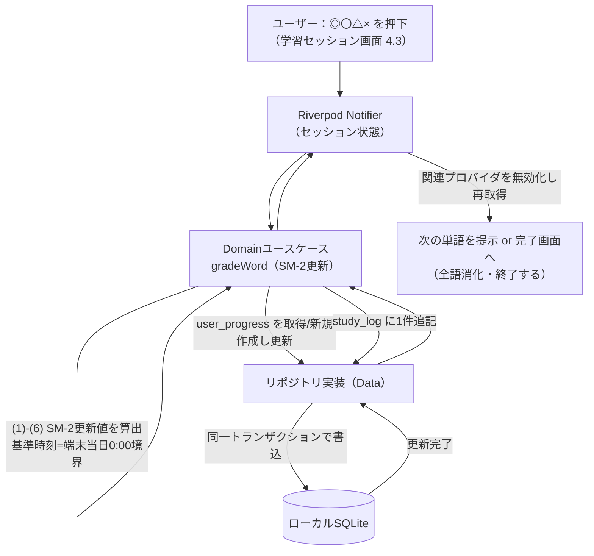
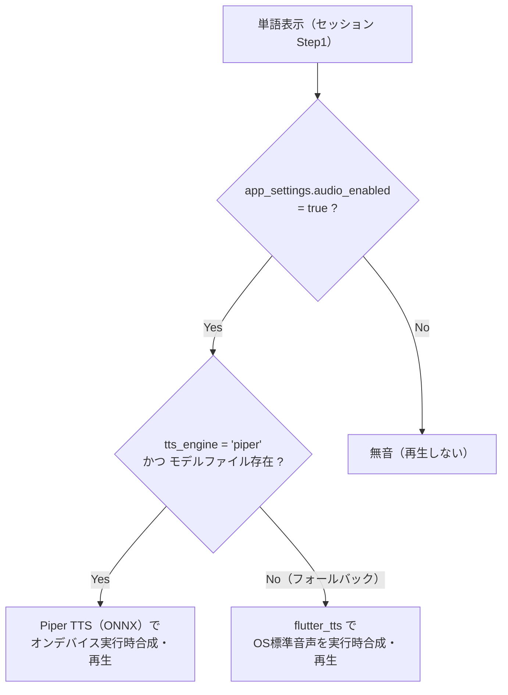

# システムアーキテクチャ設計書

| 項目 | 内容 |
|---|---|
| 文書名 | システムアーキテクチャ設計書 |
| プロジェクト名 | JACET Vocabulary Learner |
| 版数 | v1.0 |
| 作成日 | 2026-07-02 |
| 更新日 | 2026-07-02 |

---

## 1. 本書の目的と位置づけ

本書は「JACET Vocabulary Learner」（Flutter/Dart によるモバイルアプリ、iOS/Android、非商用・教育目的）のシステムアーキテクチャ全体像を定義する設計書である。RFP（`doc/rfp.md` v1.1）の第4〜7章および第9章で確定した設計事項に基づき、アプリ全体をどのようなレイヤ・モジュール・依存関係で構成するかを規定する。

本書が扱う範囲は「全体構造・レイヤ責務・状態管理方式・ディレクトリ構成・依存パッケージ・オフライン方針・データフロー」に限定する。各機能の実装レベルの詳細設計は、以下の別文書に委ねる。本書はそれらを束ねるアーキテクチャの土台としてのみ機能する。

| 詳細を委ねる文書 | 主な担当範囲 |
|---|---|
| 画面設計書 | 各画面のウィジェット構成・レイアウト・遷移詳細（RFP 第4章） |
| データ設計書 | テーブル定義・インデックス・DAO/クエリ・同梱DB生成（RFP 第6章） |
| SM-2ロジック設計書 | 評価更新規則・擬似コードのクラス化・進捗率算出（RFP 第5章） |
| TTS設計書 | flutter_tts / Piper TTS の切替・モデルダウンロード・音声合成（RFP 第4.5章・第7章） |

> 本書では個別のクラス名・ウィジェット名・メソッドシグネチャの確定は行わない。図中に現れる名称は構造説明のための代表例であり、確定は上記の各詳細設計書で行う。

---

## 2. アーキテクチャ方針（サマリ）

- **レイヤードアーキテクチャ**（Presentation / Domain / Data の3層）を採用する。依存方向は **Presentation → Domain、Data → Domain（抽象への依存）** とし、Domain 層を他層に依存しない中核に置く（依存性逆転）。Presentation は Domain のユースケース／抽象に依存し、Data は Domain が定義するリポジトリ・インターフェースを実装する。これによりビジネスロジック（SM-2・集計）をUIやDB実装から独立させ、テスト容易性と変更耐性を確保する。
- **状態管理は Riverpod（flutter_riverpod）を推奨**とする（理由は第4章）。
- **オフラインファースト**を徹底する。単語データは静的DBとしてアプリに同梱し、実行時にAPIを呼ばない。ネットワークを使う処理は「Piper TTSモデルの任意ダウンロード」だけに限定する（RFP 第7章・第9章）。
- **音声はオンデバイス実行時合成**。flutter_tts（OS標準・初期値）と Piper TTS（ONNXモデル・任意DL）を `app_settings.tts_engine` で切り替える。単語音声の事前生成・同梱は行わない（`words.audio_file_path` は将来用予約カラム）。
- データ永続化はローカル SQLite のみ。クラウド同期・アカウント機能は本バージョンのスコープ外（RFP 第7章・第8章）。

---

## 3. レイヤードアーキテクチャ定義

アプリを3層に分割する。上位層は下位層の抽象（インターフェース）にのみ依存し、下位層は上位層を知らない。Domain 層は Presentation にも Data にも依存しない中核とし、Data 層は Domain が定義するリポジトリ・インターフェースを実装する（依存性逆転）。

### 3.1 Presentation 層（プレゼンテーション層）

- **責務**: 画面の描画とユーザー操作の受付。RFP 第4章の全画面（ホーム／LV詳細／学習セッション／完了／設定）を構成する。
- **Flutter 上の要素**: `Widget`（画面・部品）、Riverpod の `Provider`/`Notifier`（画面状態・入力ハンドリング）、ルーティング。
- **原則**: UI は状態（State）を購読して描画するのみ。ビジネスロジック（SM-2計算・集計・DBアクセス）を直接持たず、Domain 層のユースケース／サービスを呼び出す。TTS再生やダウンロードの起動も Domain 経由で行う。

### 3.2 Domain 層（ドメイン層）

- **責務**: アプリ固有のビジネスルールを表現する。フレームワーク非依存（Flutter/SQLite の型に依存しない純粋な Dart）。
- **要素**:
  - **エンティティ**: `Word`、`UserProgress`、`StudyLog`、`AppSetting` 等の概念モデル。
  - **ユースケース／ドメインサービス**: SM-2評価更新（RFP 第5章）、進捗率・ストリーク・苦手TOP5・復習予定・学習量推移の集計ロジック（RFP 第4.2章）、新規/復習セッションの出題抽出（RFP 第4.3章）、TTSエンジン切替判定（RFP 第4.5章）。
  - **リポジトリ・インターフェース**: 単語・進捗・学習ログ・設定・TTS・ダウンロードへのアクセス契約（抽象）。実装は Data 層が担う。
- **原則**: SM-2の増減値・interval算出・進捗率式（RFP 第5章の確定仕様）はこの層に集約し、UIやDB実装から独立させる。基準時刻は「端末ローカル日付の当日（0:00境界）」を用いる（RFP 5.2）。

### 3.3 Data 層（データ層）

- **責務**: 永続化・外部リソースアクセスの具体実装。Domain 層のリポジトリ・インターフェースを実装する。
- **要素**:
  - **ローカルDB（sqflite）**: `words`（静的・事前投入）、`user_progress`、`study_log`、`app_settings` への CRUD と集計クエリ（RFP 第6章）。同梱DBの初回コピー・オープンもここで扱う。
  - **TTSサービス**: flutter_tts ラッパと Piper TTS（ONNXランタイム）ラッパ。`tts_engine` とモデルファイル存在有無でフォールバックする（RFP 4.5「音声再生ロジック」）。
  - **ダウンロードサービス**: Piper TTSモデル（`.onnx`）を公開インフラ（GitHub Releases / Hugging Face 等）から取得し、進捗を通知、ローカル保存、パスを `app_settings.piper_model_path` に記録（RFP 4.5・第9章）。
  - **モデル/マッパ**: DBの行（Map）と Domain エンティティの相互変換。
- **原則**: SQLite やパッケージ固有の型はこの層に閉じ込め、Domain へ漏らさない。

### 3.4 層間のデータ受け渡し

Presentation は Riverpod プロバイダ経由で Domain ユースケースを呼び、結果（エンティティ／State）を購読する。Domain はリポジトリ・インターフェースを通じて Data に処理を委譲する。Data は具体実装（sqflite / flutter_tts / ONNX / HTTP）を Domain のインターフェースへ適合させる。

---

## 4. 状態管理方式（推奨：Riverpod）

本アプリの状態管理には **Riverpod（`flutter_riverpod`）を推奨**する。

### 4.1 推奨理由

1. **レイヤードアーキテクチャとの整合**: Provider をDI（依存性注入）機構として利用でき、Domain のユースケースやリポジトリ実装（Data 層）をツリー外で束ねられる。UIとロジックの分離という本設計の狙いに合致する。
2. **`BuildContext` 非依存**: Riverpod は状態の参照に `BuildContext` を必須としないため、SM-2計算や集計処理をウィジェットツリーから切り離して呼び出せる。ロジックのユニットテストが容易になる。
3. **非同期状態の標準サポート**: `AsyncValue`（`FutureProvider`/`AsyncNotifier`）によりロード中・成功・エラーを型安全に表現できる。DB集計やモデルダウンロード進捗など、非同期処理が多い本アプリに適する。
4. **きめ細かい再描画**: プロバイダ単位の購読により、必要なウィジェットだけを再構築でき、LVリストや各種グラフを含むホーム/詳細画面のパフォーマンスに寄与する。
5. **コンパイル時安全性**: グローバルなプロバイダ定義により、実行時の型解決に頼らず依存を解決できる。1日でのMVP実装（RFP 第8章）でもボイラープレートが少なく、保守性が高い。

### 4.2 状態管理の適用方針

- 画面ごとの状態は `Notifier`/`AsyncNotifier` に集約する（例：セッション進行状態、設定画面のTTS状態、ホームの復習件数）。
- リポジトリ・ユースケースは `Provider` として公開し、Notifier からのみ参照する。
- グレード押下・設定変更などの副作用（DB更新・TTS再生）は Notifier のメソッド内で Domain ユースケースを呼んで行い、完了後に関連プロバイダを無効化（`invalidate`）して画面を再取得させる。

> 代替案として `Provider`（無印）や `Bloc` も成立するが、`BuildContext` 非依存・DI一体化・`AsyncValue` の3点で Riverpod が本設計の分離方針に最も適合するため、本書では Riverpod を推奨とする。

---

## 5. モジュール依存関係

### 5.1 レイヤ／モジュール依存図



- 依存の向きは **Presentation → Domain** と **Data → Domain（抽象への依存）** の2方向であり、いずれも Domain 層へ向かう。Domain は Presentation にも Data にも依存しない中核である。
- Data 層のリポジトリ実装は Domain のインターフェースを実装する（依存性逆転：図中の破線「実装」が Data から Domain の抽象へ向かう）。
- 実行時の呼び出しは Presentation → Domain → （抽象経由で）Data の順に処理が委譲されるが、これはコンパイル時の依存方向とは独立であり、ソースコード上の依存は常に Domain へ向かう。
- 破線の `NET`（公開インフラ）への依存は **Piper TTSモデルのダウンロード時のみ**発生する任意経路であり、通常の学習機能はすべて同梱アセットとオンデバイス処理で完結する（オフラインファースト）。

---

## 6. ディレクトリ／フォルダ構成（`lib/` 配下）

RFP の画面・機能とレイヤ責務に対応させ、`lib/` を以下の構成とする。フォルダ名は代表例であり、細部は各詳細設計書で確定する。

```text
lib/
├── main.dart                     # エントリポイント（起動・ProviderScope）
├── app.dart                      # ルートウィジェット・テーマ・ルーティング設定
│
├── core/                         # 全層共通の基盤（ロジックを持たない）
│   ├── constants/                # 定数（LV定義・SM-2定数値・DL先URL等）
│   ├── theme/                    # テーマ・配色
│   ├── router/                   # 画面遷移定義（RFP 4.0 の遷移図に対応）
│   └── utils/                    # 日付ユーティリティ（当日境界・7日間算出等）
│
├── domain/                       # Domain 層（Flutter非依存の純Dart）
│   ├── entities/                 # Word / UserProgress / StudyLog / AppSetting
│   ├── repositories/             # リポジトリ・インターフェース（抽象）
│   └── usecases/                 # SM-2更新・進捗率・ストリーク・苦手TOP5・
│                                 #   復習予定・学習量推移・出題抽出・TTS切替判定
│
├── data/                         # Data 層（具体実装）
│   ├── datasources/
│   │   └── local/                # sqflite データベース・DAO・同梱DB初期化
│   ├── models/                   # DB行 ⇔ エンティティ変換用モデル
│   ├── repositories/             # domain/repositories の実装
│   └── services/
│       ├── tts/                  # flutter_tts ラッパ / Piper(ONNX) ラッパ
│       └── download/             # Piperモデル ダウンロード（進捗通知付き）
│
└── presentation/                 # Presentation 層
    ├── home/                     # ホーム画面（LV選択・今日の復習ブロック）4.1
    ├── level_detail/             # LV詳細画面（進捗・ストリーク・グラフ）4.2
    ├── session/                  # 学習セッション（新規/復習 共通UI）4.3
    ├── complete/                 # 完了画面（新規/復習）4.4
    ├── settings/                 # 設定画面（音声ON/OFF・TTS切替・クレジット）4.5
    ├── common/                   # 共通ウィジェット（プログレスバー・ボタン等）
    └── providers/                # 画面横断の Riverpod プロバイダ（DI集約点）
```

同梱する事前投入DB（静的データ）はアプリのアセットとして配置し、`pubspec.yaml` に登録する。

```text
assets/
└── db/
    └── jacet_vocab.db            # 事前収集済みの静的DB（words を投入済み）
```

> 単語データの収集・変換（JACET8000＋Wiktionary補完）は本アプリのスコープ外（RFP 第9章）。本アプリは生成済みの `jacet_vocab.db` を同梱・利用するのみ。

---

## 7. 依存パッケージ一覧

RFP の機能に対応する主要パッケージを用途つきで示す。バージョンは実装時に最新安定版へ確定する。

| パッケージ | レイヤ | 用途 |
|---|---|---|
| `flutter_riverpod` | Presentation / DI | 状態管理・依存性注入（第4章の推奨方式） |
| `sqflite` | Data | ローカル SQLite の永続化・集計クエリ（RFP 第6章） |
| `path_provider` | Data | アプリ用ディレクトリ取得（DB配置先・Piperモデル保存先の解決） |
| `path` | Data / core | ファイルパス結合（プラットフォーム差異の吸収） |
| `flutter_tts` | Data (TTS) | OS標準TTSによる実行時音声合成・再生（初期値エンジン、RFP 4.5） |
| `sherpa_onnx` | Data (TTS) | Piper TTS（VITS/`.onnx`）をONNXランタイムでオンデバイス合成する統合ライブラリ（RFP 4.5・第7章） |
| `dio` | Data (Download) | Piper TTSモデルのHTTPダウンロード。`onReceiveProgress` による進捗表示に対応（RFP 4.5「ダウンロード仕様」） |
| `fl_chart` | Presentation | 円グラフ（完了画面の◎〇△×割合）・棒グラフ（学習量推移）・進捗表現（RFP 4.2・4.4） |
| `intl` | core / Presentation | 日付整形・曜日算出（ストリーク・過去7日カレンダー） |

補足:
- **ONNXランタイム／Piper TTS**: Piper の音声モデルは VITS ベースの `.onnx` であり、`sherpa_onnx` はこれをオンデバイスで実行できる統合パッケージ（内部でONNXランタイムを内包）である。素のONNXランタイム（`onnxruntime`）＋音素化を個別に組む方式より結合コストが低いため本書では `sherpa_onnx` を第一候補とする。最終選定はTTS設計書で確定する。
- **ダウンロードHTTPクライアント**: 進捗（%）表示（RFP 4.5）が要件のため、進捗コールバックを標準サポートする `dio` を推奨する。軽量な `http` でも代替可能だが進捗取得の実装コストが増える。
- **チェックサム検証**: 初期版はダウンロード物の改ざん検証を実装しない（RFP 第9章）。したがってハッシュ検証系パッケージは初期版の依存に含めない。
- 上表はアーキテクチャ上必須の中核依存に限定する。モデル定義補助（コード生成等）や小規模ユーティリティの採否は各詳細設計書で判断する。

---

## 8. オフラインファースト方針とデータフロー

### 8.1 オフライン方針

- **静的データ同梱**: 単語・定義・発音記号・活用形・例文・コロケーションは事前収集済みの静的DB（`assets/db/jacet_vocab.db`）としてアプリに同梱する。実行時にWiktionary等のAPIを呼ばない（RFP 第2章・第7章）。
- **全機能オフライン動作**: 学習・復習・集計・音声再生を含む全機能が、機内モードでも動作する（RFP 第7章・第11章の受け入れ基準）。
- **唯一のネットワーク利用**: Piper TTSモデルの任意ダウンロードのみ。ユーザーが設定画面で明示的に要求したときだけ発生し、失敗しても flutter_tts で全機能が継続する（RFP 4.5）。
- **音声はオンデバイス実行時合成**: 単語表示ごとにテキストから都度リアルタイム合成する。音声ファイルの事前生成・同梱・キャッシュはしない（RFP 4.5・第7章）。`words.audio_file_path` は将来用予約カラム（初期版は常にNULL）。

### 8.2 初回起動時のDB初期化フロー

同梱DBは読み取り専用アセットのため、書き込み可能なアプリ領域へ初回のみコピーして利用する。

1. `path_provider` でアプリのドキュメント/データベースディレクトリを取得。
2. 当該ディレクトリに稼働用DBが未配置なら、`assets/db/jacet_vocab.db` をコピー（`words` は投入済み。`user_progress`・`study_log`・`app_settings` は空／初期値）。
3. `sqflite` でオープンし、以降の全アクセスはこの稼働用DBに対して行う。

### 8.3 主要データフロー図（学習セッションでの評価押下）

RFP 4.3 の Step1→Step2→Step3 のうち、評価押下時（Step3）の一連の流れをレイヤ横断で示す。



- SM-2の計算（RFP 第5章の確定式）は Domain 層のユースケース内で完結し、Presentation と Data は結果の受け渡しのみを担う。
- 未学習単語は初回評価時に `user_progress` を初期値で新規作成し、同一処理内で更新・`study_log` 追記まで行う（RFP 5.2・5.3）。
- 集計系画面（ホームの復習件数、LV詳細の進捗率・ストリーク・苦手TOP5・復習予定・学習量推移）は、評価押下後に関連プロバイダが無効化されることで最新DB状態を反映する。

### 8.4 TTS音声再生のデータフロー



RFP 4.5「音声再生ロジック」に一致する。Piper 未使用・未ダウンロード・削除後はいずれも flutter_tts にフォールバックし、常にオフラインで再生できる。

---

## 9. RFP確定事項との整合

本書は RFP 第4〜7章・第9章の確定事項に準拠し、以下を満たす。

- 画面構成・遷移（第4章）… Presentation 層の各機能フォルダと `core/router` に対応。
- SM-2仕様（第5章）… Domain 層のユースケースに集約。増減値・interval式・進捗率式は本書で再定義せず、SM-2ロジック設計書へ委譲。
- DB設計（第6章）… Data 層（sqflite）に対応。テーブル/インデックス/ER図の詳細はデータ設計書へ委譲。
- 非機能（第7章）… オフライン動作・TTS切替・ローカル永続化・クラウド同期スコープ外を本書の方針に反映。
- スコープ外・実装方針（第9章）… データ収集スコープ外、Piperモデルの公開インフラ取得、チェックサム非検証、実行時合成方式、集計性能をアーキテクチャ前提として明記。

---

## 10. 更新履歴

| 版数 | 日付 | 内容 |
|---|---|---|
| v1.0 | 2026-07-02 | 初版作成。レイヤードアーキテクチャ（Presentation/Domain/Data）、Riverpod推奨、`lib/`構成、依存パッケージ、オフラインファースト方針、レイヤ依存図・主要データフロー図（Mermaid）を規定。 |
