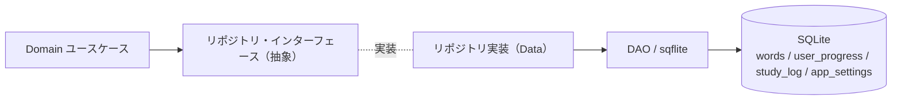
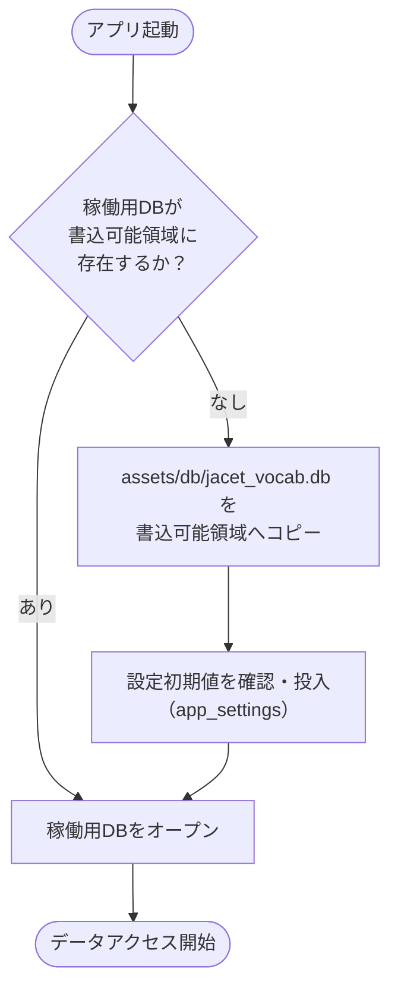
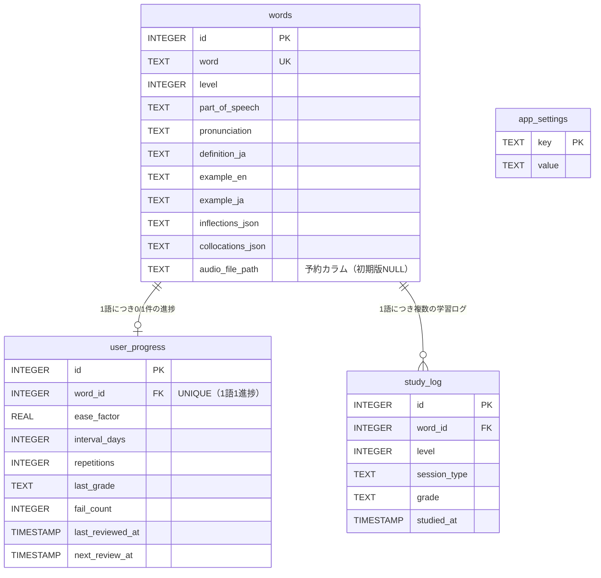

# データ設計書（DB・データアクセス設計）

| 項目 | 内容 |
|---|---|
| 文書名 | データ設計書（DB・データアクセス設計） |
| プロジェクト名 | JACET Vocabulary Learner |
| 版数 | v1.0 |
| 作成日 | 2026-07-02 |
| 更新日 | 2026-07-02 |

---

## 1. 本書の目的と位置づけ

本書は「JACET Vocabulary Learner」（Flutter/Dart によるモバイルアプリ、iOS/Android、非商用・教育目的）のデータ層（DB スキーマ・インデックス・データアクセス設計）を定義する設計書である。RFP（`doc/rfp.md` v1.1）第6章「データベース設計（SQLite）」を主たる根拠とし、第2章（データソース）・第4章（画面/集計要件）・第5章（SM-2 仕様）・第7章（非機能）・第9章（実装方針）で確定した事項に整合させる。

本書が扱う範囲は以下に限定する。

- テーブル定義（`words` / `user_progress` / `study_log` / `app_settings`）とカラムの意味・制約
- インデックス設計とその根拠
- リポジトリ／DAO 層のインターフェース設計
- 主要クエリの設計（擬似 SQL）
- 静的データの同梱・初期投入戦略
- `app_settings` の想定キーと初期値
- ER 図（RFP 準拠）

DB を利用するアプリ全体のレイヤ構造・依存パッケージ（`sqflite` 採用等）は「システムアーキテクチャ設計書」（`docs/architecture-design.md`）で確定済みであり、本書はその Data 層の内部設計を担う。SM-2 アルゴリズムの計算規則そのものは RFP 第5章の確定仕様に従い、本書ではその結果を永続化・参照する観点のみを扱う。

> **前提（RFP 準拠）**: 単語データ（JACET8000 + Wiktionary 補完、最大8000語）の収集・変換フローは本 RFP のスコープ外（別途進行）である。本書は「事前収集済みの静的データを同梱する」前提での DB・データアクセス設計を対象とする。

---

## 2. データベース全体像

| テーブル | 種別 | 役割 | 更新主体 |
|---|---|---|---|
| `words` | 静的（事前投入・読み取り専用） | 単語マスタ（語・レベル・定義・発音記号・活用形・例文・コロケーション） | 同梱 DB（実行時は原則書き込みなし） |
| `user_progress` | 動的 | 単語ごとの学習進捗・SM-2 パラメータ（1語につき 0/1 件） | 学習セッションの評価押下時 |
| `study_log` | 動的（追記のみ） | 評価押下ごとの学習履歴（ストリーク・学習量推移の集計元） | 学習セッションの評価押下時 |
| `app_settings` | 動的 | キー・バリュー形式のアプリ設定（音声 ON/OFF・TTS エンジン・Piper モデルパス） | 設定画面操作時 |

- DB エンジンは SQLite（Flutter からは `sqflite` パッケージ経由）。クラウド同期は本バージョンのスコープ外（RFP 第7章）。
- 想定データ規模は最大 8000 語（1000語 × 8レベル）。`user_progress` は学習が進むほど増えるが上限は語数と同じ 8000 件、`study_log` は追記のみで増加するが個人利用の履歴規模に収まる。

---

## 3. テーブル定義

RFP 第6章の SQL 定義に準拠して再掲し、各カラムの意味・制約を表で整理する。SQL 本文は RFP と同一である。

### 3.1 `words`（静的データ、事前投入）

```sql
CREATE TABLE words (
  id INTEGER PRIMARY KEY,
  word TEXT UNIQUE NOT NULL,
  level INTEGER NOT NULL,           -- 1-8
  part_of_speech TEXT,
  pronunciation TEXT,               -- IPA
  definition_ja TEXT,
  example_en TEXT,
  example_ja TEXT,
  inflections_json TEXT,            -- {"plural": "apples", ...}
  collocations_json TEXT,           -- ["an apple a day", ...]
  audio_file_path TEXT              -- 【予約カラム】将来のPiper TTS事前生成音声ファイル用。初期版はflutter_ttsで実行時生成するため常にNULL（第7章 音声方式を参照）
);
```

| カラム | 型 | NULL 可否 | 制約・既定 | 意味 |
|---|---|---|---|---|
| `id` | INTEGER | 不可 | PRIMARY KEY | 単語の一意識別子。`user_progress`・`study_log` から参照される。 |
| `word` | TEXT | 不可 | UNIQUE, NOT NULL | 英単語見出し。重複禁止（同一語の二重投入を防止）。 |
| `level` | INTEGER | 不可 | NOT NULL（値域 1〜8） | JACET8000 のレベル（1000語ごとに 1〜8）。LV 別出題・進捗率・苦手 TOP5 の絞り込みに使用。 |
| `part_of_speech` | TEXT | 可 | － | 品詞。データが無い場合は NULL（画面ではセクション非表示）。 |
| `pronunciation` | TEXT | 可 | － | 発音記号（IPA）。単語表示時に併記。 |
| `definition_ja` | TEXT | 可 | － | 日本語の意味。 |
| `example_en` | TEXT | 可 | － | 例文（英文、1つ）。 |
| `example_ja` | TEXT | 可 | － | 例文の日本語訳。 |
| `inflections_json` | TEXT | 可 | － | 活用形を格納した JSON 文字列（例: `{"plural":"apples"}`）。アプリ側でパースして表示。 |
| `collocations_json` | TEXT | 可 | － | コロケーションを格納した JSON 配列文字列（例: `["an apple a day"]`）。 |
| `audio_file_path` | TEXT | 可 | － | **予約カラム**。将来の Piper TTS 事前生成音声ファイルのパス用。**初期版は常に NULL**（後述 3.5）。 |

- 主キー `id` は SQLite の暗黙的 `rowid` に一致する INTEGER PRIMARY KEY。
- `word` の UNIQUE 制約により、`word` 列には自動的にインデックスが作成される。
- JSON 列（`inflections_json` / `collocations_json`）は「あれば表示、無ければセクションごと非表示」（RFP 4.3）という UI 要件に合わせ、正規化せず JSON 文字列として保持する。DB 側での構造化検索は不要なため、この非正規化を許容する。

### 3.2 `user_progress`（学習進捗、SM-2 パラメータ）

```sql
CREATE TABLE user_progress (
  id INTEGER PRIMARY KEY,
  word_id INTEGER NOT NULL UNIQUE,   -- 1語につき進捗レコードは0/1件（ER図と一致。UNIQUEで1語1進捗を保証）
  ease_factor REAL DEFAULT 2.5,
  interval_days INTEGER DEFAULT 0,
  repetitions INTEGER DEFAULT 0,
  last_grade TEXT,                  -- '◎' '〇' '△' '×' or NULL(未学習)
  fail_count INTEGER DEFAULT 0,     -- ×を押された累計回数（苦手単語TOP5用）
  last_reviewed_at TIMESTAMP,
  next_review_at TIMESTAMP,
  FOREIGN KEY(word_id) REFERENCES words(id)
);
```

| カラム | 型 | NULL 可否 | 制約・既定 | 意味 |
|---|---|---|---|---|
| `id` | INTEGER | 不可 | PRIMARY KEY | 進捗レコードの一意識別子。 |
| `word_id` | INTEGER | 不可 | NOT NULL, **UNIQUE**, FOREIGN KEY → `words(id)` | 対象単語。UNIQUE により **1語につき進捗は 0/1 件**（1語1進捗）を保証。 |
| `ease_factor` | REAL | 可 | **DEFAULT 2.5** | SM-2 の易しさ係数。初期値 2.5、下限 1.3（RFP 5.1）。interval 算出の乗数。 |
| `interval_days` | INTEGER | 可 | **DEFAULT 0** | 次回復習までの日数。未学習は 0。 |
| `repetitions` | INTEGER | 可 | **DEFAULT 0** | 連続成功回数。× で 0 にリセット。初回 interval 適用判定に使用。 |
| `last_grade` | TEXT | 可 | － | 最新の評価値（`'◎'` `'〇'` `'△'` `'×'`）。未学習は NULL。**進捗率算出は本カラムのみを用いる**（RFP 5.4）。 |
| `fail_count` | INTEGER | 可 | **DEFAULT 0** | × を押された累計回数。苦手単語 TOP5 の集計キー。 |
| `last_reviewed_at` | TIMESTAMP | 可 | － | 最終学習/復習日時。未学習は NULL。苦手 TOP5 の同数時タイブレークに使用。 |
| `next_review_at` | TIMESTAMP | 可 | － | 次回復習予定日時（`last_reviewed_at + interval_days 日`）。復習対象抽出・復習予定数の集計キー。未学習は NULL。 |

- **1語1進捗の保証**: `word_id` の UNIQUE 制約により、ER 図の「1語につき 0/1 件の進捗」を DB レベルで担保する。未学習単語は `user_progress` にレコードが存在せず、初回評価時に初期値レコードを新規作成する（RFP 5.2(0)・5.3）。
- **初期値の一致**: DEFAULT 値（`ease_factor=2.5` / `interval_days=0` / `repetitions=0` / `fail_count=0`）は RFP 5.2(0) の新規作成初期値と一致する。アプリ側で明示的に初期値を投入する場合も、DEFAULT と同値とする。
- **参照整合性**: `word_id` は `words(id)` を参照する外部キー。`words` は事前投入の静的データであり実行時に削除されないため、参照先欠落は発生しない。

### 3.3 `study_log`（学習量推移グラフ・ストリーク計算用）

```sql
CREATE TABLE study_log (
  id INTEGER PRIMARY KEY,
  word_id INTEGER NOT NULL,
  level INTEGER NOT NULL,
  session_type TEXT,                -- 'new' or 'review'
  grade TEXT,                       -- '◎' '〇' '△' '×'
  studied_at TIMESTAMP,
  FOREIGN KEY(word_id) REFERENCES words(id)
);
```

| カラム | 型 | NULL 可否 | 制約・既定 | 意味 |
|---|---|---|---|---|
| `id` | INTEGER | 不可 | PRIMARY KEY | 学習ログの一意識別子。 |
| `word_id` | INTEGER | 不可 | NOT NULL, FOREIGN KEY → `words(id)` | 学習対象の単語。UNIQUE ではない（1語につき複数ログ）。 |
| `level` | INTEGER | 不可 | NOT NULL | 学習時のレベル。学習量推移グラフ（LV 内）の絞り込みに使用（`words` を JOIN せず集計できるよう冗長保持）。 |
| `session_type` | TEXT | 可 | － | セッション種別（`'new'` = 新規学習 / `'review'` = 復習）。 |
| `grade` | TEXT | 可 | － | 押下した評価値（`'◎'` `'〇'` `'△'` `'×'`）。 |
| `studied_at` | TIMESTAMP | 可 | － | 学習日時。ストリーク・過去7日学習量の集計キー。 |

- **追記専用**: 評価押下ごとに 1 件 INSERT する（RFP 5.3・受け入れ基準）。更新・削除は行わない。
- **`level` の冗長保持**: LV 別の学習量推移集計を `words` との JOIN なしで実行できるよう、学習時点のレベルをログ自身に持たせる。集計クエリの単純化・高速化が目的。
- **非識別リレーション**: `word_id` は `words(id)` を参照する外部キー（1語につき複数の学習ログ）。`words` は静的で削除されないため学習履歴の保持に支障はない（RFP 6章 ER 図の注記に一致）。

### 3.4 `app_settings`

```sql
CREATE TABLE app_settings (
  key TEXT PRIMARY KEY,
  value TEXT
);
```

| カラム | 型 | NULL 可否 | 制約・既定 | 意味 |
|---|---|---|---|---|
| `key` | TEXT | 不可 | PRIMARY KEY | 設定キー。 |
| `value` | TEXT | 可 | － | 設定値（文字列として保持）。 |

- 他テーブルとのリレーションを持たない単独のキー・バリューストア。想定キーと初期値は第7章に定義する。

### 3.5 `audio_file_path` 予約カラムの扱い

- `words.audio_file_path` は将来の Piper TTS 事前生成音声ファイル用の**予約カラム**であり、**初期版では全行 NULL** とする（RFP 4.5・第7章・第9章）。
- 初期版は flutter_tts / Piper TTS のいずれも「単語表示のたびに実行時オンデバイス合成」する方式であり、単語ごとの音声ファイルを事前生成・同梱・キャッシュしない。したがって本カラムを参照・書き込みするコードは初期版に存在しない。
- 実機検証で実行時合成のレイテンシがユーザー体験上許容できないと判明した場合に限り、本カラムに事前生成音声のパスを格納し、事前生成キャッシュ方式へ切り替える余地を残す。スキーマ変更（マイグレーション）なしに方式変更へ移行できるよう、初期版から列だけを保持しておく設計である。

---

## 4. インデックス設計

### 4.1 定義

RFP 第6章のインデックス定義に準拠する。

```sql
CREATE INDEX idx_words_level              ON words(level);
CREATE INDEX idx_progress_next_review     ON user_progress(next_review_at); -- 復習対象・復習予定の抽出
CREATE INDEX idx_progress_fail_count      ON user_progress(fail_count);     -- 苦手単語TOP5
CREATE INDEX idx_study_log_studied_at     ON study_log(studied_at);         -- ストリーク・学習量推移
CREATE INDEX idx_study_log_level          ON study_log(level);
```

加えて、以下は制約により暗黙的にインデックス化されるため追加定義は不要である。

- `words.word`（UNIQUE 制約 → 暗黙インデックス）
- `user_progress.word_id`（UNIQUE 制約 → 暗黙インデックス。単語単位の進捗参照に利用）

### 4.2 各インデックスの根拠

対象規模は最大 8000 語（`user_progress` 最大 8000 件、`study_log` は追記増加）。全機能オフライン・端末内 SQLite での集計を、体感遅延なく（インデックスによりフルスキャンを回避して）実行することを目的とする。

| インデックス | 対象クエリ／画面要件 | 根拠 |
|---|---|---|
| `idx_words_level` | 新規学習の未学習語抽出、進捗率・苦手 TOP5 の LV 絞り込み | LV 別出題・LV 詳細集計は常に `level` で絞り込む。`level` は 8 種のみだが 8000 行の全走査を避け、対象 1000 行に限定するため付与。 |
| `idx_progress_next_review` | 復習対象抽出（`next_review_at ≦ 今日`）／明日・今週の復習予定数 | ホーム画面・復習セッション・LV 詳細で最も頻繁に走る範囲検索。`next_review_at` の範囲・並び替え（古い順）を効率化する。 |
| `idx_progress_fail_count` | 苦手単語 TOP5（`fail_count` 降順） | 降順ソート＋上位5件取得を、ソートコストを抑えて実行するため付与。 |
| `idx_study_log_studied_at` | ストリーク計算・過去7日の学習量推移 | `studied_at` の範囲（過去7日）と日別集計を効率化。追記で増える `study_log` に対し日付範囲を絞る主キー。 |
| `idx_study_log_level` | 学習量推移グラフ（LV 内、日別） | LV 詳細の学習量推移は `level` で絞り込む。`studied_at` との併用で対象行を限定。 |

- 苦手 TOP5 は `fail_count` 降順に加え「同数時 `last_reviewed_at` 古い順」のタイブレークを伴う（RFP 4.2）。`idx_progress_fail_count` は主ソートキーを支え、タイブレーク列（`last_reviewed_at`）は上位候補内の少数行に対する二次ソートで解決するため、複合インデックスは初期版では不要と判断する。8000 語規模では単一列インデックスで実用性能を満たす。
- インデックスは書き込み時のコストを伴うが、本アプリの書き込みは 1 評価あたり `user_progress` 1 件更新＋`study_log` 1 件追記と少量であり、集計読み取りの高速化の利得が上回る。

---

## 5. リポジトリ／DAO 層の設計

### 5.1 レイヤ方針

アーキテクチャ設計書に従い、Domain 層に抽象リポジトリ・インターフェースを置き、Data 層に `sqflite` を用いた具体実装（DAO）を置く。Presentation/Domain は SQL を直接知らず、リポジトリのメソッド経由でのみ DB へアクセスする。基準時刻 `now` は端末ローカル日付の当日 0:00 境界とし、呼び出し側から引数で受け取る（RFP 5.2）。



### 5.2 リポジトリ・インターフェース一覧

| リポジトリ | 主要メソッド（シグネチャは概念表現） | 対応要件 |
|---|---|---|
| `WordRepository` | `getWord(wordId)` / `getWordsByLevel(level)` / `countWordsByLevel(level)` / `getUnlearnedWordsByLevel(level, limit)` | 単語マスタ参照・新規学習の未学習語抽出（RFP 4.1/4.3） |
| `ProgressRepository` | `getProgress(wordId)` / `createInitialProgress(wordId)` / `updateProgress(progress)` / `upsertGradedProgress(progress)` | 進捗の取得／初期値新規作成／更新（RFP 5.2(0)〜(6)） |
| `ReviewRepository` | `getDueReviewWords(now)` / `countDueToday(now)` / `countDueTomorrow(now)` / `countDueThisWeek(now)` | 復習対象抽出・復習予定数（RFP 4.1/4.2/4.3） |
| `StudyLogRepository` | `appendStudyLog(wordId, level, sessionType, grade, studiedAt)` / `getDailyCounts(level, fromDate, toDate)` / `getStudyDates(fromDate, toDate)` | 学習ログ追記・学習量推移・ストリーク（RFP 4.2） |
| `StatsRepository` | `getLevelProgressRate(level)` / `getWeakWordsTop5(level)` / `getStreak(now)` | 進捗率・苦手 TOP5・ストリーク集計（RFP 4.2/5.4） |
| `SettingsRepository` | `getSetting(key)` / `setSetting(key, value)` / `getAllSettings()` | `app_settings` の読み書き（RFP 4.5/7章） |

### 5.3 主要操作の設計

- **進捗の取得**: `ProgressRepository.getProgress(wordId)` は `user_progress` を `word_id`（UNIQUE インデックス）で 1 件検索し、無ければ `null` を返す（未学習）。
- **進捗の新規作成**: `createInitialProgress(wordId)` は RFP 5.2(0) の初期値でレコードを INSERT する。DEFAULT 値と一致させる。
- **進捗の更新（評価押下）**: 評価処理は「取得 → 無ければ初期値作成 → SM-2 更新 → 保存」を**同一トランザクション**で行う（RFP 5.3）。`upsertGradedProgress` はこの一連を担い、内部で `study_log` への追記まで同一トランザクションに含める（評価 1 回につき `user_progress` 1 件確定＋`study_log` 1 件追記）。SM-2 の計算そのものは Domain 層の SM-2 ロジックが行い、リポジトリは確定後の値を永続化する。
- **study_log 追記**: `appendStudyLog(...)` は `study_log` へ 1 件 INSERT（追記専用）。
- **復習対象抽出**: `getDueReviewWords(now)` は `next_review_at ≦ now` を全レベル横断・`next_review_at` 昇順（古い順）で取得（RFP 4.3 復習セッション、件数上限なし）。
- **集計**: 進捗率・苦手 TOP5・復習予定数・学習量推移・ストリークは `StatsRepository`／`ReviewRepository`／`StudyLogRepository` の各集計メソッドが担い、対応するインデックスを利用する。

---

## 6. 主要クエリの設計（擬似 SQL）

いずれも `:now` は端末ローカル当日 0:00、`:level` は対象レベルをバインドする。日付比較は保存形式（TIMESTAMP 文字列 or エポック）に合わせて実装するが、本節では意味を優先した擬似表現とする。

### 6.1 復習対象（`next_review_at ≦ 今日`、全レベル横断、古い順）

RFP 4.3 復習セッション固有仕様。件数上限なし。

```sql
SELECT w.*, p.next_review_at
FROM   user_progress p
JOIN   words w ON w.id = p.word_id
WHERE  p.next_review_at IS NOT NULL
  AND  p.next_review_at <= :now
ORDER  BY p.next_review_at ASC;   -- 古い順
```

`idx_progress_next_review` により `next_review_at` の範囲抽出とソートを効率化する。

### 6.2 明日・今週の復習予定数（全レベル横断）

RFP 4.2「復習予定」。LV 詳細画面でも全レベル共通の数字を表示する。

```sql
-- 明日の復習予定数（next_review_at が「明日」の1日分）
SELECT COUNT(*)
FROM   user_progress
WHERE  next_review_at >= :tomorrow_start   -- 翌日 0:00
  AND  next_review_at <  :day_after_start; -- 翌々日 0:00

-- 今週の復習予定数（今日から7日以内）
SELECT COUNT(*)
FROM   user_progress
WHERE  next_review_at >= :now              -- 当日 0:00
  AND  next_review_at <  :now_plus_7days;  -- 7日後 0:00
```

なお、ホーム画面の「今日の復習ブロック」件数は 6.1 と同じ条件（`next_review_at ≦ :now`）の `COUNT(*)` で求める。

### 6.3 進捗率（LV 詳細、最新評価のみ）

RFP 5.4。評価値：◎=1.0／〇=0.5／△=0.1／×・未学習=0。分母は該当レベル総単語数（1000語）。過去履歴（`study_log`）は含めない。

```sql
SELECT
  SUM(CASE p.last_grade
        WHEN '◎' THEN 1.0
        WHEN '〇' THEN 0.5
        WHEN '△' THEN 0.1
        ELSE 0            -- '×' および last_grade IS NULL（未学習）は 0
      END)
  / (SELECT COUNT(*) FROM words WHERE level = :level)   -- = 1000
  AS progress_rate
FROM   words w
LEFT   JOIN user_progress p ON p.word_id = w.id
WHERE  w.level = :level;
```

`words` を基点に LEFT JOIN することで、進捗レコードが無い未学習語も分子 0 として自然に扱える（`×`・未学習はいずれも 0）。分母は該当レベルの総単語数（RFP 上 1000 語）。`idx_words_level` で対象 1000 行に限定する。

### 6.4 苦手単語 TOP5（このLV内）

RFP 4.2。`fail_count` 降順、同数時は最終復習日（`last_reviewed_at`）が古い順、最大5件。

```sql
SELECT w.id, w.word, p.fail_count
FROM   user_progress p
JOIN   words w ON w.id = p.word_id
WHERE  w.level = :level
  AND  p.fail_count > 0
ORDER  BY p.fail_count DESC,           -- ×回数が多い順
          p.last_reviewed_at ASC       -- 同数なら最終復習日が古い順
LIMIT  5;
```

`idx_progress_fail_count` が主ソートを支える。`fail_count > 0` の語のみを対象とする（× を一度も受けていない語は苦手として表示しない）。

### 6.5 ストリーク（連続学習日数）と過去7日の学習量

RFP 4.2。ストリークは「新規学習または復習を1回以上行った日」を1日として数えた直近の連続日数。過去7日の学習量は日別件数（新規＋復習の合算）。

```sql
-- 過去7日の学習実施日（ストリーク・カレンダー用）: 日付ごとに1行
SELECT DISTINCT DATE(studied_at) AS study_date
FROM   study_log
WHERE  studied_at >= :now_minus_7days
ORDER  BY study_date DESC;

-- 過去7日の学習量推移（このLV内、日別合算）
SELECT DATE(studied_at) AS study_date, COUNT(*) AS study_count
FROM   study_log
WHERE  level = :level
  AND  studied_at >= :now_minus_7days
GROUP  BY DATE(studied_at)
ORDER  BY study_date ASC;
```

- ストリーク（直近連続日数）の算出は、上記「学習実施日」の集合を取得したうえでアプリ側（Domain 層）で当日から遡って連続数をカウントする。日付境界を跨ぐ連続判定はアプリ側ロジックに委ね、DB は実施日集合の提供に徹する。
- `idx_study_log_studied_at`（範囲）・`idx_study_log_level`（LV 絞り込み）を利用する。

### 6.6 新規学習の未学習語抽出（補助）

RFP 4.3 新規学習セッション（選択 LV の未学習語、最大20語）。

```sql
SELECT w.*
FROM   words w
LEFT   JOIN user_progress p ON p.word_id = w.id
WHERE  w.level = :level
  AND  p.word_id IS NULL      -- 進捗レコードが無い = 未学習
ORDER  BY w.id ASC
LIMIT  20;
```

`idx_words_level` で対象レベルに限定し、進捗未作成（未学習）の語のみを出題順（`id` 昇順）に取得する。

---

## 7. `app_settings` の想定キーと初期値

RFP 4.5・第6章・第7章に基づく。値はすべて文字列で保持する。

| key | 初期値 | 取り得る値 | 説明 |
|---|---|---|---|
| `audio_enabled` | `'true'` | `'true'` / `'false'` | 読み上げ音声の全体 ON/OFF（設定画面 4.5 で管理）。単語表示時の自動再生可否を制御。 |
| `tts_engine` | `'flutter_tts'` | `'flutter_tts'` / `'piper'` | 現在有効な TTS エンジン。初期値は OS 標準の `flutter_tts`。Piper 有効化時に `'piper'` へ切替。 |
| `piper_model_path` | `NULL`（未設定） | 端末ローカルパス文字列 / `NULL` | Piper TTS モデル（`.onnx`）のダウンロード先パス。未ダウンロード時は `NULL`。削除時に `NULL` へ戻す。 |

- 音声再生ロジック（RFP 4.5）: `tts_engine == 'piper'` かつ `piper_model_path` のファイルが存在する場合のみ Piper TTS を使用し、それ以外は `flutter_tts` にフォールバックする。
- 初期投入: 同梱 DB の時点で `audio_enabled` と `tts_engine` の初期値行を投入しておく（`piper_model_path` は未設定＝行なし、または値 NULL）。アプリ側は取得時に既定値でフォールバックできるよう実装する。

---

## 8. 静的データの同梱・初期投入戦略

### 8.1 方式: プリビルド DB 同梱

単語データ（JACET8000 + Wiktionary 補完、最大8000語）の同梱方式として、**プリビルド SQLite DB ファイルをアプリアセットに同梱**する方式を採用する（アーキテクチャ設計書と一致：`assets/db/jacet_vocab.db`）。

理由:

- 8000 語 × 多列（定義・例文・活用形 JSON 等）を INSERT する SQL アセット実行方式は初回起動時のパース・投入コストが大きく、「初回起動が重い」体験を招く。プリビルド DB のファイルコピーは高速で、初回起動の待ち時間を最小化できる。
- 単語データは事前収集済みの静的データ（RFP 第2章・第9章。収集フロー自体はスコープ外）であり、ビルド時点で確定した DB を丸ごと同梱するのが最も単純かつ確実。
- オフライン完結（RFP 第7章）に適合し、実行時 API 呼び出しを一切伴わない。

### 8.2 初期投入フロー（初回起動）



1. 書き込み可能領域（アプリのドキュメント/データベースディレクトリ）に稼働用 DB があるか確認する。
2. 無ければ同梱アセット `assets/db/jacet_vocab.db` を書き込み可能領域へコピーする。コピー直後の DB は次の状態:
   - `words`: 8000語（LV1〜8）投入済み・`audio_file_path` は全行 NULL。
   - `user_progress`: 空（学習開始により作成される）。
   - `study_log`: 空。
   - `app_settings`: 初期値（`audio_enabled='true'`、`tts_engine='flutter_tts'`）投入済み。
3. `sqflite` でオープンし、以降の全アクセスはこの稼働用 DB に対して行う（同梱アセットは以後読み取らない）。

### 8.3 同梱 DB のスキーマ整合

同梱 DB は本書第3〜4章の `CREATE TABLE` / `CREATE INDEX`（RFP 第6章と同一）で構築する。`words` にはデータを投入し、`user_progress`・`study_log` は空、`app_settings` は初期値を投入した状態でビルドする。DB 生成（データ収集・変換）自体は RFP 第9章のとおりスコープ外であり、本書は「その成果物である DB を同梱・投入する」設計のみを規定する。

### 8.4 将来のスキーマ変更（マイグレーション方針）

初期版はスキーマ確定済みであり `sqflite` の `version = 1` で運用する。将来 `audio_file_path` を用いた事前生成方式へ切り替える等の変更が生じた場合は、`onUpgrade` によるマイグレーションで対応する（初期版では列を予約済みのため、この切替はスキーマ変更を伴わずデータ運用のみで実現できる）。

---

## 9. ER 図（RFP 準拠）

RFP 第6章の ER 図に準拠し、4テーブルとリレーションを示す。本文の各テーブル定義（第3章）と整合する。



- `words ||--o| user_progress`: 1語につき進捗は 0/1 件（`user_progress.word_id` の UNIQUE 制約で保証）。
- `words ||--o{ study_log`: 1語につき複数の学習ログ（非識別リレーション）。
- `app_settings`: キー・バリューの単独テーブルで、他テーブルとのリレーションを持たない（RFP 第6章の注記に一致）。

---

## 10. 参照

- `doc/rfp.md`（v1.1）第2章・第4章・第5章・第6章・第7章・第9章
- `docs/architecture-design.md`（システムアーキテクチャ設計書）— Data 層方針・`sqflite` 採用・同梱 DB（`assets/db/jacet_vocab.db`）
- `docs/screen-design.md`（画面設計書）— 各画面が要求する集計・データ項目
