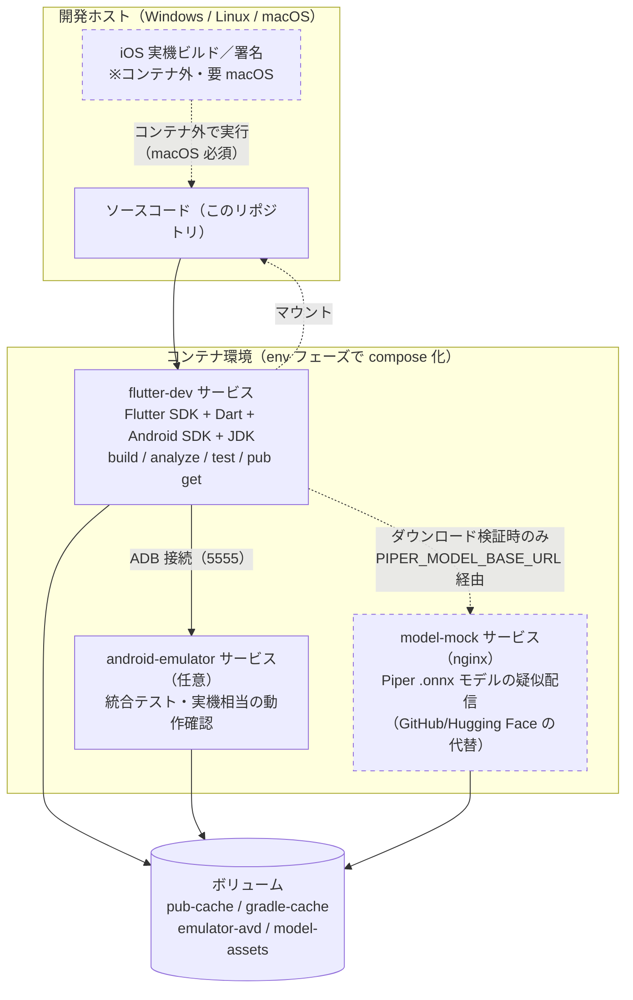
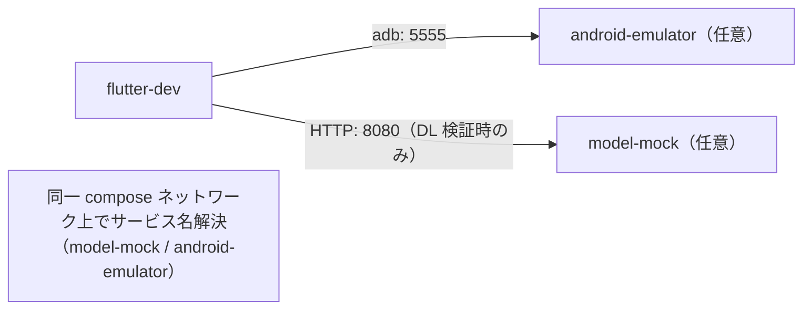
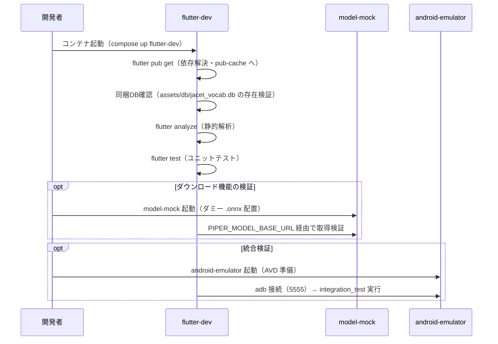

# 開発・実行環境設計書

| 項目 | 内容 |
|---|---|
| 文書名 | 開発・実行環境設計書（DEVELOPMENT-ENVIRONMENT 設計書） |
| プロジェクト名 | JACET Vocabulary Learner |
| 版数 | v1.0 |
| 作成日 | 2026-07-02 |
| 更新日 | 2026-07-02 |

---

## 1. 本書の目的と位置づけ

本書は「JACET Vocabulary Learner」（Flutter/Dart によるモバイルアプリ、iOS/Android、非商用・教育目的）の**開発・ビルド・検証に必要な環境**を設計する文書である。後続の環境構築フェーズ（`env` フェーズ）で `Dockerfile` / `compose` ファイルを作成できるよう、必要なコンテナ／サービス、バージョン、公開ポート、ボリューム、環境変数、初期化手順を規定する。

本書は「設計（何が必要か）」に集中し、**`Dockerfile` や `compose` ファイルの実体は作成しない**（それらは環境構築フェーズの成果物）。アプリ本体のアーキテクチャは `docs/architecture-design.md`（システムアーキテクチャ設計書）に、機能仕様は `doc/rfp.md`（RFP v1.1）に従う。

### 1.1 前提となる本アプリの性質（環境設計上の重要点）

RFP 第2・6・7章より、本アプリは以下の性質を持つ。環境設計はこれに厳密に従い、**アプリが必要としないサーバー資源を作らない**方針とする。

- **オフラインファースト**: 単語データは事前収集済みの静的 SQLite（`assets/db/jacet_vocab.db`）としてアプリに同梱する。実行時に外部 API を呼ばない（RFP 第2章「実行時にAPIを叩かない」）。
- **永続化は端末内の組み込み SQLite（sqflite）のみ**: サーバー側 DB は存在しない。クラウド同期・アカウント機能はスコープ外（RFP 第7章）。→ **サーバー DB コンテナは不要**。
- **状態はすべて端末ローカル**: 共有キャッシュ／セッションストアを持たない。→ **キャッシュサーバー（Redis 等）は不要**。
- **唯一の実行時ネットワーク利用は Piper TTS モデルの任意ダウンロード**（GitHub Releases / Hugging Face 等の公開インフラから `.onnx` を取得。RFP 4.5・第9章）。→ 開発時にこの経路を**オフラインで再現・検証するためのモック配信サービス**のみ、支援サービスとして環境に含める。

> 結論: 本プロジェクトに「アプリのランタイム DB／キャッシュサーバー」は存在しない。したがって本環境設計は **(a) Flutter ビルド・テスト実行環境**、**(b) Android エミュレータ実行環境（統合検証用）**、**(c) Piper モデル配信モック（ダウンロード機能の検証用）** の3系統を対象とする。これらが「開発・実行環境として必要なコンテナ／サービス」である。

---

## 2. 環境全体構成

### 2.1 構成図

### 2.2 各サービスの役割

| サービス | 種別 | 役割 | 必須/任意 |
|---|---|---|---|
| `flutter-dev` | 開発・ビルド | `flutter pub get` / `analyze` / `test` / Android APK・AAB ビルド。CI と同一環境で再現性を確保 | 必須 |
| `android-emulator` | 実行・検証 | 統合テスト（integration_test）と手動動作確認。SM-2・画面遷移・TTS・DL の実機相当検証 | 任意（KVM 前提） |
| `model-mock` | 支援 | Piper TTS モデル（`.onnx`）ダウンロード機能をオフラインで検証するための静的配信（nginx）。成功・失敗・進捗表示（RFP 4.5）を再現 | 任意（DL 検証時） |

> **iOS ビルドはコンテナ化しない**: iOS の署名・ビルドは Apple のツールチェーン（Xcode/macOS）が必須で Linux コンテナで実行できない。iOS 向けはホスト（macOS 環境）で `flutter build ios` を実行する運用とし、本コンテナ環境の対象外とする。この制約は正直に前提として明記する。

---

## 3. サービス別 詳細設計

### 3.1 `flutter-dev`（開発・ビルド環境）

- **目的**: Flutter/Dart のビルド・静的解析・ユニットテスト・Android パッケージング。開発者ローカルと CI で同一イメージを用い、再現性を担保する。
- **ベースイメージ（ピン留め）**: `ghcr.io/cirruslabs/flutter:3.35.5`（Flutter SDK・Dart・Android SDK・JDK を同梱するコミュニティ標準イメージ。タグを固定して再現性を確保する）。自前構築する場合は `ubuntu:24.04` ベースに下表のツールを同一バージョンで導入する。
- **同梱ツールと採用バージョン**（2026-07-02 時点で採用する固定値。後続の環境構築フェーズはこの値をそのまま用いる）:

| ツール | 採用バージョン（固定） | 用途 |
|---|---|---|
| Flutter SDK | `3.35.5`（stable チャネル） | ビルド・テスト基盤 |
| Dart SDK | `3.9.2`（Flutter 3.35.5 同梱） | 言語ランタイム |
| Android compileSdk / targetSdk | API 36（Android 16） | Android ビルドターゲット |
| Android minSdk | API 24（Android 7.0） | サポート下限 |
| Android SDK Platform | `platforms;android-36` | ビルド対象プラットフォーム |
| Android Build-Tools | `36.0.0` | APK/AAB ビルド |
| Android Platform-Tools（`adb`） | `36.0.0` | デプロイ・`adb` 接続 |
| Android cmdline-tools | `19.0` | `sdkmanager` 等のSDK管理 |
| JDK | Temurin `17.0.13`（LTS） | Gradle 実行に必要 |
| Gradle（ラッパ） | `8.12` | Android ビルド |
| Android Gradle Plugin (AGP) | `8.7.3` | Android ビルド |

- **公開ポート**:

| ポート | 用途 |
|---|---|
| 9100 | Dart DevTools（デバッグ・パフォーマンス確認） |
| 9101 | Dart VM Service（DevTools 接続用、必要に応じ） |

- **ボリューム**:

| ボリューム／マウント | マウント先（例） | 目的 |
|---|---|---|
| ソースコード（ホストのリポジトリをバインドマウント） | `/workspace` | 編集内容を即時ビルドへ反映 |
| `pub-cache`（名前付きボリューム） | `/root/.pub-cache` | 依存パッケージのキャッシュ（再取得抑制） |
| `gradle-cache`（名前付きボリューム） | `/root/.gradle` | Gradle 依存・ビルドキャッシュ |
| `android-sdk`（名前付きボリューム、イメージ非同梱時） | `/opt/android-sdk` | Android SDK コンポーネントの永続化 |

- **主要環境変数**:

| 変数 | 例 | 用途 |
|---|---|---|
| `FLUTTER_HOME` | `/sdks/flutter` | Flutter SDK パス |
| `ANDROID_SDK_ROOT` | `/opt/android-sdk` | Android SDK パス |
| `JAVA_HOME` | `/usr/lib/jvm/temurin-17` | JDK パス（Temurin 17.0.13） |
| `PUB_CACHE` | `/root/.pub-cache` | pub キャッシュ先 |
| `GRADLE_USER_HOME` | `/root/.gradle` | Gradle キャッシュ先 |
| `PIPER_MODEL_BASE_URL` | `http://model-mock:8080/models` | Piper モデル取得先。**開発時はモックへ向け**、本番既定値（公開インフラの実 URL）を上書きしてダウンロード機能を検証（RFP 4.5・第9章） |

> `PIPER_MODEL_BASE_URL` は「モデル取得先を環境で差し替える」ためのフックである。アプリ本体の既定 URL は `core/constants` に定数化（`docs/architecture-design.md` 第6章参照）し、開発ビルド時に本変数で上書きしてモック配信へ向ける想定とする（実装方式は TTS 設計書で確定）。

### 3.2 `android-emulator`（統合検証環境・任意）

- **目的**: `integration_test` と手動確認による実機相当の動作検証（画面遷移・SM-2 更新・TTS 再生・モデル DL フロー）。
- **ベースイメージ（ピン留め）**: `budtmo/docker-android:emulator_14.0`（system-image + emulator + noVNC を同梱）。
- **AVD／system-image（固定）**: `system-images;android-36;google_apis_playstore;x86_64`（API 36 / Android 16、x86_64、Google Play 付き）。デバイスプロファイルは `pixel_6`。
- **前提**: ハードウェアアクセラレーション（`/dev/kvm`）が利用可能な Linux ホストで動作する。KVM が使えないホストではエミュレータは起動困難なため、その場合は**ホスト側の実機／エミュレータで検証**する運用へ切り替える（本サービスは任意扱い）。
- **公開ポート**:

| ポート | 用途 |
|---|---|
| 5554 / 5555 | ADB（`5555` を `flutter-dev` から接続してデプロイ・テスト実行） |
| 6080 | noVNC（ブラウザからエミュレータ画面を確認、イメージが対応する場合） |

- **ボリューム**:

| ボリューム | マウント先（例） | 目的 |
|---|---|---|
| `emulator-avd`（名前付きボリューム） | `/root/.android/avd` | AVD 定義・状態の永続化（起動時間短縮） |

- **主要環境変数**:

| 変数 | 例 | 用途 |
|---|---|---|
| `EMULATOR_DEVICE` | `pixel_6` | 対象デバイスプロファイル |
| `ANDROID_API_LEVEL` | `36` | system-image のバージョン（API 36 / Android 16） |
| `EMULATOR_ARGS` | `-no-audio -no-window` | ヘッドレス実行時のオプション |

### 3.3 `model-mock`（Piper モデル配信モック・任意）

- **目的**: RFP 4.5 の「Piper TTS モデルダウンロード」を**オフラインかつ決定的**に検証する。公開インフラ（GitHub Releases / Hugging Face）への実アクセスなしに、成功・失敗・進捗表示（%）の各シナリオを再現する。
- **ベースイメージ（ピン留め）**: `nginx:1.27-alpine`（静的ファイル配信のみ）。
- **配信物**: 検証用の小容量ダミー `.onnx`（および必要なら音素設定ファイル）。**本番用のライセンス配布物は同梱せず**、検証専用のプレースホルダを配置する（RFP 第9章「チェックサム検証は初期版では実装しない」方針とも整合。改ざん検証は行わない）。
- **公開ポート**:

| ポート | 用途 |
|---|---|
| 8080 | HTTP 静的配信（`flutter-dev` の `PIPER_MODEL_BASE_URL` が指す先） |

- **ボリューム**:

| ボリューム／マウント | マウント先（例） | 目的 |
|---|---|---|
| `model-assets`（ホストの検証用資材をバインドマウント） | `/usr/share/nginx/html/models` | ダミーモデルの配信元 |

- **検証シナリオ再現方針**（実装は環境構築フェーズ）:
  - 正常系: 200 応答＋一定サイズ配信 → ダウンロード完了・`tts_engine='piper'` へ切替（RFP 4.5 状態A→B）。
  - 進捗表示: `Content-Length` を付与し、`dio` の `onReceiveProgress`（`docs/architecture-design.md` 第7章）で % を確認。
  - 異常系: 存在しないパス（404）や遅延・切断で失敗時のエラー表示・状態A維持（RFP 4.5・受け入れ基準4.5）を確認。

---

## 4. サービス間ネットワーク・依存関係

- 3サービスは同一のコンテナ内部ネットワークに接続し、サービス名（`model-mock`、`android-emulator`）で名前解決する。
- 外部公開が必要なのは開発者がアクセスするポート（DevTools 9100、noVNC 6080、モック 8080）に限定する。
- **通常の開発・ユニットテストは `flutter-dev` 単体で完結**する。`android-emulator` と `model-mock` は統合検証・ダウンロード検証時のみ起動する（オフラインファーストの性質上、常時起動の外部サービス依存を持たない）。

---

## 5. 初期化手順（環境構築フェーズでの想定シーケンス）

以下は `env` フェーズで `Dockerfile`/`compose` を実装した後に実行される初期化手順の設計である（本フェーズでは手順を定義するのみ、実ファイルは作成しない）。

手順の要点:

1. **依存解決**: `flutter pub get`。`pub-cache`／`gradle-cache` ボリュームにより再構築時の再取得を抑制。
2. **同梱アセット検証**: 静的 DB（`assets/db/jacet_vocab.db`）が存在し `pubspec.yaml` の `assets` に登録されていることを確認（`docs/architecture-design.md` 8.2）。単語データの収集・生成自体は本プロジェクトのスコープ外（RFP 第9章）で、生成済み DB を配置する前提。
3. **静的解析・テスト**: `flutter analyze` と `flutter test` を CI と同一イメージで実行。
4. **（任意）ダウンロード検証**: `model-mock` を起動し `PIPER_MODEL_BASE_URL` をモックへ向けて、成功／進捗／失敗の各シナリオを確認。
5. **（任意）統合検証**: `android-emulator` を起動し `adb` 接続のうえ `integration_test` を実行、または noVNC で手動確認。
6. **Android パッケージング**: 必要時に `flutter build apk` / `flutter build appbundle` を `flutter-dev` 上で実行。iOS 版はホスト（macOS）側で別途ビルド。

---

## 6. 環境変数一覧（サマリ）

環境構築フェーズで `.env`／compose に定義する変数の集約。パス系の値は本書での固定パスとし、バージョン相当の値は第3章でピン留めした固定値に一致させる。

| 変数 | サービス | 値 | 用途 |
|---|---|---|---|
| `FLUTTER_HOME` | flutter-dev | `/sdks/flutter` | Flutter SDK パス（3.35.5） |
| `ANDROID_SDK_ROOT` | flutter-dev / emulator | `/opt/android-sdk` | Android SDK パス |
| `JAVA_HOME` | flutter-dev | `/usr/lib/jvm/temurin-17` | JDK パス（Temurin 17.0.13） |
| `PUB_CACHE` | flutter-dev | `/root/.pub-cache` | pub キャッシュ |
| `GRADLE_USER_HOME` | flutter-dev | `/root/.gradle` | Gradle キャッシュ |
| `PIPER_MODEL_BASE_URL` | flutter-dev | `http://model-mock:8080/models` | Piper モデル取得先（開発時はモック） |
| `EMULATOR_DEVICE` | android-emulator | `pixel_6` | デバイスプロファイル |
| `ANDROID_API_LEVEL` | android-emulator | `36` | system-image バージョン（Android 16） |
| `EMULATOR_ARGS` | android-emulator | `-no-audio -no-window` | ヘッドレス実行オプション |

---

## 7. ポート・ボリューム一覧（サマリ）

### 7.1 公開ポート

| ポート | サービス | 用途 |
|---|---|---|
| 9100 | flutter-dev | Dart DevTools |
| 9101 | flutter-dev | Dart VM Service（必要時） |
| 5554 / 5555 | android-emulator | ADB |
| 6080 | android-emulator | noVNC（画面確認） |
| 8080 | model-mock | Piper モデル疑似配信（HTTP） |

### 7.2 ボリューム

| ボリューム | サービス | 目的 |
|---|---|---|
| `pub-cache` | flutter-dev | 依存パッケージキャッシュ |
| `gradle-cache` | flutter-dev | Gradle ビルドキャッシュ |
| `android-sdk` | flutter-dev / emulator | Android SDK 永続化（イメージ非同梱時） |
| `emulator-avd` | android-emulator | AVD 状態の永続化 |
| `model-assets` | model-mock | 検証用ダミーモデルの配信元 |
| （ソースのバインドマウント） | flutter-dev | 編集の即時反映 |

---

## 8. 設計上の制約・注意事項

- **サーバー DB／キャッシュは設けない**: 本アプリは端末内組み込み SQLite（sqflite）で完結し、サーバー側 DB・キャッシュを持たない（RFP 第6・7章）。したがって環境にも Postgres/MySQL/Redis 等は含めない。「DB／キャッシュ」に相当する検証支援は、静的 DB アセットの検証（`flutter-dev`）と任意の配信モック（`model-mock`）で代替する。
- **iOS はコンテナ対象外**: Xcode/macOS 必須のため Linux コンテナで扱えない。iOS ビルドはホスト（macOS）運用とする。
- **エミュレータは KVM 依存**: `/dev/kvm` を利用できないホストでは `android-emulator` を用いず、ホスト側の実機／エミュレータで検証する。
- **バージョンは本書で固定（ピン留め済み）**: 第3章の採用バージョン（Flutter 3.35.5 / Dart 3.9.2 / Android API 36・Build-Tools 36.0.0・Platform-Tools 36.0.0・cmdline-tools 19.0 / JDK Temurin 17.0.13 / Gradle 8.12 / AGP 8.7.3、ベースイメージ `ghcr.io/cirruslabs/flutter:3.35.5`・`budtmo/docker-android:emulator_14.0`・`nginx:1.27-alpine`、system-image `system-images;android-36;google_apis_playstore;x86_64`）は 2026-07-02 時点の確定値であり、環境構築フェーズはこの値をそのまま用いる。将来更新する場合は本書を改版して固定値を差し替える。
- **本フェーズでは `Dockerfile`／`compose` を作成しない**: それらは環境構築フェーズの成果物であり、本書はその入力仕様（必要サービス・バージョン・ポート・ボリューム・環境変数・初期化手順）を提供するにとどまる。

---

## 9. RFP・アーキテクチャ設計との整合

- オフラインファースト・実行時 API 非依存（RFP 第2・7章）→ 常時稼働の外部サービス依存を持たない環境設計。
- 静的 DB 同梱（RFP 第6章、`docs/architecture-design.md` 8.2）→ 初期化手順でアセット存在検証を実施。
- Piper TTS モデルの公開インフラ取得・進捗表示・失敗時フォールバック（RFP 4.5・第9章）→ `model-mock` と `PIPER_MODEL_BASE_URL` で検証可能に設計。
- クラウド同期・アカウントはスコープ外（RFP 第7・8章）→ バックエンド／認証サービスを環境に含めない。

---

## 10. 更新履歴

| 版数 | 日付 | 内容 |
|---|---|---|
| v1.0 | 2026-07-02 | 初版作成。Flutter ビルド環境（flutter-dev）・Android エミュレータ（任意）・Piper モデル配信モック（任意）の3系統を定義。サーバー DB／キャッシュ不要の根拠、バージョン方針、公開ポート、ボリューム、環境変数、初期化手順、構成図・依存図・初期化シーケンス（Mermaid）を規定。 |
