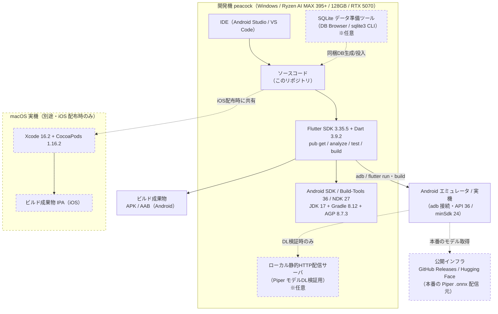
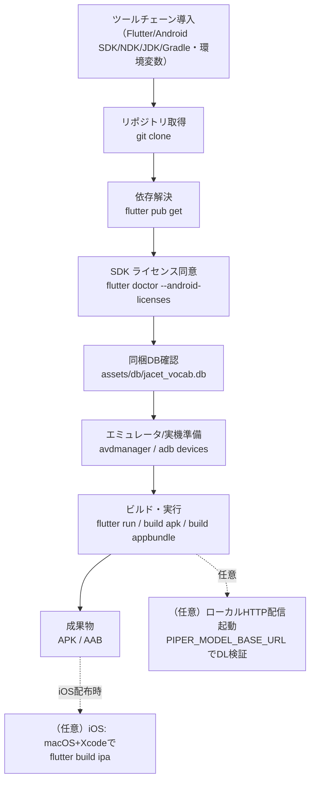

# 開発・実行環境設計書

| 項目 | 内容 |
|---|---|
| 文書名 | 開発・実行環境設計書（DEVELOPMENT-ENVIRONMENT 設計書） |
| プロジェクト名 | JACET Vocabulary Learner |
| 版数 | v1.0 |
| 作成日 | 2026-07-02 |
| 更新日 | 2026-07-02 |

---

## 1. 本書の目的と位置づけ

本書は「JACET Vocabulary Learner」（Flutter/Dart によるモバイルアプリ、iOS/Android 対象、SQLite 同梱、非商用・教育目的）の**開発・ビルド・実行に必要な環境**を設計する文書である。後続の環境構築作業が、迷いなく実際のビルド環境を用意できるよう、必要なツールチェーンとそのバージョン、環境変数、使用ポート、永続ディレクトリ（キャッシュ等）、構成要素（サービス）、および初期化（セットアップ）手順を仕様として定義する。

本書は「設計（何が必要か）」に集中し、具体の設定ファイル実体（各種設定スクリプト等）は作成しない。アプリ本体のアーキテクチャは `docs/architecture-design.md`（システムアーキテクチャ設計書）に、機能仕様は `doc/rfp.md`（RFP v1.1）に従う。

### 1.1 前提となる本アプリの性質（環境設計上の重要点）

RFP 第2・6・7章より、本アプリは以下の性質を持つ。環境設計はこれに厳密に従い、**アプリが必要としないサーバー資源を作らない**方針とする。

- **オフラインファースト**: 単語データは事前収集済みの静的 SQLite（`assets/db/jacet_vocab.db`、JACET8000＋Wiktionary 補完、最大8000語）としてアプリに同梱する。実行時に外部 API を呼ばない（RFP 第2章「実行時にAPIを叩かない」）。
- **永続化は端末内の組み込み SQLite（sqflite）のみ**: サーバー側 DB は存在しない。クラウド同期・アカウント機能はスコープ外（RFP 第7章）。→ **サーバー DB・キャッシュサーバー（Redis 等）は不要**。
- **唯一の実行時ネットワーク利用は Piper TTS モデルの任意ダウンロード**（GitHub Releases / Hugging Face 等の公開インフラから `.onnx` を取得。RFP 4.5・第9章）。→ 本番は公開インフラを直接利用し**自前ホスティングは不要**。開発時のダウンロード検証にのみ、任意のローカル HTTP 配信を用いる。

### 1.2 コンテナ化に関する方針（本プロジェクトの決定事項）

本プロジェクトの開発・ビルド環境は、開発機（Windows）上の**ネイティブ・ツールチェーンで直接構築する**。ビルド/CI 環境のコンテナ化（Docker 等）は本プロジェクトでは採用しない。理由は次のとおり。

- **主要開発機が Windows（RFP 第12章「peacock」）であり、Flutter/Android ビルドは Windows 上のネイティブ SDK で完結する**。Android エミュレータもハードウェアアクセラレーション（Windows Hypervisor Platform / AEHD）で開発機上に直接構築できる。
- **iOS ビルドはコンテナ化できない**。Apple のツールチェーン（Xcode）は macOS 上でのみ動作し、Linux コンテナで実行できないため、iOS 向けは macOS 実機（Xcode）を前提とする（第6章）。
- **アプリがオフラインファーストで、実行時に依存するサーバーサービスを持たない**ため、常時稼働のバックエンド・DB・キャッシュを再現するためのコンテナ群を必要としない。

したがって本書は、Docker/compose 等のコンテナ資材ではなく、**開発機上に導入するツールと設定を「構成要素（サービス）」として定義する**（第9章の一覧参照）。

---

## 2. 開発機前提（RFP 第12章）

RFP 第12章「開発引き渡し情報」に基づき、主要開発機の前提を次のとおりとする。

| 項目 | 内容 | 環境設計上の意味 |
|---|---|---|
| ホスト名 | peacock | 単一開発機での構築を前提とする |
| CPU | AMD Ryzen AI MAX 395+ | ビルド・エミュレータの並列実行に十分。x86_64 系エミュレータ（HAXM 相当のハードウェア支援）を利用可能 |
| メモリ | 128GB（ユニファイド） | Android エミュレータ＋IDE＋ビルドの同時稼働に余裕あり |
| GPU | NVIDIA RTX 5070 | エミュレータの GPU レンダリング（`-gpu host`）に利用 |
| OS | Windows | Android ビルド・実行はネイティブで完結。iOS ビルドは対象外（別途 macOS が必要、第6章） |
| 補足 | LM Storage / LM Studio 常駐 | 本アプリのビルドとは独立。ポート競合の注意点として第8章に記載 |

- Android の仮想化支援は、Windows Hypervisor Platform（WHPX）または AMD 向けの AEHD を有効化して用いる。RTX 5070 により `-gpu host`（ハードウェア GPU）でのエミュレータ描画を推奨する。
- iOS はターゲットプラットフォームに含まれるが、Windows 開発機ではビルド・署名ができない。iOS 配布が必要になった時点で macOS 実機（Xcode）を用意する運用とする（第6章で前提を明記）。

---

## 3. 開発ツールチェーンとバージョン指定

2026-07-02 時点で採用する固定値。後続の環境構築作業はこの値をそのまま用いる。Android 系は開発機（Windows）で必須、iOS 系（Xcode / CocoaPods）は macOS でのみ使用する。

### 3.1 共通（Flutter/Dart）

| ツール | 採用バージョン（固定） | 用途 |
|---|---|---|
| Flutter SDK | `3.35.5`（stable チャネル） | ビルド・テスト基盤（`architecture-design.md` と整合） |
| Dart SDK | `3.9.2`（Flutter 3.35.5 同梱） | 言語ランタイム |
| Git for Windows | `2.47` 以降 | リポジトリ取得・Flutter SDK の管理 |
| IDE | Android Studio `2024.3`（Meerkat）または VS Code `1.97` 以降＋Flutter/Dart 拡張 | 編集・デバッグ・エミュレータ管理 |

### 3.2 Android ビルド系（Windows 開発機で必須）

| ツール | 採用バージョン（固定） | 用途 |
|---|---|---|
| Android SDK Platform | `platforms;android-36`（Android 16） | compileSdk / targetSdk 対象 |
| Android compileSdk / targetSdk | API 36（Android 16） | ビルドターゲット |
| Android minSdk | API 24（Android 7.0） | サポート下限 |
| Android Build-Tools | `36.0.0` | APK/AAB ビルド |
| Android Platform-Tools（`adb`） | `36.0.0` | 端末・エミュレータ接続、デプロイ |
| Android cmdline-tools | `19.0`（latest） | `sdkmanager` / `avdmanager` によるSDK管理 |
| Android Emulator | `35.x` | 仮想デバイス実行 |
| Android system-image | `system-images;android-36;google_apis_playstore;x86_64` | エミュレータ用 OS イメージ |
| Android NDK | `27.0.12077973`（Flutter 3.35 系の既定 NDK） | ネイティブ依存（`sherpa_onnx` 等）のビルド |
| JDK | Temurin `17.0.13`（LTS） | Gradle／AGP 実行に必要 |
| Gradle（ラッパ） | `8.12` | Android ビルド |
| Android Gradle Plugin (AGP) | `8.7.3` | Android ビルド |

> **NDK が必要な理由**: Piper TTS のオンデバイス合成に用いる `sherpa_onnx`（ONNX ランタイム内包、`architecture-design.md` 参照）はネイティブライブラリを含むため、Android ビルドに NDK が必要となる。バージョンは Flutter 3.35 系の既定 NDK に一致させる。

### 3.3 iOS ビルド系（macOS でのみ使用・Windows 開発機では不使用）

| ツール | 採用バージョン（固定） | 用途 |
|---|---|---|
| macOS | Sonoma `14.x` 以降 | Xcode 実行 OS |
| Xcode | `16.2` | iOS ビルド・署名・シミュレータ |
| CocoaPods | `1.16.2` | iOS 側 Flutter プラグインの依存解決 |
| Ruby | `3.x`（CocoaPods 実行用、システム同梱可） | CocoaPods ランタイム |

> iOS 系ツールは Windows 開発機には導入しない。iOS ビルドが必要になった時点で別途 macOS 実機に上記を導入する（第6章）。

---

## 4. 環境全体構成

### 4.1 構成図

### 4.2 構成要素（サービス）の役割

| 構成要素 | 種別 | 役割 | 必須/任意 |
|---|---|---|---|
| Flutter/Dart ツールチェーン | 開発・ビルド | `flutter pub get` / `analyze` / `test` / `run` / Android APK・AAB ビルド | 必須 |
| Android SDK/NDK/JDK/Gradle | ビルド | Android パッケージング・ネイティブ依存ビルド | 必須（Android） |
| Android エミュレータ / 実機 | 実行・検証 | 画面遷移・SM-2 更新・TTS 再生・モデル DL フローの動作確認 | 必須（検証） |
| SQLite データ準備ツール | 支援 | 同梱静的 DB（`jacet_vocab.db`）の生成・投入・検証（第7章） | 任意 |
| ローカル静的 HTTP 配信サーバ | 支援 | Piper `.onnx` ダウンロード機能のオフライン検証（第5章）。本番は公開インフラを直接利用 | 任意 |
| Xcode / CocoaPods（macOS） | ビルド | iOS ビルド・署名（Windows 不可、別途 macOS 実機） | 任意（iOS 配布時） |

---

## 5. Piper TTS モデル ダウンロード検証用のローカル HTTP 配信（任意）

### 5.1 位置づけ

- **本番**: Piper TTS の音声モデル（`.onnx`）は GitHub Releases / Hugging Face 等、**既存の公開インフラから直接ダウンロードする。自前のホスティングサーバーは不要**（RFP 4.5・第7章・第9章）。
- **開発時（任意）**: 通信環境に依存せず、ダウンロードの成功・進捗（%）・失敗の各シナリオを**決定的に**再現するために、開発機上でローカル静的 HTTP 配信サーバを一時起動して検証できるようにする。あくまで開発検証用であり、リリース物には含めない。

### 5.2 仕様

| 項目 | 内容 |
|---|---|
| 用途 | Piper `.onnx`（および必要なら音素設定ファイル）のダウンロード機能検証（RFP 4.5「ダウンロード仕様」・受け入れ基準4.5） |
| 実現手段（例） | 静的ファイル配信であれば任意。例: `dart pub global activate dhttpd` による `dhttpd`、`python -m http.server`、その他軽量静的サーバ。Docker 等のコンテナは不要 |
| 使用ポート | `8080`（開発機ローカル。空いていなければ任意ポートへ変更可） |
| 配信ディレクトリ | 開発機上の検証用ディレクトリ（例: リポジトリ外の `./_dev/model-mock/`）にダミー `.onnx` を配置 |
| 配信物 | 検証用の小容量ダミー `.onnx`（本番ライセンス配布物は同梱しない） |
| 参照方法 | アプリのモデル取得先を、開発ビルド時に環境変数 `PIPER_MODEL_BASE_URL`（第8章）で `http://<開発機IP>:8080/models` へ差し替えて検証。既定値は公開インフラの実 URL（`core/constants` に定数化。`architecture-design.md` 参照） |

### 5.3 検証シナリオ

- **正常系**: 200 応答＋一定サイズ配信 → ダウンロード完了・`tts_engine='piper'` へ切替（RFP 4.5 状態A→B）。
- **進捗表示**: `Content-Length` を付与し、`dio` の `onReceiveProgress` で % を確認（`architecture-design.md`）。
- **異常系**: 存在しないパス（404）・遅延・切断で、失敗時のエラー表示・状態A維持（受け入れ基準4.5）を確認。RFP 第9章の方針どおり、チェックサムによる改ざん検証は初期版では実装しない。

---

## 6. iOS ビルド環境の前提（コンテナ化不可）

- iOS はターゲットプラットフォームに含まれる（RFP 冒頭）が、**iOS ビルドはコンテナ化できず、Windows 開発機（peacock）ではビルド・署名できない**。Apple のツールチェーン（Xcode）は macOS 上でのみ動作する。
- iOS 向けの配布が必要になった時点で、別途 **macOS 実機に Xcode 16.2・CocoaPods 1.16.2**（第3.3節）を導入し、同一リポジトリを共有して `flutter build ipa` を実行する運用とする。
- 初期バージョンの主開発・検証は **Android（エミュレータ／実機）を主対象**とし、iOS は同一 Flutter コードベースで動作することを macOS 環境で別途確認する。この制約を前提として正直に明記する。

---

## 7. 静的データ準備環境（開発用・データ収集はスコープ外）

同梱する静的 SQLite（`assets/db/jacet_vocab.db`、JACET8000＋Wiktionary 補完、最大8000語）を**生成・投入・検証**するための開発用環境を設計する。単語データの**収集・変換スクリプトの実装は本プロジェクトのスコープ外**（RFP 第9章・別途進行）であり、本節は「収集済みデータを RFP 第6章スキーマの DB へ投入し、アプリへ同梱する」工程の環境を定義する。

### 7.1 ツール

| ツール | 採用バージョン（推奨） | 用途 |
|---|---|---|
| SQLite（`sqlite3` CLI） | `3.46` 以降 | スキーマ作成・データ投入・集計クエリ検証 |
| DB Browser for SQLite | `3.13` 以降 | GUI でのテーブル/インデックス/データ目視確認 |

### 7.2 想定手順

1. RFP 第6章の DDL（`words` / `user_progress` / `study_log` / `app_settings` とインデックス）で空 DB を作成する。
2. 収集済みの単語データ（スコープ外で用意）を `words` テーブルへ投入する（`id` / `word` / `level`(1–8) / 品詞 / 発音 / 定義 / 例文 / 活用 JSON / コロケーション JSON）。`audio_file_path` は初期版では常に NULL（予約カラム、RFP 第7章）。
3. 制約・整合を検証する: `word` の UNIQUE、`level` が 1–8、総語数（最大8000語＝1000語×8レベル）、インデックスの付与（`idx_words_level` 等）。
4. `user_progress` / `study_log` は空、`app_settings` は初期値（`audio_enabled='true'`、`tts_engine='flutter_tts'`、`piper_model_path=NULL`）を投入する。
5. 完成した DB を `assets/db/jacet_vocab.db` として配置し、`pubspec.yaml` の `assets` に登録する（`architecture-design.md` 8.2）。アプリ初回起動時に読み書き可能領域へコピーして使用する。

---

## 8. 環境変数・ポート・永続ディレクトリ 一覧

### 8.1 環境変数一覧

開発機（Windows）に設定する環境変数。パス例は Windows 表記。

| 変数 | 例（Windows） | 対象 | 用途 |
|---|---|---|---|
| `FLUTTER_HOME` | `C:\dev\flutter` | 共通 | Flutter SDK 配置先。`%FLUTTER_HOME%\bin` を `PATH` へ追加 |
| `ANDROID_SDK_ROOT` | `C:\Users\<user>\AppData\Local\Android\Sdk` | Android | Android SDK パス（`ANDROID_HOME` も同値で設定） |
| `JAVA_HOME` | `C:\Program Files\Eclipse Adoptium\jdk-17.0.13` | Android | JDK パス（Temurin 17.0.13） |
| `PUB_CACHE` | `C:\Users\<user>\AppData\Local\Pub\Cache` | 共通 | pub 依存キャッシュ先 |
| `GRADLE_USER_HOME` | `C:\Users\<user>\.gradle` | Android | Gradle 依存・ビルドキャッシュ先 |
| `PATH`（追記） | `%FLUTTER_HOME%\bin;%ANDROID_SDK_ROOT%\platform-tools;%ANDROID_SDK_ROOT%\cmdline-tools\latest\bin` | 共通 | `flutter` / `adb` / `sdkmanager` を解決 |
| `PIPER_MODEL_BASE_URL` | `http://<開発機IP>:8080/models`（開発検証時のみ） | アプリ（開発ビルド） | Piper モデル取得先の上書き。既定は公開インフラの実 URL（第5章） |

> macOS で iOS ビルドを行う場合のみ、別途 `PATH` に CocoaPods/Xcode の各ツールを通す（macOS 側で標準的に解決されるため追加の恒久変数は原則不要）。

### 8.2 ポート一覧

すべて開発機ローカルのポートであり、外部公開は不要。

| ポート | 構成要素 | 用途 |
|---|---|---|
| 9100 | Flutter/Dart | Dart DevTools（デバッグ・パフォーマンス） |
| 9101 | Flutter/Dart | Dart VM Service（DevTools 接続・必要時） |
| 5554 / 5555 | Android エミュレータ | エミュレータ制御 / `adb` 接続 |
| 8080 | ローカル HTTP 配信サーバ（任意） | Piper モデル DL 検証（第5章） |

> LM Studio 等の常駐アプリ（RFP 第12章）が使うポート（既定 1234 等）とは重複しないが、上記ポートが専有済みの場合は空きポートへ変更する。

### 8.3 永続ディレクトリ（キャッシュ・状態）一覧

コンテナのボリュームに相当する、再構築時に再取得を避けるべき永続領域。

| 領域 | パス例（Windows） | 目的 |
|---|---|---|
| ソースコード | リポジトリ作業ディレクトリ | 編集対象。ビルドの入力 |
| pub キャッシュ | `%PUB_CACHE%` | 依存パッケージのキャッシュ（再取得抑制） |
| Gradle キャッシュ | `%GRADLE_USER_HOME%` | Gradle 依存・ビルドキャッシュ |
| Android SDK | `%ANDROID_SDK_ROOT%` | SDK/Build-Tools/NDK/system-image の永続化 |
| AVD 定義・状態 | `C:\Users\<user>\.android\avd` | エミュレータ定義・状態（起動時間短縮） |
| Piper モデル配置先（実機/エミュレータ内） | アプリのデータディレクトリ（`path_provider` で解決） | ダウンロード済みモデルの保存。`app_settings.piper_model_path` に記録 |
| モデル検証用ディレクトリ（任意） | 開発機の `./_dev/model-mock/` | ローカル HTTP 配信のダミー `.onnx` 置き場（第5章） |

---

## 9. 初期化（セットアップ）手順

### 9.1 手順

以下を順に実施することで、開発機（peacock）上に開発・ビルド・実行環境を確立する。

1. **ツールチェーン導入**: 第3章の固定バージョンで Flutter SDK・Android SDK（Build-Tools 36.0.0 / Platform-Tools 36.0.0 / cmdline-tools 19.0 / NDK 27.0.12077973 / system-image android-36）・JDK 17（Temurin）・IDE を導入し、第8.1節の環境変数（`FLUTTER_HOME` / `ANDROID_SDK_ROOT` / `JAVA_HOME` / `PUB_CACHE` / `GRADLE_USER_HOME` / `PATH`）を設定する。
2. **リポジトリ取得**: `git clone` で本リポジトリを開発機へ取得する。
3. **依存解決**: リポジトリ直下で `flutter pub get` を実行し、依存パッケージ（`sqflite` / `path_provider` / `flutter_tts` / `sherpa_onnx` / `dio` 等）を解決する。
4. **SDK ライセンス同意**: `flutter doctor` で不足を確認し、`flutter doctor --android-licenses`（内部で `sdkmanager --licenses`）で Android SDK ライセンスに同意する。仮想化支援（WHPX / AEHD）と GPU 支援を有効化する。
5. **同梱データ確認**: 静的 DB（`assets/db/jacet_vocab.db`）が存在し `pubspec.yaml` の `assets` に登録されていることを確認する（第7章・`architecture-design.md` 8.2）。
6. **エミュレータ/実機準備**: `avdmanager` で API 36（`google_apis_playstore;x86_64`、Pixel プロファイル）の AVD を作成し起動する。または USB デバッグを有効化した実機を `adb devices` で認識させる。
7. **ビルド／実行**: `flutter run` で実行しながら開発する。パッケージング時は `flutter build apk` / `flutter build appbundle` を実行し、成果物（APK/AAB）を得る。
8. **（任意）ダウンロード検証**: 第5章のローカル HTTP 配信を起動し、`PIPER_MODEL_BASE_URL` を向けて成功／進捗／失敗シナリオを確認する。
9. **（任意）iOS 確認**: iOS 配布が必要な場合のみ、macOS 実機で Xcode 16.2・CocoaPods 1.16.2 を導入し、`flutter build ipa` を実行する（第6章）。

### 9.2 セットアップ／ビルドフロー図

---

## 10. 設計上の制約・注意事項

- **コンテナ化しない**: 本プロジェクトは Windows 開発機のネイティブ・ツールチェーンで構築する（第1.2節）。Docker/compose 等のコンテナ資材は用いない。
- **iOS はコンテナ対象外かつ Windows ビルド不可**: Xcode/macOS 必須のため、iOS 配布時は別途 macOS 実機を用意する（第6章）。
- **サーバー DB／キャッシュは設けない**: 端末内組み込み SQLite（sqflite）で完結し、サーバー DB・キャッシュを持たない（RFP 第6・7章）。したがって Postgres/MySQL/Redis 等は環境に含めない。
- **自前ホスティング不要**: Piper モデルの本番配信は公開インフラ（GitHub Releases / Hugging Face）を直接利用する。ローカル HTTP 配信は開発検証専用（第5章）。
- **データ収集はスコープ外**: 単語データの収集・変換は本プロジェクトのスコープ外（RFP 第9章）。本書は投入済み DB を同梱する工程の環境のみを定義する（第7章）。
- **バージョンは本書で固定**: 第3章の採用バージョンは 2026-07-02 時点の確定値であり、後続の環境構築作業はこの値をそのまま用いる。将来更新時は本書を改版して差し替える。

---

## 11. RFP・アーキテクチャ設計との整合

- オフラインファースト・実行時 API 非依存（RFP 第2・7章）→ 常時稼働の外部サービス依存を持たないネイティブ環境設計。
- 静的 DB 同梱（RFP 第6章、`architecture-design.md` 8.2）→ 初期化手順でアセット存在検証を実施し、データ準備環境（第7章）を定義。
- Piper TTS モデルの公開インフラ取得・進捗表示・失敗時フォールバック（RFP 4.5・第9章）→ 任意のローカル HTTP 配信と `PIPER_MODEL_BASE_URL` で検証可能に設計。
- iOS/Android 両対応（RFP 冒頭）だが開発機は Windows（RFP 第12章）→ Android はネイティブビルド、iOS は macOS/Xcode 前提として明記。
- クラウド同期・アカウントはスコープ外（RFP 第7・8章）→ バックエンド／認証サービスを環境に含めない。

---

## 12. 更新履歴

| 版数 | 日付 | 内容 |
|---|---|---|
| v1.0 | 2026-07-02 | 初版作成。Windows 開発機（RFP 第12章 peacock）を前提としたネイティブ Flutter 開発・ビルド・実行環境を定義。開発ツールチェーンのバージョン固定（Flutter 3.35.5 / Dart 3.9.2 / Android SDK・Build-Tools 36.0.0・Platform-Tools 36.0.0・cmdline-tools 19.0・NDK 27.0.12077973・JDK Temurin 17.0.13・Gradle 8.12・AGP 8.7.3、iOS 向け Xcode 16.2・CocoaPods 1.16.2）、環境変数・ポート・永続ディレクトリ・構成要素の各一覧、静的データ準備環境、Piper モデル DL 検証用の任意ローカル HTTP 配信、初期化手順、構成図・セットアップ/ビルドフロー図（Mermaid）を規定。iOS はコンテナ化不可・macOS/Xcode 前提を明記。 |
