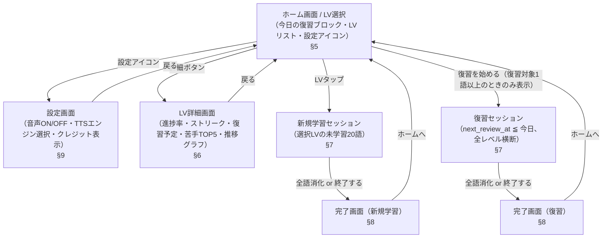
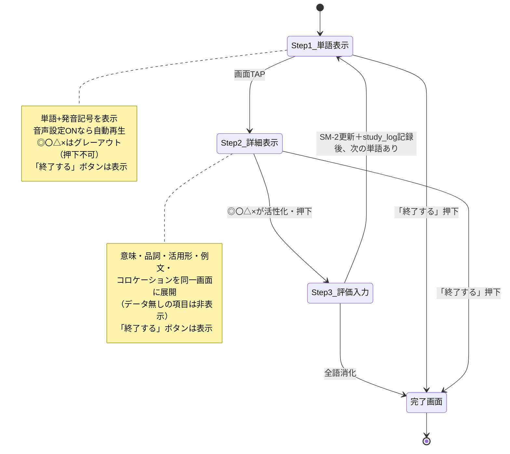
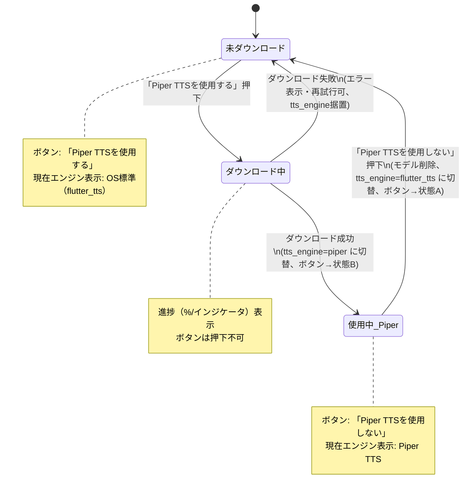

# 画面・UI設計書

| 項目 | 内容 |
|---|---|
| 文書名 | 画面・UI設計書 |
| プロジェクト名 | JACET Vocabulary Learner |
| 版数 | v1.0 |
| 作成日 | 2026-07-02 |
| 更新日 | 2026-07-02 |

---

## 1. 本書の目的と位置づけ

本書は「JACET Vocabulary Learner」（Flutter/Dart によるモバイルアプリ、iOS/Android、非商用・教育目的）の画面・UI設計を定義する設計書である。RFP（`doc/rfp.md` v1.1）第4章「画面構成・機能仕様」に基づき、各画面の目的・表示要素・レイアウト・主要ウィジェット構成・状態別表示・遷移条件を実装可能な精度で規定する。

本書はシステムアーキテクチャ設計書（`docs/architecture-design.md`）の下位に位置し、同書が「画面設計書」に委ねると定めた「各画面のウィジェット構成・レイアウト・遷移詳細（RFP 第4章）」を担当する。SM-2の更新規則・進捗率算出式（第5章）、テーブル定義（第6章）、TTS切替の内部ロジック（第4.5章・第7章）の詳細は各詳細設計書に委ね、本書では各画面がそれらのデータをどう表示・操作するかに限定して記述する。

本書が対象とする画面は次の5つである。

| 節 | 画面 | RFP対応 |
|---|---|---|
| 5 | ホーム画面（LV選択統合） | 4.1 |
| 6 | LV詳細画面 | 4.2 |
| 7 | 学習セッション画面（新規・復習共通） | 4.3 |
| 8 | 完了画面（新規・復習） | 4.4 |
| 9 | 設定画面 | 4.5 |

---

## 2. 共通設計方針

### 2.1 プラットフォーム・デザイン基盤

- Flutter の Material 3（`ThemeData(useMaterial3: true)`）を基盤とし、iOS/Android で共通のUIを提供する。
- 縦画面（ポートレート）を基本とする。横画面は必須要件ではない。
- 全画面でオフライン動作すること（RFP 第7章）。ネットワーク接続前提のUI要素（設定画面のPiper TTSモデルダウンロードを除く）を持たない。

### 2.2 画面遷移の実装方針

- 画面遷移は Flutter の `Navigator`（ルートベース）で実装する。ホーム画面をルート（初期ルート）とする。
- 各セッション画面・完了画面・詳細画面・設定画面は `push` で積み、「戻る」「ホームへ」は `pop` もしくはホームまでの `popUntil` で戻す。
- 具体的な状態管理方式（Provider/Riverpod 等）はアーキテクチャ設計書の規定に従い、本書では画面が参照・更新するデータ項目のみを扱う。

### 2.3 状態別表示の共通原則

RFP 第4章・第11章で要求される「条件付き表示」を全画面で次の原則に統一する。

- **空状態（Empty State）**: データが0件の集計は、当該セクションを非表示にするか、または明示的な空メッセージを表示する（各節で個別に規定）。
- **条件付きセクション非表示**: 表示すべきデータが存在しない項目（活用形・コロケーション等、復習ブロック0語時）は、プレースホルダを出さずセクションごと非表示にする。
- **活性・非活性（グレーアウト）**: 押下不可のボタンは視覚的にグレーアウト（`onPressed: null` によるMaterialの無効表示）し、条件成立時に活性化する。
- **常時表示要素**: セッション中の「終了する」ボタンなど、状態に関わらず常に表示すべき要素は、いかなるStepでも消さない。

### 2.4 画面遷移全体図（RFP 4.0 準拠・再掲）

RFP 第4.0節の画面遷移図を本設計書の基準図として再掲し、各遷移に本書での節番号を対応づける。



---

## 3. 画面共通コンポーネント

各画面で再利用する共通ウィジェットを次のとおり定義する（名称は代表例。確定は実装時）。

| コンポーネント | 用途 | 使用画面 |
|---|---|---|
| `ProgressBarWidget` | 進捗率（%＋横棒プログレスバー） | ホーム／LV詳細 |
| `GradeButtonsRow` | ◎〇△×の4ボタン行。活性/非活性を切替 | 学習セッション |
| `EndSessionButton` | 「終了する」ボタン（常時表示） | 学習セッション |
| `SessionProgressIndicator` | 「n / N 語目」の進捗バー | 学習セッション |
| `GradePieChart` | ◎〇△×割合の円グラフ | 完了画面 |
| `StreakCalendar` | 過去7日カレンダー（曜日別実施有無） | LV詳細 |
| `StudyBarChart` | 過去7日の学習量推移（棒グラフ） | LV詳細 |
| `WeakWordsList` | 苦手単語TOP5リスト | LV詳細 |

---

## 4. データ表示仕様（グラフ・可視化要素の共通定義）

RFP で要求される可視化要素の表示仕様を、実装の参照点として先に定義する。算出式の詳細は RFP 第5章および SM-2ロジック設計書に従い、本書は表示側の仕様のみを規定する。

### 4.1 進捗率・プログレスバー

- **値**: `進捗率 = Σ(各単語の last_grade に対応する評価値) / 該当レベルの総単語数（1000語）`（RFP 5.4）。評価値は ◎=1.0／〇=0.5／△=0.1／×・未学習=0。
- **表示**: 数値（％、小数第1位まで等の丸めは実装時に統一）＋横棒プログレスバー（`LinearProgressIndicator` 相当、値域 0.0〜1.0）。
- **ホーム画面のLVリスト**では各LVの進捗率を数値または細いバーで簡潔に表示し、**LV詳細画面**では数値＋横棒バーで大きく表示する。

### 4.2 苦手な単語 TOP5

- **対象**: 当該LV内の単語のうち `fail_count`（×累計回数）が1以上のもの。
- **並び順**: `fail_count` 降順。同数の場合は最終復習日（`last_reviewed_at`）が古い順。
- **表示件数**: 最大5件。
- **各行の表示**: 単語（`word`）と×回数（`fail_count`）。
- **空状態**: 対象が0件（そのLVで一度も×がない）の場合は、当該セクションを非表示にする。

### 4.3 学習量推移グラフ（過去7日）

- **対象**: 当該LV内の `study_log` を日別に集計。当日を含む直近7日を横軸（左が古い、右が当日）。
- **値**: 日別の学習数（新規学習＋復習の合算件数）。
- **表現**: 縦棒グラフ（7本）。学習が0件の日は高さ0の空バーとして表示し、7日分の枠は常に描画する（バー本数の欠落による誤読を避ける）。
- **空状態**: 7日間すべて0件でも、7本の空バーと軸を表示する（セクション全体は非表示にしない。ストリーク・カレンダーとの整合を保つため）。

### 4.4 ストリーク・過去7日カレンダー

- **ストリーク数**: 新規学習または復習を1回以上行った日を1日として数えた、直近の連続日数（RFP 用語集）。数値で表示する。
- **カレンダー**: 過去7日を曜日ラベル付きで並べ、各日に「実施あり／なし」をマーク（例：実施日は塗り、未実施日は薄色）で表示する。
- **判定元**: `study_log.studied_at` の端末ローカル日付単位で、当日レコードの有無により実施有無を判定する。

### 4.5 理解度の円グラフ（完了画面）

- **対象**: 当該セッション中に押下した評価（◎〇△×）の件数割合。
- **表現**: 円グラフ（`PieChart` 相当）。◎〇△×の4区分を色分けし、割合（％または件数）を凡例で示す。
- **集計元**: セッション中に記録した評価のカウント（当該セッションのみ。過去の履歴は含めない）。

---

## 5. ホーム画面（RFP 4.1）

### 5.1 目的

アプリ起動後の最初の画面。LV選択画面を統合し、(1) 今日の復習の入口、(2) LV1〜LV8の選択と進捗把握、(3) 設定画面への入口、を1画面で提供する。

### 5.2 表示要素

1. **アプリバー**: アプリ名（タイトル）と、右上の**設定アイコン**（歯車）。
2. **今日の復習ブロック**（条件付き表示）: 復習対象件数と「復習を始める」ボタン。
3. **LVリスト**: LV1〜LV8を固定順で縦に並べたリスト。各行に1行説明・進捗率・詳細ボタン。

> RFP 4.1 のとおり、音声ON/OFFスイッチはホーム画面には表示しない（設定画面へ移動）。

### 5.3 UIレイアウト概要

```
┌─────────────────────────────┐
│ JACET Vocabulary Learner      ⚙  │  ← アプリバー（右上に設定アイコン）
├─────────────────────────────┤
│ ┌─────────────────────────┐ │
│ │ 📌 今日の復習   12語         │ │  ← 復習ブロック（1語以上のときのみ表示・強調）
│ │        [ 復習を始める ]      │ │
│ └─────────────────────────┘ │
│                                 │
│ レベルを選ぶ                     │
│ ┌─────────────────────────┐ │
│ │ LV1 中学教科書レベルの基本語  │ │
│ │ 進捗 42.5% ▓▓▓▓░░░░  [詳細]│ │  ← LVタップで新規学習セッション
│ ├─────────────────────────┤ │
│ │ LV2 高校初級・英字新聞の基礎語 │ │
│ │ 進捗 10.0% ▓░░░░░░░  [詳細]│ │
│ ├─────────────────────────┤ │
│ │ … LV3〜LV8 …               │ │
│ └─────────────────────────┘ │
└─────────────────────────────┘
```

### 5.4 主要ウィジェット構成

```
Scaffold
├─ AppBar
│  ├─ title: Text（アプリ名）
│  └─ actions: [ IconButton(Icons.settings) ]  → 設定画面へ push
└─ body: ListView / CustomScrollView
   ├─ TodayReviewBlock（復習対象1語以上のときのみ生成）
   │  ├─ Card（強調配色）
   │  │  ├─ Text（"今日の復習 {count}語"）
   │  │  └─ ElevatedButton（"復習を始める"）→ 復習セッションへ push
   └─ LevelList
      └─ ListView.builder（LV1〜LV8、固定順）
         └─ LevelTile（各LV）
            ├─ InkWell（行タップ）→ 新規学習セッションへ push
            ├─ Text（LV名・1行説明）
            ├─ ProgressBarWidget（進捗率）
            └─ TextButton（"詳細"）→ LV詳細画面へ push
```

### 5.5 状態別表示

| 状態 | 表示 |
|---|---|
| 復習対象が0語 | 「今日の復習ブロック」を**ブロックごと非表示**（`if (reviewCount > 0)` で条件生成）。LVリストは常時表示。 |
| 復習対象が1語以上 | 復習ブロックを表示し、件数と「復習を始める」ボタンをカード状・強調配色で表示。 |
| いずれの場合も | LV1〜LV8は常に固定順・8件すべて表示（未学習LVは進捗率0%で表示）。 |

- 復習対象件数は「全レベル横断で `next_review_at ≦ 今日` の単語数」。画面表示時（初回表示・ホームへの復帰時）に再計算する。

### 5.6 遷移条件

| 操作 | 遷移先 | 条件 |
|---|---|---|
| LV行タップ | 新規学習セッション（当該LV） | 常時可能 |
| 「詳細」ボタン | LV詳細画面（当該LV） | 常時可能 |
| 「復習を始める」ボタン | 復習セッション | 復習対象が1語以上のときのみボタンが存在 |
| 設定アイコン | 設定画面 | 常時可能 |

---

## 6. LV詳細画面（RFP 4.2）

### 6.1 目的

選択したレベル1つについて、詳細説明と学習状況（進捗率・ストリーク・復習予定・苦手TOP5・学習量推移）を可視化する。学習の振り返りと計画のための画面であり、ここから学習は開始しない（開始はホームのLVタップ）。

### 6.2 表示要素

タイトル：LV名 ＋ 詳細説明（RFP 3.1 の当該LVの「対象・カバー率・到達イメージ」）。

1. **進捗率**（数値％＋横棒プログレスバー）。
2. **連続学習日数（ストリーク）**（数値）＋**過去7日カレンダー**。
3. **復習予定**（全レベル共通の数字）: 明日の復習予定数／今週（今日から7日以内）の復習予定数。
4. **苦手な単語 TOP5**（このLV内）。
5. **学習量推移グラフ**（過去7日、このLV内）。

> RFP 4.2 の注記のとおり、復習予定はLV詳細画面内であっても**全レベル共通の数字**を表示する（当該LVに限定しない）。

### 6.3 UIレイアウト概要

```
┌─────────────────────────────┐
│ ← LV3（2001〜3000語）           │  ← アプリバー（戻る）
├─────────────────────────────┤
│ 高等学校・大学入試レベルの中核語… │  ← 詳細説明（対象・カバー率・到達イメージ）
│                                 │
│ 進捗率                           │
│  62.3%  ▓▓▓▓▓▓░░░░           │  ← ①
│                                 │
│ 連続学習日数    5日              │  ← ②
│  月 火 水 木 金 土 日            │
│  ●  ●  ○  ●  ●  ●  ○         │  ← 過去7日カレンダー
│                                 │
│ 復習予定（全レベル共通）          │  ← ③
│  明日: 8語   今週: 34語          │
│                                 │
│ 苦手な単語 TOP5                  │  ← ④（0件なら非表示）
│  1. abandon   ×4                │
│  2. …                           │
│                                 │
│ 学習量推移（過去7日）             │  ← ⑤
│  ▁ ▃ ▅ ▂ ▇ ▄ ▁                │
└─────────────────────────────┘
```

### 6.4 主要ウィジェット構成

```
Scaffold
├─ AppBar（leading: 戻る, title: LV名）
└─ body: SingleChildScrollView > Column
   ├─ Text（詳細説明：対象・カバー率・到達イメージ）
   ├─ Section「進捗率」
   │  └─ ProgressBarWidget（%＋LinearProgressIndicator）
   ├─ Section「連続学習日数」
   │  ├─ Text（"{streak}日"）
   │  └─ StreakCalendar（過去7日・曜日別マーク）
   ├─ Section「復習予定」
   │  └─ Row [ Text("明日 {n}語"), Text("今週 {m}語") ]   ← 全レベル横断値
   ├─ Section「苦手な単語 TOP5」（fail_count>0 の単語が存在するときのみ）
   │  └─ WeakWordsList（最大5行：単語＋×回数）
   └─ Section「学習量推移」
      └─ StudyBarChart（過去7日・棒グラフ）
```

### 6.5 状態別表示

| 項目 | 空／特殊状態時の表示 |
|---|---|
| 進捗率 | 未学習のLVは 0.0%・空バー。セクションは常時表示。 |
| ストリーク | 実施履歴なしは 0日。カレンダーは7日分すべて「未実施」で描画。 |
| 復習予定 | 該当0語でも「明日: 0語／今週: 0語」と表示（数字を隠さない）。 |
| 苦手TOP5 | 当該LVで `fail_count>0` の単語が0件の場合、**セクションごと非表示**。 |
| 学習量推移 | 7日すべて0件でも7本の空バーと軸を表示（セクションは非表示にしない）。 |

### 6.6 遷移条件

| 操作 | 遷移先 | 条件 |
|---|---|---|
| 戻る（アプリバー左） | ホーム画面 | 常時可能 |

- LV詳細画面からは学習セッションを開始しない（RFP 4.0 の遷移に準拠）。

---

## 7. 学習セッション画面（新規学習・復習共通、RFP 4.3）

### 7.1 目的

1語ずつ「単語表示 → 詳細表示 → 評価入力」の3ステップを繰り返し、SM-2で習得度・次回復習日を更新する。新規学習セッションと復習セッションは**共通のUI**を用い、対象単語の抽出条件と一部の終了条件のみが異なる。

### 7.2 表示要素（共通）

- **進捗バー**: 現在何語目か（`n / N 語目`）を常時表示。
- **単語・発音記号**: 画面上部。
- **詳細情報**（Step2で展開）: 意味・品詞／活用形／例文（英文＋日本語訳）／コロケーション。
- **◎〇△×ボタン**: `GradeButtonsRow`。Step1でグレーアウト、Step2で活性化。
- **「終了する」ボタン**: 常時表示（新規・復習共通）。

### 7.3 3ステップの共通フロー

RFP 4.3 のフローを踏襲する。

- **Step1（単語表示）**: 単語＋発音記号を表示。音声設定ONなら表示と同時に自動再生（TTSエンジンは `app_settings.tts_engine` に従う。詳細は TTS設計書）。◎〇△×はグレーアウト（押下不可）。
- **Step2（詳細表示）**: 画面TAPで同一画面内に詳細情報を展開。◎〇△×を活性化。データが無い項目はセクションごと非表示。
- **Step3（評価入力）**: ◎〇△×いずれかを押下 → SM-2更新（習得度・次回復習日）＋ `study_log` に1件記録 → 次の単語（Step1）へ自動遷移。

### 7.4 学習セッション Step1→2→3 の状態遷移図

RFP 4.3 の状態遷移図を本設計書の基準図として再掲・詳細化する。



- Step3で押下後、残単語があれば次の単語のStep1へ、なければ完了画面へ遷移する。
- 「終了する」はStep1・Step2のどちらからでも押下でき、押下時点までの結果で完了画面へ遷移する。

### 7.5 UIレイアウト概要

```
Step1（グレーアウト）              Step2（活性化）
┌───────────────────┐    ┌───────────────────┐
│ [進捗バー] 3 / 20 語  終了 │    │ [進捗バー] 3 / 20 語  終了 │
├───────────────────┤    ├───────────────────┤
│                       │    │  apple                │
│      apple            │    │  /ˈæp.əl/             │
│      /ˈæp.əl/         │    │ ─────────────────  │
│                       │    │  意味: りんご（名詞）    │
│   （TAPで詳細表示）     │    │  活用形: 複数形 apples │
│                       │    │  例文: An apple a day…│
│                       │    │       りんごを1日1個… │
│                       │    │  コロケーション: …      │
├───────────────────┤    ├───────────────────┤
│  ◎    〇    △    ×    │    │  ◎    〇    △    ×    │
│ (灰) (灰) (灰) (灰)    │    │ (活) (活) (活) (活)    │
└───────────────────┘    └───────────────────┘
```

### 7.6 主要ウィジェット構成

```
Scaffold
├─ AppBar / 上部バー
│  ├─ SessionProgressIndicator（"n / N 語目"）
│  └─ EndSessionButton（"終了する", 常時表示）
└─ body: Column
   ├─ WordHeader
   │  ├─ Text（word）
   │  └─ Text（pronunciation）
   ├─ DetailPanel（Step2でのみ表示 / AnimatedSwitcher等で展開）
   │  ├─ Section 意味・品詞（definition_ja, part_of_speech）
   │  ├─ Section 活用形（inflections_json ／ 無ければ非表示）
   │  ├─ Section 例文（example_en + example_ja ／ 無ければ非表示）
   │  └─ Section コロケーション（collocations_json ／ 無ければ非表示）
   ├─ GestureDetector（画面TAP → Step1からStep2へ）
   └─ GradeButtonsRow
      └─ [◎, 〇, △, ×]（Step1: onPressed=null で灰／Step2: 有効）
```

### 7.7 状態別表示

| 対象 | 規則 |
|---|---|
| ◎〇△×ボタン | Step1：グレーアウト（`onPressed: null`、押下不可）。Step2（TAP後）：活性化（押下可能）。Step3押下後に次の単語へ移ると再びStep1状態（グレーアウト）に戻る。 |
| 詳細情報の各セクション | 活用形（`inflections_json`）・例文（`example_en`/`example_ja`）・コロケーション（`collocations_json`）など、データが無い（NULL/空）項目は**セクションごと非表示**。意味・品詞は基本必須項目として表示。 |
| 音声自動再生 | `app_settings.audio_enabled == true` のときのみ、Step1の単語表示と同時に自動再生。OFFのときは再生しない（UIは同一）。 |
| 「終了する」ボタン | 全Stepで**常時表示**。 |
| 進捗バー | 全Stepで常時表示。分母Nは新規＝出題語数（最大20）、復習＝抽出時点の対象語数。 |

### 7.8 新規学習セッション固有仕様

- **対象**: 選択したLV内の未学習単語（`user_progress` レコード無し、または未評価の単語）。
- **出題数**: 1セッション20語固定。未学習の残りが20語未満のときはその分だけで終了。
- **起動**: ホーム画面のLV行タップ。
- **完了遷移**: 全語消化、または「終了する」押下で**新規学習用の完了画面**（§8.2）へ。

### 7.9 復習セッション固有仕様

- **対象**: `next_review_at ≦ 今日` の単語（全レベル横断、`next_review_at` が古い順）。
- **件数**: 上限なし。「終了する」で随時終了可能。
- **起動**: ホーム画面の「復習を始める」ボタン。
- **完了遷移**: 全語消化、または「終了する」押下で**復習用の完了画面**（§8.3）へ。

### 7.10 遷移条件

| 操作 | 遷移先 | 条件 |
|---|---|---|
| 画面TAP | Step2（詳細表示） | Step1のとき |
| ◎〇△×押下 | 次の単語のStep1、または完了画面 | Step2のとき。残単語ありで次単語、なしで完了 |
| 「終了する」押下 | 完了画面（セッション種別に応じる） | 常時可能 |

---

## 8. 完了画面（RFP 4.4）

### 8.1 目的

セッション終了時（全語消化または「終了する」押下）に、当該セッションの結果を要約表示する。新規学習と復習で表示項目が一部異なる。理解度の円グラフは両者共通。

### 8.2 新規学習セッション完了時

**表示要素**:

1. 理解度の円グラフ（◎〇△×の割合）。
2. このレベルの総単語数（1000語）。
3. 今回の学習対象数（今回出題・評価した語数）。
4. 累計学習済み単語数（このレベル内で `user_progress` が存在＝1回以上評価済みの語数）。

```
┌─────────────────────────────┐
│ 学習完了！                       │
├─────────────────────────────┤
│        ◎40% 〇35%              │
│         (円グラフ)  △15% ×10%   │
│                                 │
│ このレベルの総単語数   1000語     │
│ 今回の学習対象数       20語       │
│ 累計学習済み単語数     260語       │
│                                 │
│           [ ホームへ ]           │
└─────────────────────────────┘
```

### 8.3 復習セッション完了時

**表示要素**:

1. 理解度の円グラフ（◎〇△×の割合）。
2. 今回消化した単語数。
3. 残りの復習対象数（`next_review_at ≦ 今日` の残件数）。0の場合は非表示または完了メッセージ。

```
┌─────────────────────────────┐
│ 復習完了！                       │
├─────────────────────────────┤
│        ◎50% 〇30%              │
│         (円グラフ)  △15% ×5%    │
│                                 │
│ 今回消化した単語数     12語       │
│ 残りの復習対象数       0語        │  ← 0のとき非表示 or「本日の復習は完了です」
│                                 │
│           [ ホームへ ]           │
└─────────────────────────────┘
```

### 8.4 主要ウィジェット構成

```
Scaffold
├─ AppBar（title: "学習完了" / "復習完了"）
└─ body: Column
   ├─ GradePieChart（◎〇△×割合。両モード共通）
   ├─ SummaryList
   │  ├─【新規】総単語数 / 今回の学習対象数 / 累計学習済み数
   │  └─【復習】今回消化数 / 残りの復習対象数（0なら非表示 or 完了メッセージ）
   └─ ElevatedButton（"ホームへ"）→ popUntil(ホーム)
```

### 8.5 状態別表示

| 状態 | 表示 |
|---|---|
| 復習完了・残り0語 | 「残りの復習対象数」の行を**非表示**にするか、「本日の復習は完了です」等の完了メッセージに置換。 |
| 円グラフ | いずれのモードでも当該セッションで押下した◎〇△×の割合のみを集計。 |
| 「終了する」で途中終了 | その時点までに評価した語のみで各集計（円グラフ・消化数）を算出。 |

### 8.6 遷移条件

| 操作 | 遷移先 | 条件 |
|---|---|---|
| 「ホームへ」 | ホーム画面 | 常時可能（`popUntil` でホームまで戻す） |

- ホームへ戻った時点で、ホームの復習件数・LV進捗率は再計算・再表示される。

---

## 9. 設定画面（RFP 4.5）

### 9.1 目的

ホーム画面右上の設定アイコンから遷移。(1) 読み上げ音声の全体ON/OFF、(2) TTSエンジンの選択（flutter_tts ⇄ Piper TTS）とPiperモデルのダウンロード/削除、(3) データソース・クレジット表示、を1画面にまとめる。

### 9.2 表示要素

1. **音声設定**: 読み上げ音声のON/OFFスイッチ（`app_settings.audio_enabled`）。
2. **TTSエンジン**:
   - 現在有効なエンジンの表示（`app_settings.tts_engine`。「OS標準（flutter_tts）」または「Piper TTS」）。
   - Piper TTSの状態表示（未ダウンロード／ダウンロード中／ダウンロード済み・使用中）と操作ボタン。
3. **データソース・クレジット表示**: RFP 第2章のクレジット文言。

### 9.3 UIレイアウト概要（RFP 4.5 準拠・再掲）

```
┌─────────────────────────┐
│ ← 設定                     │
├─────────────────────────┤
│ 音声設定                     │
│                             │
│  読み上げ音声       [ ON/OFF ] │  ← 全体スイッチ（audio_enabled）
│                             │
│  ─────────────────────    │
│  TTSエンジン                 │
│                             │
│  現在: OS標準（flutter_tts）  │  ← 現在有効なエンジン（tts_engine）
│                             │
│  Piper TTS（高品質音声）       │
│  未ダウンロード                │
│  [ Piper TTSを使用する ]      │  ← 状態A（未DL）のボタン
│                             │
├─────────────────────────┤
│ データソース・クレジット表示     │
│  ・JACET8000                │
│  ・Wiktionary - CC BY-SA 4.0 │
│  ・Algorithm SM-2, (C) …     │
└─────────────────────────┘
```

クレジット文言（RFP 第2章のとおり全文表示）:

```
・JACET8000 (Japan Association of College English Teachers)
・Wiktionary - CC BY-SA 4.0 (https://en.wiktionary.org/)
・Algorithm SM-2, (C) Copyright SuperMemo World, 1991
```

### 9.4 主要ウィジェット構成

```
Scaffold
├─ AppBar（leading: 戻る, title: "設定"）
└─ body: ListView
   ├─ Section「音声設定」
   │  └─ SwitchListTile（"読み上げ音声" / value=audio_enabled）
   ├─ Divider
   ├─ Section「TTSエンジン」
   │  ├─ Text（"現在: {OS標準（flutter_tts） | Piper TTS}"）
   │  ├─ Text（"Piper TTS（高品質音声）"）
   │  ├─ PiperStatusText（"未ダウンロード" / "ダウンロード中 {%}" / "ダウンロード済み・使用中"）
   │  ├─ LinearProgressIndicator（ダウンロード中のみ表示）
   │  └─ PiperActionButton（状態に応じてラベル・挙動を切替）
   └─ Section「データソース・クレジット表示」
      └─ Text（第2章クレジット全文）
```

### 9.5 Piper TTSボタンの状態と挙動

RFP 4.5 の状態表を再掲する。

| 状態 | ボタン表示 | 押下時の挙動 |
|---|---|---|
| A. 未ダウンロード | 「Piper TTSを使用する」 | ①モデルファイルをダウンロード（進捗表示）→②完了後 `tts_engine='piper'` に自動切替→③ボタンを状態Bへ |
| B. ダウンロード済み・使用中 | 「Piper TTSを使用しない」 | ①モデルファイルを端末から削除→②`tts_engine='flutter_tts'` に自動切替→③ボタンを状態Aへ |

- ダウンロード元は GitHub Releases / Hugging Face 等の公開インフラ上の英語音声モデル（`.onnx`）。自前ホスティングは行わない（RFP 4.5・第7章）。
- ダウンロード中は進捗（%またはインジケータ）を表示し、ボタンは押下不可（重複起動防止）。
- ダウンロード失敗時（通信エラー・容量不足等）はエラーメッセージを表示し、状態Aのまま維持する（`tts_engine` は変更しない）。
- モデルパスは `app_settings.piper_model_path` に記録する（内部処理の詳細は TTS設計書・データ設計書に従う）。

### 9.6 Piper TTSボタンの状態遷移図

RFP 4.5 の状態遷移図を再掲し、UI表示（ボタンラベル・進捗表示）と対応づけて詳細化する。



### 9.7 状態別表示

| 対象 | 規則 |
|---|---|
| 音声ON/OFFスイッチ | 切替を `app_settings.audio_enabled` に即時反映・永続化。UI上のスイッチ状態と設定値は常に一致。 |
| 現在エンジン表示 | `tts_engine` に応じて「OS標準（flutter_tts）」または「Piper TTS」を表示。 |
| Piperボタン | 状態A/Bでラベルを切替。ダウンロード中は押下不可＋進捗表示。 |
| ダウンロード失敗 | エラーメッセージ表示、状態Aを維持（ボタン再押下で再試行可能）。 |

### 9.8 遷移条件

| 操作 | 遷移先 | 条件 |
|---|---|---|
| 戻る（アプリバー左） | ホーム画面 | 常時可能 |

- 設定変更（音声ON/OFF・TTSエンジン切替）は即時に `app_settings` へ永続化し、他画面（学習セッションの音声再生）に反映される。

---

## 10. 受け入れ基準との対応

RFP 第11章の各画面項目を本設計書のどの規定が満たすかを対応づける。

### 10.1 共通・非機能

| 受け入れ基準 | 本書での対応 |
|---|---|
| オフラインで全画面・全機能が動作 | §2.1（全画面オフライン方針）、§9.5（PiperのみDL時に通信） |
| 音声ON/OFFが `app_settings` に永続化 | §9.7（audio_enabled 即時永続化） |
| `tts_engine` に応じてPiper/flutter_ttsで再生 | §7.7（音声自動再生）、§9.5〜9.6（エンジン切替） |

### 10.2 ホーム画面（4.1）

| 受け入れ基準 | 本書での対応 |
|---|---|
| 復習対象0語で復習ブロックがブロックごと非表示 | §5.5（復習ブロックの条件生成） |
| 復習対象1語以上で件数＋ボタンを強調表示 | §5.3・§5.5 |
| LV1〜8固定順・1行説明・進捗率・詳細ボタン | §5.3・§5.4 |
| 設定アイコンから設定画面へ遷移・音声スイッチ非表示 | §5.2・§5.6 |

### 10.3 設定画面（4.5）

| 受け入れ基準 | 本書での対応 |
|---|---|
| 音声ON/OFF表示・即時反映・永続化 | §9.2・§9.7 |
| 未DLで「使用する」押下→進捗表示→`piper`切替→ボタン変化 | §9.5・§9.6（状態A→B） |
| ダウンロード失敗でエラー表示・未DL維持 | §9.5・§9.7 |
| 「使用しない」押下→モデル削除→`flutter_tts`復帰→ボタン戻る | §9.5・§9.6（状態B→A） |
| クレジット表示 | §9.3（第2章文言の全文表示） |

### 10.4 LV詳細画面（4.2）

| 受け入れ基準 | 本書での対応 |
|---|---|
| 進捗率＝`Σ(last_grade値)/1000` を%＋バー表示 | §4.1・§6.2 |
| 復習予定（明日／今週）を全レベル共通で表示 | §4.4は日別、§6.2・§6.5（全レベル共通の明日／今週） |
| 苦手TOP5を `fail_count` 降順（同数は最終復習日古い順）最大5件 | §4.2・§6.2 |
| ストリーク・過去7日カレンダー・過去7日学習量推移 | §4.3・§4.4・§6.2 |

### 10.5 学習セッション（4.3）

| 受け入れ基準 | 本書での対応 |
|---|---|
| Step1で◎〇△×グレーアウト、Step2で活性化 | §7.3・§7.7・§7.4（状態遷移図） |
| 音声設定ONで単語表示と同時に自動再生 | §7.3・§7.7 |
| データ無し項目はセクションごと非表示 | §7.6・§7.7 |
| 「終了する」常時表示、押下時点までの結果で完了へ | §7.2・§7.7・§7.10 |
| 新規は選択LVの未学習を最大20語出題 | §7.8 |
| 復習は `next_review_at ≦ 今日` を全レベル横断・古い順・上限なし | §7.9 |

### 10.6 完了画面（4.4）

| 受け入れ基準 | 本書での対応 |
|---|---|
| 新規完了で円グラフ・総単語数・学習対象数・累計学習済み数 | §8.2 |
| 復習完了で円グラフ・消化数・残り復習対象数（0で非表示/完了メッセージ） | §8.3・§8.5 |

> SM-2・データ更新（第11章の該当項目）は SM-2ロジック設計書・データ設計書の担当範囲であり、本書は評価押下時にそれらの更新処理と `study_log` 記録を呼び出す（§7.3）ことのみを規定する。

---

## 11. 更新履歴

| 版数 | 日付 | 内容 |
|---|---|---|
| v1.0 | 2026-07-02 | 初版作成。RFP 第4章に基づき、ホーム／LV詳細／学習セッション（新規・復習共通）／完了（新規・復習）／設定の各画面について、目的・表示要素・レイアウト・主要ウィジェット構成・状態別表示・遷移条件を規定。画面遷移全体図・学習セッション状態遷移図・Piper TTS状態遷移図をMermaidで再掲・詳細化。進捗バー・苦手TOP5・推移グラフ・円グラフ・ストリークカレンダーの表示仕様を定義し、受け入れ基準（第11章）との対応表を付した。 |
