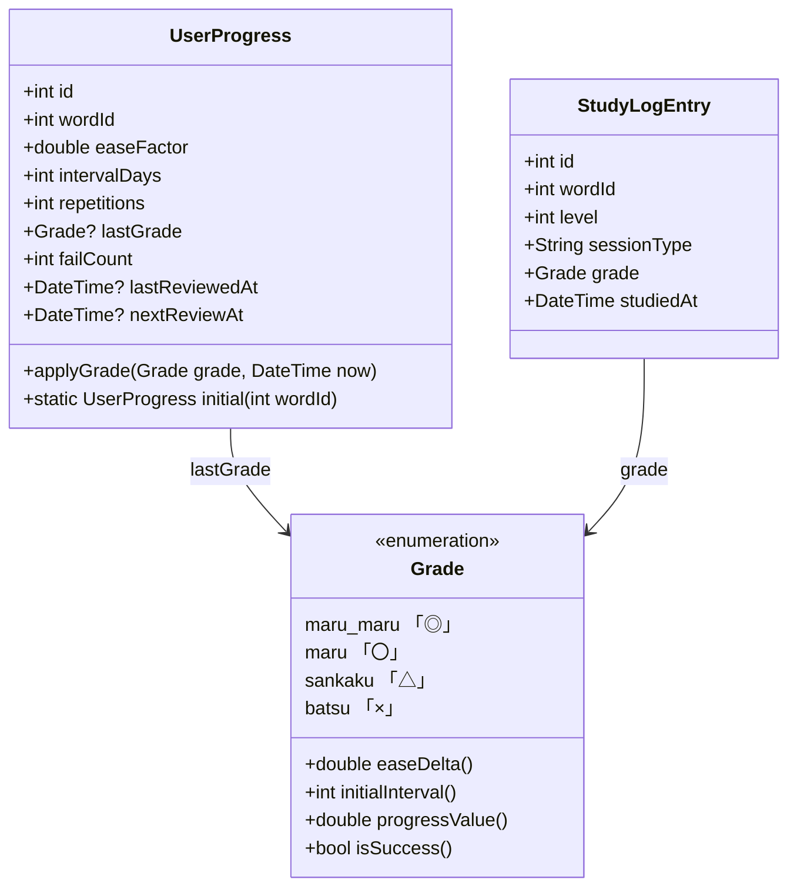
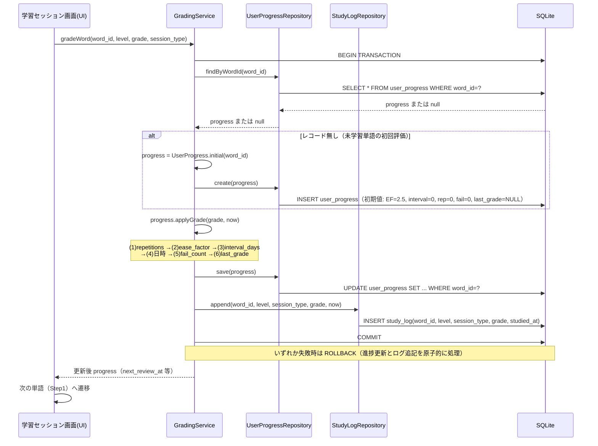
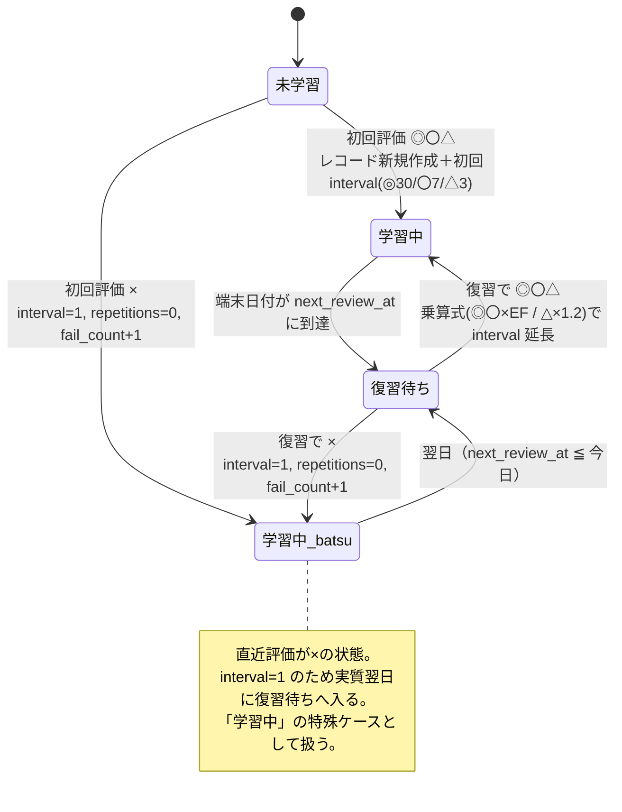

# SM-2 学習ロジック・ドメイン設計書

**プロジェクト名**: JACET Vocabulary Learner
**対象**: SM-2学習アルゴリズム／学習進捗ドメイン
**開発フレームワーク**: Flutter (Dart)
**版数**: v1.0
**作成日**: 2026-07-02
**更新日**: 2026-07-02
**準拠元**: RFP（doc/rfp.md v1.1）第5章・第6章・第11章

---

## 1. 本書の位置づけとスコープ

本書は、RFP第5章「SM-2アルゴリズム仕様」を実装可能な粒度まで具体化した設計書である。以下を規定する。

- 4段階評価（◎〇△×）に対する `ease_factor`・`interval_days`・`repetitions` の更新規則（RFP確定仕様）
- `gradeWord` / `applyGrade` の処理設計（未学習単語の初期値レコード新規作成 → SM-2更新 → `study_log` 追記を同一トランザクションで実行するフロー）
- 進捗率（LV詳細画面用）と `next_review_at` の算出規則
- 計算トレース例（実装者が単体テストで検証可能な形）
- 処理シーケンス図・カード状態遷移図（Mermaid）
- RFP第11章のSM-2受け入れ基準との対応

本書はSM-2ロジックとその周辺ドメインに限定する。画面レイアウト・DB物理スキーマ・開発環境の詳細は、それぞれ `docs/screen-design.md`・`docs/data-design.md`・`docs/development-environment-design.md` に従う。

---

## 2. 確定仕様（RFP第5章の整理）

### 2.1 評価と初期パラメータ

RFP第5.1節の確定仕様を、実装者が参照しやすい形で再掲する。以下の値はすべてRFPの確定値であり、本書で変更・追加する数値はない。

| ボタン | 意味 | `ease_factor` 増減 Δ | 初回 `interval`（更新後 `repetitions`==1 のとき） | 既存カード（更新後 `repetitions`≧2 のとき）の `interval` |
|---|---|---|---|---|
| ◎（楽） | 簡単に思い出せた | +0.10 | 30日 | `interval_prev × ease_factor`（更新後EFを使用） |
| 〇（良） | 思い出せた | ±0（維持） | 7日 | `interval_prev × ease_factor`（更新後EFを使用） |
| △（難） | 苦労して思い出せた | −0.15 | 3日 | `interval_prev × 1.2`（延長幅を抑制） |
| ×（忘） | 思い出せなかった | −0.20 | 1日（リセット） | 1日にリセット（`repetitions`=0 へ） |

### 2.2 `ease_factor` の境界値

| 項目 | 値 | 根拠 |
|---|---|---|
| 初期値 | 2.5 | 未学習カードの初期値。`user_progress.ease_factor DEFAULT 2.5` と一致 |
| 下限 | 1.3 | すべての評価で `ease_factor = max(1.3, ease_factor + Δ)` を適用 |
| 上限 | なし | ◎の連続で上限なく増加しうる |

### 2.3 `repetitions` と `interval` の判定規則

| 状況 | 更新前 `repetitions` | 評価 | 更新後 `repetitions` | 適用する `interval` 規則 |
|---|---|---|---|---|
| 未学習の初回成功 | 0 | ◎〇△ | 1 | 初回interval（◎30／〇7／△3） |
| 既存カードの成功 | 1以上 | ◎〇△ | +1 | 乗算式（◎〇: ×`ease_factor`／△: ×1.2） |
| 失敗（未学習・既存問わず） | 任意 | × | 0 | `interval_days` = 1 に強制リセット |

> **注記**: 判定に用いる `repetitions` は「(1)更新後」の値である。未学習（更新前0）で◎〇△を押すと更新後1となり初回intervalが適用され、既存カード（更新前1以上）で成功すると更新後2以上となり乗算式が適用される。この分岐がRFP第5.2節(3)の核心である。

### 2.4 端数処理（設計判断）

RFP第5.2節(3)の乗算式は `round(...)` を用いる。本設計では Dart の `num.round()` に準拠し、**四捨五入（小数第1位が0.5のときは絶対値の大きい方へ丸める）** で `interval_days`（整数）を確定する。`interval_days` は常に1以上となる（初回interval・乗算式・×リセットのいずれの経路でも1未満にならない）。

---

## 3. ドメインモデル

### 3.1 エンティティ・値オブジェクト

SM-2ロジックが扱うドメインを、進捗エンティティ・学習ログエンティティ・評価値オブジェクトの3要素で構成する。物理テーブル（`user_progress`／`study_log`）はRFP第6章に一致する。



### 3.2 `Grade` 値オブジェクトが保持する定数

`Grade` は4段階評価を型安全に表現し、評価値に紐づく定数を一元管理する。数値はすべて第2章の確定仕様に一致する。

| `Grade` | `easeDelta()` | `initialInterval()` | `progressValue()`（進捗率用） | `isSuccess()` |
|---|---|---|---|---|
| ◎ | +0.10 | 30 | 1.0 | true |
| 〇 | 0.00 | 7 | 0.5 | true |
| △ | −0.15 | 3 | 0.1 | true |
| × | −0.20 | （該当なし。常にリセット） | 0.0 | false |

> `progressValue()` は進捗率算出（第6章）専用の値であり、`last_grade` が `NULL`（未学習）の単語は0.0として扱う（`Grade` が存在しないため、進捗率集計側で0を割り当てる）。

### 3.3 進捗エンティティ `UserProgress` の初期値

未学習単語に対して新規作成する初期値レコードは、RFP第6章の `DEFAULT` 値と一致させる。`UserProgress.initial(wordId)` が生成する。

| フィールド | 初期値 |
|---|---|
| `easeFactor` | 2.5 |
| `intervalDays` | 0 |
| `repetitions` | 0 |
| `failCount` | 0 |
| `lastGrade` | null |
| `lastReviewedAt` | null |
| `nextReviewAt` | null |

---

## 4. サービス責務と処理設計

### 4.1 責務分担

| コンポーネント | 責務 |
|---|---|
| 学習セッション画面（UI層） | ◎〇△×押下イベントを受け取り、`GradingService.gradeWord()` を1回呼び出す。戻り値の更新後進捗を用いて次単語へ遷移する。SM-2計算そのものは持たない。 |
| `GradingService`（アプリケーションサービス層） | `gradeWord()` を提供。1回の評価を**単一トランザクション**として統括する。レコードの取得／新規作成の判断、`applyGrade` 呼び出し、`study_log` 追記の順序と原子性を保証する。 |
| `UserProgress`（ドメインエンティティ） | `applyGrade(grade, now)` として、SM-2のパラメータ更新規則（第2章）を自身の状態に適用する純粋ロジック。永続化・ログ記録は持たない。 |
| `UserProgressRepository`（インフラ層） | `findByWordId` / `create` / `save` を提供。SQLiteの `user_progress` テーブルへの入出力を担う。 |
| `StudyLogRepository`（インフラ層） | `append` を提供。`study_log` テーブルへ1件INSERTする。 |

### 4.2 `gradeWord` フロー（同一トランザクション）

`gradeWord` は次の3ステップを1つのトランザクション内で実行する。いずれかが失敗した場合は全体をロールバックし、進捗更新とログ追記の整合性を保つ。

1. **レコード取得 or 未学習単語の初期値レコード新規作成**
   `word_id` で `user_progress` を検索し、存在しなければ `UserProgress.initial(wordId)` を新規作成（INSERT）する。存在すればそのレコードを対象とする。
2. **SM-2更新**
   対象エンティティに `applyGrade(grade, now)` を適用し、`save`（新規作成分は確定、既存分はUPDATE）する。
3. **`study_log` 追記**
   `append(word_id, level, session_type, grade, now)` で学習ログを1件記録する。

> **重複記録の防止**: `study_log` への記録は `gradeWord` 側の責務とし、`applyGrade`（`UserProgress` 内）はログ記録を行わない。これによりRFP第5.3節の擬似コードと同じく、1評価につき `study_log` は必ず1件のみ記録される。

### 4.3 `applyGrade` の内部手順（RFP第5.2節に対応）

`UserProgress.applyGrade(grade, now)` は以下の順で自身の状態を更新する。

1. **`repetitions`**: ◎〇△なら `+1`、×なら `0`。
2. **`ease_factor`**: `ease_factor = max(1.3, ease_factor + grade.easeDelta())`。
3. **`interval_days`**:
   - `grade == ×` → `1`
   - `repetitions == 1`（今回の成功で初めて1になった＝初回学習）→ `grade.initialInterval()`（◎30／〇7／△3）
   - `repetitions >= 2`（既存カード）→ `factor = (◎〇なら ease_factor / △なら 1.2)`、`interval_days = round(interval_days_prev × factor)`
4. **日時**: `last_reviewed_at = now`、`next_review_at = now + interval_days 日`。
5. **苦手カウント**: `grade == ×` のとき `fail_count += 1`（累計。復習で再度×でも加算）。
6. **最新評価**: `last_grade = grade`（進捗率は常に最新評価のみで算出）。

手順(3)は必ず手順(1)（`repetitions` 更新）と手順(2)（`ease_factor` 更新）の**後**に評価し、乗算式では「更新後の `ease_factor`」を用いる。

### 4.4 評価押下時の処理シーケンス図



### 4.5 参照擬似コード（RFP第5.3節と整合）

```pseudo
function gradeWord(word_id, level, grade, session_type, now):
    transaction:
        progress = userProgressRepository.findByWordId(word_id)
        if progress == null:                       # 未学習単語 → 初期値レコード新規作成
            progress = UserProgress.initial(word_id)   # EF=2.5, interval=0, rep=0, fail=0, last_grade=null
            userProgressRepository.create(progress)
        progress.applyGrade(grade, now)            # SM-2更新（下記）
        userProgressRepository.save(progress)
        studyLogRepository.append(word_id, level, session_type, grade, now)  # study_log 追記
    return progress

function applyGrade(grade, now):                   # UserProgress のメソッド
    # (1) repetitions
    repetitions = (grade == '×') ? 0 : repetitions + 1
    # (2) ease_factor（下限1.3）
    ease_factor = max(1.3, ease_factor + grade.easeDelta())
    # (3) interval_days
    if grade == '×':
        interval_days = 1
    else if repetitions == 1:                      # 未学習の初回成功
        interval_days = grade.initialInterval()    # ◎30 / 〇7 / △3
    else:                                          # repetitions >= 2（既存カード）
        factor = (grade in ('◎','〇')) ? ease_factor : 1.2
        interval_days = round(interval_days * factor)
    # (4) 日時（now は端末ローカル当日0:00境界）
    last_reviewed_at = now
    next_review_at   = now + days(interval_days)
    # (5) 苦手カウント
    if grade == '×': fail_count = fail_count + 1
    # (6) 最新評価
    last_grade = grade
```

---

## 5. カード状態遷移

### 5.1 状態の定義

1語の学習状態を、`user_progress` レコードの有無と `next_review_at` の到来状況で判定する。

| 状態 | 判定条件 | 意味 |
|---|---|---|
| 未学習 | `user_progress` レコードが存在しない（`last_grade = NULL`） | 一度も評価されていない。進捗率0、新規学習セッションの出題対象。 |
| 学習中（待機） | レコードあり かつ `next_review_at > 今日` | 評価済みで次回復習日を待機中。復習セッションの出題対象外。 |
| 復習待ち | レコードあり かつ `next_review_at ≦ 今日` | 復習期日が到来。復習セッション（全レベル横断・古い順）の出題対象。 |

> ×評価は独立した状態ではなく、`interval_days=1`・`repetitions=0`・`fail_count+1` を伴う遷移として表現する。×押下直後は `next_review_at = 翌日` となり「学習中（待機）」を経て翌日「復習待ち」へ入る。

### 5.2 状態遷移図



本図は第4.4節の処理シーケンスと整合する。すべての遷移は `gradeWord`（＝評価押下）またはカレンダー日付の進行によってのみ発生する。

---

## 6. 進捗率と next_review_at の算出

### 6.1 進捗率（LV詳細画面用）

RFP第4.2節・第5.4節に従い、進捗率は**最新評価（`last_grade`）のみ**で算出する。過去の評価履歴（`study_log`）は進捗率算出に含めない。

```
進捗率 = Σ(各単語の last_grade に対応する評価値) / 該当レベルの総単語数（1000語）
```

| 単語の状態（`last_grade`） | 評価値 |
|---|---|
| ◎ | 1.0 |
| 〇 | 0.5 |
| △ | 0.1 |
| ×  | 0.0 |
| 未学習（レコード無し／`last_grade = NULL`） | 0.0 |

- 分母は該当レベルの総単語数（RFP第3章より各レベル1000語固定）。
- 集計は当該レベルの `words` に対して `user_progress.last_grade` を左結合し、レコードが無い単語（未学習）は0.0として扱う。
- 表示はパーセント値＋横棒プログレスバー（RFP第4.2節）。

### 6.2 next_review_at の算出と日付境界

```
last_reviewed_at = now
next_review_at   = last_reviewed_at + interval_days 日
```

- 基準時刻 `now` は**端末ローカル日付の当日0:00境界**とする（RFP第5.2節）。すなわち、同一カレンダー日内の複数回評価でも `now` の日付部分は同日として扱い、`next_review_at` は「評価日 + `interval_days` 日」の0:00となる。
- 復習対象判定（復習セッション出題・ホーム画面「今日の復習ブロック」・LV詳細画面の復習予定）は、`next_review_at ≦ 今日` を端末ローカル当日0:00境界で比較する。
- LV詳細画面の復習予定（RFP第4.2節）は全レベル横断で算出する：
  - 明日の復習予定数 = `next_review_at` が明日の単語数
  - 今週の復習予定数 = `next_review_at` が今日から7日以内の単語数

---

## 7. 計算トレース例（検証用）

以下は実装者が単体テストで検証できるトレースである。`now` は各行の「評価日」の当日0:00とする。`round()` は四捨五入（第2.4節）。

### 7.1 単発トレース（1回の評価）

| # | 前提（更新前） | 評価 | 更新後 `repetitions` | 更新後 `ease_factor` | 適用規則 | 更新後 `interval_days` | `fail_count` | `next_review_at` |
|---|---|---|---|---|---|---|---|---|
| T1 | 未学習（EF=2.5, int=0, rep=0） | ◎ | 1 | max(1.3, 2.5+0.10)=**2.60** | 初回interval ◎ | **30** | 0 | 評価日+30日 |
| T2 | 未学習（EF=2.5, int=0, rep=0） | 〇 | 1 | max(1.3, 2.5+0.00)=**2.50** | 初回interval 〇 | **7** | 0 | 評価日+7日 |
| T3 | 未学習（EF=2.5, int=0, rep=0） | △ | 1 | max(1.3, 2.5−0.15)=**2.35** | 初回interval △ | **3** | 0 | 評価日+3日 |
| T4 | 未学習（EF=2.5, int=0, rep=0） | × | 0 | max(1.3, 2.5−0.20)=**2.30** | ×リセット | **1** | 1 | 評価日+1日 |
| T5 | 既存（EF=2.60, int=30, rep=1） | 〇 | 2 | max(1.3, 2.60+0.00)=**2.60** | 乗算式 ×EF：round(30×2.60)=round(78.0) | **78** | 0 | 評価日+78日 |
| T6 | 既存（EF=2.60, int=30, rep=1） | ◎ | 2 | max(1.3, 2.60+0.10)=**2.70** | 乗算式 ×EF：round(30×2.70)=round(81.0) | **81** | 0 | 評価日+81日 |
| T7 | 既存（EF=2.45, int=78, rep=2） | △ | 3 | max(1.3, 2.45−0.15)=**2.30** | △乗算式 ×1.2：round(78×1.2)=round(93.6) | **94** | 0 | 評価日+94日 |
| T8 | 既存（EF=2.25, int=94, rep=3） | × | 0 | max(1.3, 2.25−0.20)=**2.05** | ×リセット | **1** | +1 | 評価日+1日 |
| T9 | 既存（EF=1.35, int=10, rep=4） | △ | 5 | max(1.3, 1.35−0.15)=**1.30**（下限） | △乗算式 ×1.2：round(10×1.2)=round(12.0) | **12** | 0 | 評価日+12日 |
| T10 | 既存（EF=1.30, int=12, rep=5） | × | 0 | max(1.3, 1.30−0.20)=**1.30**（下限維持） | ×リセット | **1** | +1 | 評価日+1日 |

- T4：未学習の初回×。レコードを初期値で新規作成後、`repetitions=0`・`interval=1` に確定し、`fail_count` が0→1へ加算される。
- T9・T10：`ease_factor` が下限1.3で頭打ちになることを示す（T9で1.30に到達、T10で1.30−0.20でも1.3を維持）。

### 7.2 連続トレース（1単語の生涯例）

同一単語を時系列で評価した例。前行の更新後値が次行の更新前値になる。

| 経過日 | 評価 | 更新後 `repetitions` | 更新後 `ease_factor` | 適用規則 | 更新後 `interval_days` | `fail_count` | `next_review_at`（0:00基準） |
|---|---|---|---|---|---|---|---|
| Day 0（未学習） | ◎ | 1 | 2.60 | 初回interval ◎=30 | 30 | 0 | Day 30 |
| Day 30 | 〇 | 2 | 2.60 | ×EF：round(30×2.60)=78 | 78 | 0 | Day 108 |
| Day 108 | △ | 3 | 2.45 | △×1.2：round(78×1.2)=94 | 94 | 0 | Day 202 |
| Day 202 | × | 0 | 2.25 | ×リセット | 1 | 1 | Day 203 |
| Day 203 | 〇 | 1 | 2.25 | 初回interval 〇=7（rep==1のため） | 7 | 1 | Day 210 |
| Day 210 | ◎ | 2 | 2.35 | ×EF：round(7×2.35)=round(16.45)=16 | 16 | 1 | Day 226 |

- Day 203の行が重要：×リセット後 `repetitions=0` に戻っているため、次の成功で `repetitions==1` となり**再び初回interval（◎30／〇7／△3）**が適用される（乗算式ではない）。これはRFP第5.2節(3)の分岐に一致する。
- `fail_count` はDay 202で1へ加算された後、成功評価では減算されず累計として保持される（苦手単語TOP5の集計に使用）。

### 7.3 進捗率トレース（LV詳細画面）

あるレベル（総単語数1000語）で、`last_grade` の内訳が下表のときの進捗率。

| `last_grade` | 単語数 | 評価値 | 小計 |
|---|---|---|---|
| ◎ | 120 | 1.0 | 120.0 |
| 〇 | 80 | 0.5 | 40.0 |
| △ | 30 | 0.1 | 3.0 |
| × | 20 | 0.0 | 0.0 |
| 未学習 | 750 | 0.0 | 0.0 |
| **合計** | **1000** | — | **163.0** |

進捗率 = 163.0 / 1000 = **0.163 → 16.3%**

---

## 8. RFP第11章 受け入れ基準との対応

RFP第11章「SM-2・データ更新（5章・6章）」の各基準に対し、本設計での担保箇所を示す。

| RFP第11章の受け入れ基準 | 本書での担保箇所 |
|---|---|
| 未学習単語（`user_progress` レコード無し）を初めて評価すると、初期値（EF=2.5／interval=0／rep=0／fail=0／last_grade=NULL）でレコードが新規作成され、同一処理内でSM-2更新が適用される | 第3.3節（初期値）、第4.2節ステップ1・第4.4節 alt分岐（同一トランザクションでの create → applyGrade → save） |
| 各評価押下で `ease_factor` が定義どおり増減し（◎+0.10／〇±0／△−0.15／×−0.20）、下限1.3を下回らない | 第2.1節・第2.2節、第4.3節手順(2)、トレースT1〜T4・T9・T10 |
| 未学習（rep=0）の成功で初回interval（◎30／〇7／△3）が、既存カードで乗算式（◎〇×EF／△×1.2）が適用される | 第2.3節、第4.3節手順(3)、トレースT1〜T3（初回）・T5〜T7・T9（乗算式） |
| ×押下で interval=1・repetitions=0 にリセットされ、`fail_count` が加算される | 第2.1節・第2.3節、第4.3節手順(1)(3)(5)、トレースT4・T8・T10 |
| `next_review_at = last_reviewed_at + interval_days 日` で算出される | 第6.2節、第4.3節手順(4)、各トレースの `next_review_at` 列 |
| 評価押下ごとに `study_log` に1件記録される | 第4.2節ステップ3（重複記録防止の注記）、第4.4節・第4.5節（`gradeWord` が1件のみ append） |

また、進捗率に関するLV詳細画面（4.2）の受け入れ基準「進捗率が `Σ(last_grade の評価値) / 1000`（◎=1.0／〇=0.5／△=0.1／×・未学習=0）で算出される」は、第6.1節および第7.3節で担保する。

---

## 9. 用語

本書で用いる用語はRFP第10章「用語集」に準拠する（`ease_factor`／`interval_days`／`repetitions`／`next_review_at`／`fail_count`／`last_grade`／評価値◎〇△×）。定義の差異はない。
