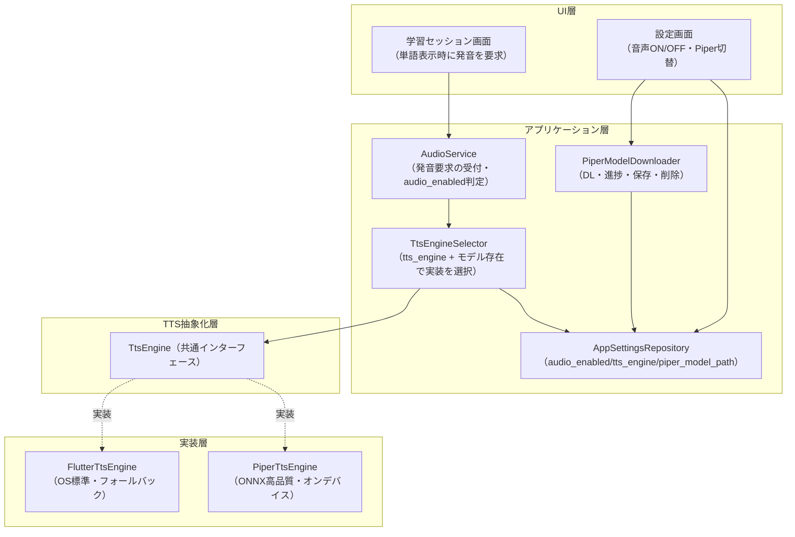
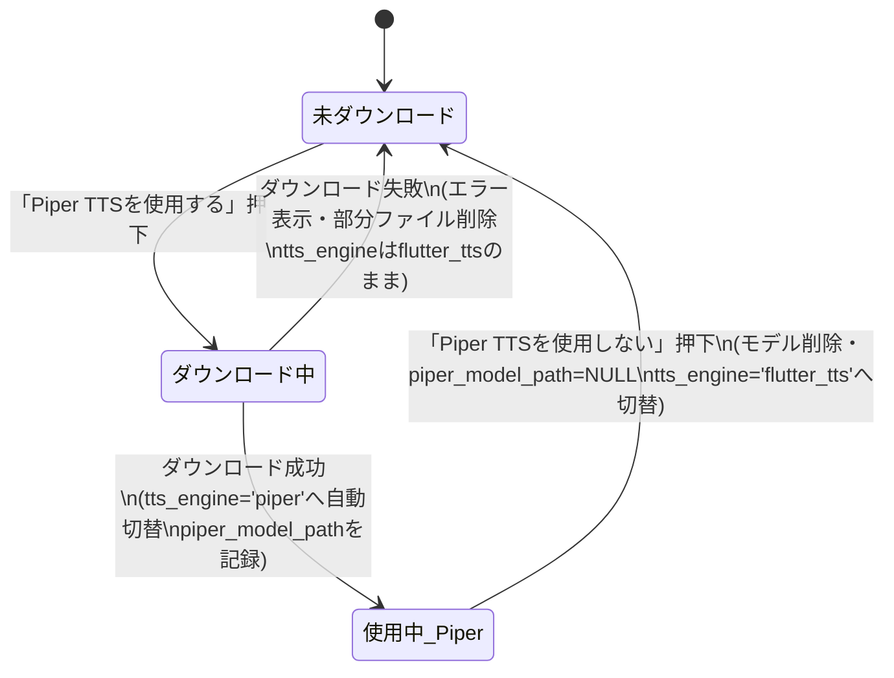
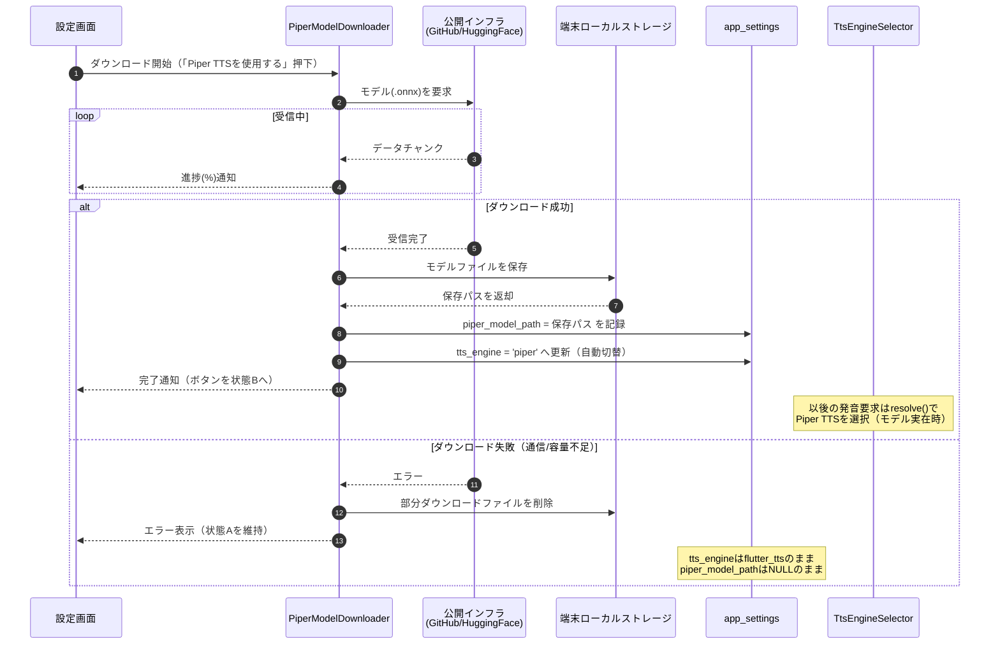
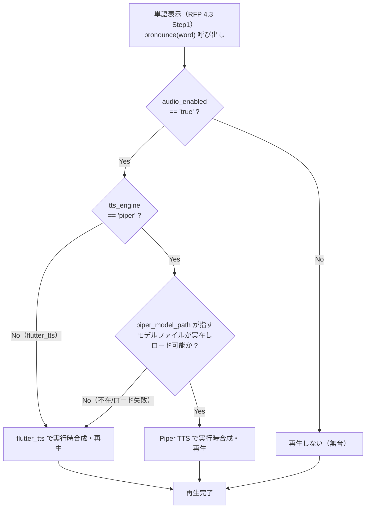

# 音声・TTSエンジン設計書

| 項目 | 内容 |
|---|---|
| 文書名 | 音声・TTSエンジン設計書（TTS / AUDIO 設計書） |
| プロジェクト名 | JACET Vocabulary Learner |
| 開発主体 | JaMTec LLC（Jotaro） |
| 版数 | v1.0 |
| 作成日 | 2026-07-02 |
| 更新日 | 2026-07-02 |
| 準拠RFP | doc/rfp.md v1.1（第4.5章・第7章・第9章・第11章） |

---

## 1. 本書の目的と位置づけ

本書は「JACET Vocabulary Learner」（Flutter/Dart によるモバイルアプリ、iOS/Android、非商用・教育目的）における**音声読み上げ機能とTTS（Text-to-Speech）エンジンの設計**を定義する文書である。RFP v1.1 の第4.5章（設定画面・音声再生ロジック）、第7章（非機能要件・音声方式）、第9章（実装方針）を実装可能な精度まで具体化することを目的とする。

本アプリの音声機能は、以下の2つのTTS実装を**共通インターフェースの背後に抽象化**し、設定によって切り替える構成をとる。

- **flutter_tts**（OS標準TTS）: 初期状態かつフォールバックエンジン。
- **Piper TTS**（オンデバイスのONNXモデルによる高品質音声）: 設定画面からモデルをダウンロードして有効化する任意エンジン。

本書は音声・TTSの設計に集中する。画面遷移・DB全体・SM-2ロジックは、それぞれ `docs/screen-design.md`・`docs/data-design.md`・`docs/sm2-logic-design.md` に従い、システム全体構成は `docs/architecture-design.md` に従う。RFPに記載のない要件は創作せず、本書はRFPの確定仕様の範囲内で設計する。

### 1.1 設計の前提（RFPからの確定事項）

RFP第4.5章・第7章・第9章より、音声機能は以下の性質を持つ。本書はこれに厳密に従う。

- **実行時リアルタイム合成**: flutter_tts・Piper TTS のいずれも、単語表示のたびにテキストから**実行時にオンデバイスで都度リアルタイム合成して再生**する。単語ごとの音声ファイルを事前生成・同梱・キャッシュすることは初期版では行わない（RFP 4.5・第7章）。
- **オフライン動作**: 音声再生も通信不要でオフライン動作すること。ただしPiper TTSはモデルダウンロード完了後に限る（RFP 第7章）。唯一の実行時ネットワーク利用はPiper TTSモデルの任意ダウンロードのみ。
- **モデルは公開インフラから直接取得**: Piper TTSモデル（`.onnx`）は GitHub Releases / Hugging Face 等の既存公開インフラから直接ダウンロードする。自前のホスティングサーバーは持たない（RFP 4.5・第7章・第9章）。
- **チェックサム検証は初期版で非実装**: 公開インフラの配布物をそのまま利用する方針（RFP 第9章）。
- **予約カラム `words.audio_file_path`**: 事前生成音声ファイル用の将来用予約カラム。初期版では常にNULL。実機検証で実行時合成レイテンシがユーザー体験上許容できないと判明した場合に限り、事前生成キャッシュ方式へ切り替えるための余地として残す（RFP 第7章・第9章）。

---

## 2. 全体構成

### 2.1 レイヤ構成

音声機能は、UI／アプリケーション／TTS抽象化／実装の4層で構成する。UI・アプリケーション層は**具体的なTTS実装を知らず**、抽象インターフェース `TtsEngine` のみに依存する。



### 2.2 各コンポーネントの責務

| コンポーネント | 責務 |
|---|---|
| `AudioService` | 単語表示時の発音要求を受け付ける唯一の窓口。`audio_enabled` を確認し、ONのときのみ `TtsEngineSelector` 経由で合成・再生を実行する。 |
| `TtsEngineSelector` | `app_settings.tts_engine` とモデルファイルの実在有無から、その時点で使用すべき `TtsEngine` 実装（`PiperTtsEngine` または `FlutterTtsEngine`）を選択する。 |
| `TtsEngine`（抽象IF） | UI・アプリ層が依存する共通インターフェース。合成・再生・停止・初期化・破棄・利用可否判定を規定する。実装差異を隠蔽する。 |
| `FlutterTtsEngine` | `flutter_tts` パッケージを用いてOS標準TTSで英語テキストを実行時合成・再生する実装。常に利用可能なフォールバック。 |
| `PiperTtsEngine` | ダウンロード済み `.onnx` モデルを用いてオンデバイスで実行時合成・再生する高品質実装。モデル未存在時は利用不可を返す。 |
| `PiperModelDownloader` | Piperモデルの公開インフラからのダウンロード、進捗通知、端末ローカル保存、削除を担う。 |
| `AppSettingsRepository` | `app_settings` テーブルの `audio_enabled` / `tts_engine` / `piper_model_path` を読み書きし、永続化する。 |

---

## 3. TTS抽象化レイヤ（共通インターフェース）

### 3.1 インターフェース定義

UI・アプリケーション層が依存する共通インターフェースを `TtsEngine` として定義する。flutter_tts / Piper TTS の双方はこのインターフェースを実装し、呼び出し側は実装の違いを意識しない。

```dart
/// TTS実装の共通インターフェース。
/// flutter_tts / Piper TTS の双方がこれを実装する。
abstract class TtsEngine {
  /// このエンジンの識別子（'flutter_tts' または 'piper'）。
  String get id;

  /// このエンジンが現時点で利用可能か。
  /// flutter_tts は常に true。
  /// Piper はモデルファイルが実在しロード可能なとき true。
  Future<bool> isAvailable();

  /// エンジンの初期化（言語=en、話速・音高等の設定、Piperはモデルロード）。
  Future<void> initialize();

  /// 与えられたテキストを実行時にリアルタイム合成して再生する。
  /// 再生中に新たな要求が来た場合は先行再生を停止してから再生する。
  Future<void> speak(String text);

  /// 再生中の音声を停止する。
  Future<void> stop();

  /// リソースを解放する（Piperはモデルのアンロード等）。
  Future<void> dispose();
}
```

### 3.2 抽象化により保証する不変条件

- 呼び出し側（`AudioService`）は `TtsEngine.speak(text)` のみを呼ぶ。どの実装が動くかは `TtsEngineSelector` が決める。
- `speak()` は**テキストからの実行時合成**を意味し、事前生成ファイルの再生ではない（初期版方針）。
- どちらの実装も**オフラインで完結**する（Piperはモデルダウンロード済みが前提）。
- Piperが `isAvailable() == false` を返す状況（モデル未存在・ロード失敗）では、`TtsEngineSelector` が自動的に `FlutterTtsEngine` へフォールバックする。これにより発音要求が失敗して無音になることを防ぐ。

### 3.3 2実装の切替設計

`TtsEngineSelector` は、発音要求のたびに次の規則で実装を選択する。判定は軽量で、DBの `tts_engine` 値とモデルパスのファイル存在確認のみで完結する。

```dart
Future<TtsEngine> resolve() async {
  final engine = await settings.getTtsEngine();      // 'flutter_tts' | 'piper'
  final path   = await settings.getPiperModelPath(); // ローカルパス or null
  if (engine == 'piper' && path != null && await File(path).exists()) {
    final piper = piperEngine; // 遅延初期化済みのPiper実装
    if (await piper.isAvailable()) {
      return piper;
    }
  }
  return flutterTtsEngine; // それ以外は常にflutter_ttsへフォールバック
}
```

この選択規則は、RFP第4.5章「音声再生ロジック」および第7章の「`tts_engine == 'piper'` かつモデルファイルが存在する場合のみPiper TTSを使用、それ以外はflutter_ttsにフォールバック」と一致する。詳細な判定フローは第6章（図3）に示す。

---

## 4. 音声再生ロジック

### 4.1 再生方式（実行時リアルタイム合成）

本アプリの音声は、学習セッション画面（RFP 4.3 Step1）で**単語が表示されるたびに**、その単語テキストを**実行時にオンデバイスでリアルタイム合成して再生**する。これはflutter_tts・Piper TTSのいずれの実装でも共通である。

- **事前生成・同梱・キャッシュはしない**（初期版方針、RFP 4.5・第7章）。単語ごとの音声ファイルを持たない。
- 発音対象は `words.word`（英単語見出し）。発音記号 `pronunciation`（IPA）は画面表示用であり、合成入力そのものには用いない。
- 合成入力は言語=英語（en）として扱う。

### 4.2 発音要求のトリガと `audio_enabled` の関与

RFP 4.3 Step1 の仕様どおり、単語表示と同時に音声を自動再生する。ただし再生するのは**音声設定がONのときのみ**である。

```dart
// AudioService: 学習セッション画面から単語表示時に呼ばれる唯一の窓口
Future<void> pronounce(String word) async {
  if (!await settings.isAudioEnabled()) return;   // audio_enabled=false なら無音
  final engine = await selector.resolve();        // 実装を選択（Piper or flutter_tts）
  await engine.speak(word);                        // 実行時合成・再生
}
```

- `app_settings.audio_enabled == 'false'` の場合、TTSエンジンは一切呼ばれず無音とする（RFP 4.3・第11章）。
- `audio_enabled == 'true'` の場合のみ、`TtsEngineSelector` が選んだ実装で合成・再生する。
- 前の単語の音声が再生中に次の単語へ遷移した場合、`speak()` 実装内で先行再生を停止してから新規再生する（発音の重なりを防ぐ）。

### 4.3 判定条件の要約

| 条件 | 使用エンジン |
|---|---|
| `audio_enabled == 'false'` | 再生しない（無音） |
| `audio_enabled == 'true'` かつ `tts_engine == 'piper'` かつ モデル実在・ロード可 | Piper TTS |
| `audio_enabled == 'true'` かつ 上記以外（`tts_engine == 'flutter_tts'`／モデル不在／ロード失敗） | flutter_tts（フォールバック） |

### 4.4 `audio_file_path`（予約カラム）の扱い

`words.audio_file_path` は**将来用の予約カラム**であり、初期版では常にNULLとして扱う。初期版の再生ロジックはこのカラムを参照しない（実行時合成のみ）。

このカラムは、実機検証で単語表示ごとの実行時合成レイテンシがユーザー体験上許容できないと判明した場合に限り、`audio_file_path` を用いた**事前生成キャッシュ方式**へ切り替えるための余地として機能する（RFP 第7章・第9章）。切替を行う場合でも、再生の呼び出し口は `AudioService.pronounce()` に集約されているため、切替の影響範囲を再生ロジック内部に限定できる設計とする。初期版ではこの切替は実装しない。

---

## 5. Piper TTSモデルのダウンロード設計

### 5.1 ダウンロード元と方針

- **取得元**: GitHub Releases または Hugging Face 等、既存の公開インフラ上にホスティングされたPiper TTS英語音声モデル（`.onnx` 形式。付随する設定ファイルが必要な場合はそれも含む）を直接取得する。**自前のホスティングサーバーは不要**（RFP 4.5・第7章・第9章）。具体的なモデルURLは実装時に選定する。
- **チェックサム検証**: 初期版では改ざん検証（チェックサム照合）を**実装しない**。公開インフラの配布物をそのまま利用する（RFP 第9章）。
- **保存先**: 端末ローカルストレージのアプリ専用領域（アプリのドキュメント/サポートディレクトリ配下）に保存する。保存後の絶対パスを `app_settings.piper_model_path` に記録する。

### 5.2 ダウンロード状態と設定画面ボタン

RFP 4.5 に基づき、設定画面のPiper TTSボタンは以下2状態を持つ。ダウンロード中は進捗を表示する中間状態を経る。

| 状態 | ボタン表示 | 押下時の挙動 |
|---|---|---|
| A. 未ダウンロード | 「Piper TTSを使用する」 | ①モデルをダウンロード（進捗表示）→ ②完了後 `tts_engine` を `'piper'` へ自動切替 → ③ボタンを状態Bへ変更 |
| B. ダウンロード済み・使用中 | 「Piper TTSを使用しない」 | ①モデルファイルを端末から削除 → ②`tts_engine` を `'flutter_tts'` へ自動切替 → ③ボタンを状態Aへ戻す |

- **ダウンロード中**は進捗（%またはインジケータ）を表示し、ボタンは再押下不可（多重起動防止）とする。
- **ダウンロード失敗時**（通信エラー・容量不足等）はエラーメッセージを表示し、**状態Aのまま維持**する。`tts_engine` は変更せず `'flutter_tts'` のまま、`piper_model_path` はNULLのまま、部分ダウンロードファイルがあれば削除する。

### 5.3 状態遷移図（図1）



### 5.4 ダウンロード／切替シーケンス（図2）

未ダウンロード状態から「Piper TTSを使用する」を押下した際の、設定画面・ダウンローダ・ストレージ・`app_settings`・TTS切替の連携を示す。



削除（「Piper TTSを使用しない」押下）時は、`PiperModelDownloader` が①モデルファイルをストレージから削除 → ②`app_settings.piper_model_path` をNULLに更新 → ③`app_settings.tts_engine` を `'flutter_tts'` に更新 → ④ボタンを状態Aへ戻す、の順で処理する。

### 5.5 モデル取得先の定数化とビルド時上書き（`PIPER_MODEL_BASE_URL`）

Piperモデルの取得先URLは、配布形態（本番配布／開発検証）に応じて差し替え可能とする。ここで**決定的に重要な前提**として、モデルのダウンロードは `PiperModelDownloader` すなわち**アプリプロセス自身**が、動作している端末環境（Androidエミュレータ／実機、iOSシミュレータ／実機）の内側から HTTP(S) で実行する。したがって `--dart-define` に渡す取得先URLは、**そのアプリが動作する実行形態から名前解決・接続できる到達可能なホスト**でなければならない。本節はこの到達性要件を含めて上書き方式を確定する。

**上書き方式（`--dart-define` によるコンパイル時注入）**

`PiperModelDownloader` が参照するベースURLは、`core/constants` の単一の定数に集約する。この定数は Dart のコンパイル時環境変数（`String.fromEnvironment`）から読み取り、未指定時はアプリ側既定値（公開インフラの実URL）にフォールバックする。

```dart
// core/constants: モデル取得先ベースURLの単一の決定点
class PiperModelSource {
  /// アプリ側の既定取得先（公開インフラの実URL。実装時に確定）。
  static const String _defaultBaseUrl =
      'https://<公開インフラ上のPiper英語モデル配布先>'; // 実装時に確定

  /// ベースURL。ビルド時に PIPER_MODEL_BASE_URL が渡されればそれを、
  /// 渡されなければ既定値を用いる。
  static const String baseUrl = String.fromEnvironment(
    'PIPER_MODEL_BASE_URL',
    defaultValue: _defaultBaseUrl,
  );

  /// 取得対象のモデルファイル名（実装時に選定モデルへ確定）。
  static const String modelFileName = '<selected_model>.onnx';

  /// 実際に取得するURL。
  static String get modelUrl => '$baseUrl/$modelFileName';
}
```

**本番ビルド（到達性は自明）**

`PIPER_MODEL_BASE_URL` を指定せずにビルドする。`baseUrl` は既定値（公開インフラ = GitHub Releases / Hugging Face の `https` 実URL）となり、実利用者の端末はインターネット経由で直接ダウンロードする（RFP 4.5・第7章「自前ホスティング不要」）。公開インフラの `https` ホストはどの実行形態からも到達可能であり、追加設定を要しない。

**開発・検証ビルド（実行形態別の到達可能URLを指定）**

開発時は取得先を開発者ホスト上の**静的HTTP配信**（開発機のローカルディレクトリで `.onnx` を配る軽量サーバ。コンテナ不要、Flutter開発機上で完結）へ向ける。ここで、コンテナ内サービス名（例 `model-mock`）や `localhost`／`127.0.0.1` を無条件に渡してはならない。**「アプリから見た開発ホスト」は実行形態ごとに異なるアドレスになる**ためである。実行形態ごとの到達可能なアドレスと `--dart-define` に渡すURL例を次表に定める（配信ポートは例として 8080）。

| 実行形態 | アプリから見た開発ホストの到達先 | `--dart-define` に渡すURL例 |
|---|---|---|
| Androidエミュレータ | エミュレータ→ホストのループバックは専用エイリアス `10.0.2.2`（`localhost`はエミュレータ自身を指すため不可） | `http://10.0.2.2:8080/models` |
| Android実機（USB接続） | `adb reverse tcp:8080 tcp:8080` で開発ホストの8080を端末の `127.0.0.1` に転送 | `http://127.0.0.1:8080/models`（要 `adb reverse`） |
| Android実機（同一LAN） | 開発ホストのLAN IP（例 `192.168.x.x`） | `http://<開発ホストのLAN IP>:8080/models` |
| iOSシミュレータ | ホストとネットワークを共有するため `127.0.0.1` で到達可 | `http://127.0.0.1:8080/models` |
| iOS実機（同一LAN） | 開発ホストのLAN IP（例 `192.168.x.x`） | `http://<開発ホストのLAN IP>:8080/models` |

- **禁止事項**: コンテナ／compose のサービス名（`model-mock` 等）や、実行形態を無視した固定 `localhost` を `--dart-define` に渡さないこと。これらは端末・エミュレータ側から名前解決・接続できず、ダウンロードが必ず失敗する。差し替え先は上表の到達可能ホストに限定する。
- **平文HTTP許可（開発ビルドのみ）**: 上表の開発向けURLは `http://`（平文）である。Androidは既定で平文通信を禁止するため、**開発ビルドに限り** `network_security_config` で開発ホスト（`10.0.2.2` / `127.0.0.1` / LAN IP）宛ての cleartext を許可する。iOSも**開発ビルドに限り** ATS（App Transport Security）例外を設定する。本番ビルドは公開インフラの `https` を用いるため、これらの平文例外は不要であり本番成果物には含めない。

```bash
# Androidエミュレータ（ホストのループバックは 10.0.2.2）
flutter run --dart-define=PIPER_MODEL_BASE_URL=http://10.0.2.2:8080/models

# Android実機（USB接続時は adb reverse でホストの8080を端末の 127.0.0.1 へ転送）
adb reverse tcp:8080 tcp:8080
flutter run --dart-define=PIPER_MODEL_BASE_URL=http://127.0.0.1:8080/models

# iOSシミュレータ（ホストと同一の 127.0.0.1）
flutter run --dart-define=PIPER_MODEL_BASE_URL=http://127.0.0.1:8080/models

# iOS実機 / Android実機（同一LAN：開発ホストのLAN IPを指定）
flutter run --dart-define=PIPER_MODEL_BASE_URL=http://192.168.10.5:8080/models

# 統合テストも同様に、実行形態に対応する到達可能URLを渡す
flutter test integration_test --dart-define=PIPER_MODEL_BASE_URL=http://10.0.2.2:8080/models
```

- **選定理由**: `--dart-define` はビルド時に値を焼き込むコンパイル時定数であり、`const` として最適化されるうえ、実行時の追加設定ファイルや通信を要しない。取得先の差し替え点をアプリ内の1定数（`PiperModelSource.baseUrl`）に限定できるため、実行形態に応じた到達可能URLへの切替が漏れなく1箇所で完結する。到達性はコンテナ内部のトポロジではなく、上表のとおり「アプリが動く端末から開発ホストへ届くか」で判断する。
- チェックサム検証は初期版で実装しないため（RFP 第9章・第1.1節）、取得先が本番（公開インフラ）／開発（ローカル配信）のいずれであっても配布物はそのまま利用する。

---

## 6. 再生時の判定フロー（図3）

単語表示時に `AudioService.pronounce()` が実行する判定を示す。RFP 4.5「音声再生ロジック」と第4.2・4.3節を図示したものである。



この判定は第3.3節の `TtsEngineSelector.resolve()` および第4.2節の `AudioService.pronounce()` と整合する。Piperが選ばれても実行時にロード失敗した場合は、その場でflutter_ttsへフォールバックする（無音を避ける）。

---

## 7. オフライン動作と設定の永続化

### 7.1 オフライン動作要件

- 単語データはアプリに事前組み込みのため、音声を含む全機能が通信不要で動作する（RFP 第7章）。
- flutter_tts はOS標準TTSを用い、常にオフラインで動作する。
- Piper TTS は**モデルダウンロード完了後**はオフラインで動作する。合成はオンデバイスで完結し、再生時に通信を行わない。
- 実行時にネットワークを利用する唯一の処理は、設定画面からのPiperモデルの任意ダウンロードのみである。ダウンロード未実施でも、flutter_ttsにより音声機能はオフラインで完全に成立する。

### 7.2 設定の永続化（`app_settings`）

音声関連の設定は `app_settings`（key-value）テーブルに永続化し、アプリ再起動後も保持する。RFP 第6章の定義と一致させる。

| key | value 例 | 説明 | 初期値 |
|---|---|---|---|
| `audio_enabled` | `'true'` / `'false'` | 読み上げ音声の全体ON/OFF（設定画面4.5で管理）。切替は即時反映・永続化。 | `'true'`（本書で固定） |
| `tts_engine` | `'flutter_tts'` / `'piper'` | 現在有効なTTSエンジン。Piperダウンロード成功時に `'piper'`、削除時に `'flutter_tts'` へ自動更新。 | `'flutter_tts'`（RFP 第6章で確定） |
| `piper_model_path` | 端末ローカルパス文字列 / `NULL` | Piperモデルの保存先パス。未ダウンロード時はNULL、削除時にNULLへ戻す。 | `NULL`（RFP 第6章で確定） |

**`audio_enabled` の初期値に関する設計判断**: RFP 第6章は `tts_engine`（`'flutter_tts'`）と `piper_model_path`（`NULL`）の初期値を確定しているが、`audio_enabled` の初期値は明文化していない。本書は設計判断として初期値を **`'true'`（音声ON）に固定**する。根拠は、RFP 4.3 が「音声設定ONのとき、単語表示と同時に音声が自動再生される」を標準フローとして規定しており、初回起動時から発音機能が利用できる状態が本アプリの想定する既定体験であるため。この初期値は初回起動時のDB初期化（同梱DBのシード）で `app_settings` に投入し、以後はユーザー操作の切替結果を永続化する。

- 音声ON/OFFスイッチの状態は切替時に即座に `audio_enabled` へ書き込み、永続化する（RFP 第11章）。
- `tts_engine` と `piper_model_path` はダウンロード成功・モデル削除のタイミングで一貫して更新する。両者が矛盾しない（`tts_engine=='piper'` なのにモデル不在）場合でも、再生時の判定（第6章）がモデル実在を確認するため、安全にflutter_ttsへフォールバックする。

---

## 8. RFP第11章 受け入れ基準との対応

本設計が満たすRFP第11章の音声・設定画面関連の受け入れ基準と、対応する設計箇所を示す。

| RFP第11章 受け入れ基準 | 本書の対応箇所 |
|---|---|
| オフライン（機内モード）で音声再生を含む全機能が動作する（Piper使用時はDL済み前提） | 第7.1節（オフライン動作要件） |
| 音声ON/OFFスイッチの設定が `app_settings` に永続化され再起動後も保持される | 第4.2節・第7.2節（`audio_enabled` の即時反映・永続化） |
| `tts_engine` の値に応じてPiper（モデルあり）またはflutter_tts（フォールバック）で再生される | 第3.3節・第4.3節・第6章（判定フロー） |
| 音声設定ONのとき、単語表示と同時に音声が自動再生される | 第4.1節・第4.2節（発音トリガと `audio_enabled` 判定） |
| 音声ON/OFF切替が `app_settings.audio_enabled` に即時反映・永続化される | 第4.2節・第7.2節 |
| 未DL状態で「Piper TTSを使用する」押下 → 進捗表示 → 完了後 `tts_engine='piper'` へ → ボタンが「使用しない」に変化 | 第5.2節・第5.3節（図1）・第5.4節（図2） |
| ダウンロード失敗時はエラー表示、状態は未ダウンロードのまま維持 | 第5.2節・第5.3節（失敗分岐）・第5.4節（図2 失敗分岐） |
| 「Piper TTSを使用しない」押下 → モデル削除 → `tts_engine='flutter_tts'` へ → ボタンが「使用する」に戻る | 第5.2節・第5.3節・第5.4節末尾（削除フロー） |
| データソース・クレジット表示が設定画面内に表示される | 設定画面全体仕様（`docs/screen-design.md`）に委譲。本書はTTS部の設計に限定 |

---

## 9. 実装上の補足方針

- **エンジンの遅延初期化**: `PiperTtsEngine` のモデルロードはコスト（メモリ・時間）を伴うため、`tts_engine=='piper'` かつモデル実在時に初回利用で初期化し、削除・切替時に `dispose()` する。flutter_tts は常時利用可能なため軽量に初期化しておく。
- **合成レイテンシの監視**: 実機検証で単語表示ごとの実行時合成レイテンシがユーザー体験上許容できないと判明した場合に限り、`words.audio_file_path`（予約カラム）を用いた事前生成キャッシュ方式へ切り替える（第4.4節・RFP 第9章）。初期版では実装しない。
- **失敗時の無音回避**: 発音要求はどの経路でも最終的にflutter_ttsへフォールバック可能とし、音声設定ONの状態で無音になることを避ける。
- **多重ダウンロード防止**: ダウンロード中は設定画面のPiperボタンを再押下不可とし、重複ダウンロード・状態不整合を防ぐ。
- **利用パッケージ**: `docs/architecture-design.md`（第7章 依存パッケージ）と整合させ、OS標準TTSは `flutter_tts`、Piper TTS（VITS/`.onnx`）のオンデバイス合成は `sherpa_onnx`（内部にONNXランタイムを内包）、モデルのHTTPダウンロード（進捗表示 `onReceiveProgress` を含む）は `dio`、保存先パス取得はアプリ専用ディレクトリAPI（`path_provider` 等）、パス結合は `path` を第一候補とする。最終的なパッケージ選定・バージョン確定は実装時に行う。

---

## 10. 用語

| 用語 | 定義 |
|---|---|
| **TTS** | Text-to-Speech。テキストから音声を合成する技術。 |
| **flutter_tts** | Flutterから各OS標準のTTSエンジンを呼び出すパッケージ。本アプリの初期状態かつフォールバックエンジン。 |
| **Piper TTS** | オフラインMLベースの音声合成エンジン。事前学習済みONNXモデル（`.onnx`）をダウンロードして有効化する高品質音声。 |
| **ONNX** | 機械学習モデルの標準交換フォーマット。Piperの音声モデルはこの形式で配布される。 |
| **実行時リアルタイム合成** | 単語表示のたびにテキストからその場で音声を生成する方式。事前生成ファイルを持たない（初期版方針）。 |
| **tts_engine** | `app_settings` に保持する、現在有効なTTSエンジンを示す値（`'flutter_tts'` または `'piper'`）。 |
| **フォールバック** | Piperが利用不可（未DL・モデル不在・ロード失敗）のとき、自動的にflutter_ttsへ切り替える動作。 |
